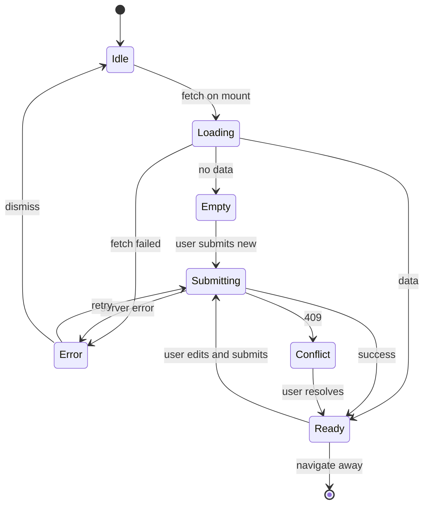

# {{Feature Title}} — User flows

> Companion to [`plan.md`](plan.md) and [`tdd.md`](tdd.md). Every state listed here must have a corresponding test in `tdd.md`.

## 1. Happy path

Numbered steps a user takes from entry to success. Each step lists the visible UI and the system action.

| # | User does | UI shows | System does | Telemetry |
|---|-----------|----------|-------------|-----------|
| 1 | {{Lands on `/{{route}}`}} | {{Empty state with CTA}} | {{Fetch initial data}} | `{{slug}}.viewed` |
| 2 | {{Clicks "Create"}} | {{Form opens with focus on first field}} | {{No-op}} | — |
| 3 | {{Fills required fields, submits}} | {{Spinner on submit button}} | {{Server action validates + persists}} | `{{slug}}.submitted` |
| 4 | — | {{Success toast + redirect to detail}} | {{Revalidate cache}} | `{{slug}}.created` |

## 2. Error states

Every row maps to a test in [`tdd.md`](tdd.md) §1.

| Trigger | User-visible state | Recovery path | Telemetry | Test ref |
|---------|--------------------|---------------|-----------|----------|
| Required field missing | Inline error under field, submit blocked | User edits field | — (client-side) | tdd #2 |
| Invalid format (email, date, etc.) | Inline error, submit blocked | User edits field | — | tdd #2 |
| Auth missing / expired | Redirect to sign-in with `returnTo={{route}}` | Sign in, return to form with state | `auth.expired` | flows-only |
| Permission denied (RLS) | Toast: "You can't do that" + disabled CTA | Contact admin (link) | `{{slug}}.forbidden` | tdd #4 |
| Network failure | Toast: "Network error, try again" + retry button | Click retry | `{{slug}}.failed` | tdd #6 |
| Server 500 | Toast with error code + support link | Click retry; if persists, copy code | `{{slug}}.failed` | tdd #6 |
| Conflict (duplicate / race) | Inline error: "Already exists" + suggestion | User changes value or opens existing | `{{slug}}.conflict` | tdd #3 |
| Rate limit | Toast: "Too many requests, wait Xs" + countdown | Auto-retry after countdown | `{{slug}}.rate_limited` | tdd #6 |
| Validation drift (server rejects what client allowed) | Inline server error mapped to field | User edits, resubmits | `{{slug}}.validation_drift` | tdd #3 |

## 3. Alternate flows

Each alt flow has a numbered scenario and explicit acceptance.

### 3.1 Cancel

User backs out mid-form.

- **Trigger:** Cancel button or browser back.
- **State:** Confirm dialog if dirty; discard if clean.
- **Acceptance:** No partial row written; analytics event `{{slug}}.cancelled` fires.

### 3.2 Retry

After a transient failure (network, 5xx, rate limit).

- **Trigger:** Retry CTA in error toast.
- **State:** Re-runs the same submission idempotently (server action keyed on a client-generated UUID).
- **Acceptance:** No duplicate row on retry.

### 3.3 Partial save / drafts

If feature supports drafts.

- **Trigger:** {{Auto-save every N seconds / explicit "Save draft"}}
- **Storage:** {{Local storage / draft row with `status='draft'`}}
- **Acceptance:** Refresh restores draft; submit promotes draft → final.

### 3.4 Deep link entry

User lands on a deep route without prior context.

- **Example:** `/{{route}}/{{id}}/edit` opened directly.
- **Behavior:** Page server-fetches the row; if missing, render 404; if not authorized, render 403.
- **Acceptance:** No client-only redirect loops.

### 3.5 Empty state

No data yet.

- **UI:** Illustration + headline + primary CTA.
- **Acceptance:** CTA opens the same flow as the happy path.

### 3.6 Loading state

While data is fetching.

- **UI:** Skeleton matching final layout (no layout shift).
- **Acceptance:** Skeleton visible within 100ms; replaced by real data with no flash.

### 3.7 Permissions denied

User authenticated but lacks role.

- **UI:** Read-only view if applicable, otherwise 403 page.
- **Acceptance:** No action buttons render; deep links honor RLS.

### 3.8 Offline

Browser offline.

- **UI:** Banner: "You're offline. Changes will sync when reconnected."
- **Behavior:** Read from cache if available; queue writes if drafts are supported, else block submit.
- **Acceptance:** No throw; clear messaging.

### 3.9 Mobile / small viewport

- **Breakpoint:** {{`sm` (640px)}}
- **Adjustments:** {{Stacked layout, full-width CTA, drawer instead of modal}}
- **Acceptance:** No horizontal scroll; tap targets ≥44px.

## 4. State diagram

## 5. Acceptance summary

This feature is "done" when:

- [ ] Every row in §1 (happy path) has a passing E2E or manual smoke step.
- [ ] Every row in §2 (errors) has a passing test in `tdd.md`.
- [ ] Every alt flow in §3 has documented acceptance and a passing test or manual verification note.
- [ ] State diagram in §4 matches the implementation.
- [ ] Telemetry events in §1 and §2 fire with the documented payloads.
