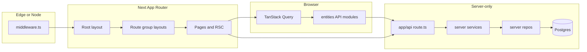

# Bullyproof application overview

This page is **hand-maintained**. Per-file listings live in `01-` … `09-` and are produced by `pnpm docs:code-reference:generate`.

## What Bullyproof is

Bullyproof is a **Next.js App Router** school-facing product: curriculum delivery, certification, culture ratings, admin dashboards, resources, and user/school administration. Data lives in **Postgres** via **Drizzle ORM**; auth and cookies flow through **Supabase** (`@supabase/ssr`, session refresh in middleware). Client data fetching uses **TanStack Query**; local UI state often uses **Zustand**. Shared UI primitives come from **`@workspace/ui`** (shadcn-style) plus app-local `components/`.

## High-level request flow

1. **Middleware** refreshes the Supabase session on matched routes.
2. **Layouts** compose providers (see `providers/`), fonts, and shell UI (`app-sidebar`, headers).
3. **Server Components** load data or delegate to **API routes** for mutations and sensitive logic.
4. **`server/`** centralizes DB access (repos), validation, and orchestration (services); API routes and server actions call into these layers.
5. **`entities/`** groups feature-specific **client** API helpers, React UI, and query keys/stores by domain (school, lessons, certification, dashboard, etc.).

## Route groups (under `app/`)

| Group | Role |
|-------|------|
| `(auth)` | Sign-in and logout experiences. |
| `(main)` | Primary authenticated app: schools, lessons, admin, courses, support, settings. |
| `(present)` | Presentation-style routes for delivering lessons in a focused layout. |

`app/api/` holds REST-style handlers consumed by the browser and server code.

## Major directories

- **`server/`** — Authoritative persistence and business rules (not imported into client bundles as a boundary; keep server-only imports here).
- **`entities/`** — Vertical slices for product domains: thin API wrappers, feature UI, models.
- **`components/`** — Reusable atoms/molecules/organisms/templates shared across routes.
- **`drizzle/`** — App-local schema mirror and SQL migrations (see `08-drizzle-and-data.md`).
- **`scripts/`** — CLI maintenance, seeds, migrations helpers (see `09-scripts-and-ops.md`).

## Out of scope for the numbered reference

Build output (`.next/`, `.turbo/`), dependencies, and static assets under `public/` are not inventoried. Binary or office docs under `docs/` outside this folder are excluded.

## See also

- [CONTEXT.md](../../CONTEXT.md) — domain glossary (School, Lesson, Curriculum, etc.).
- [README.md](./README.md) in this folder — TOC and regeneration commands.
- [../scripts/README.md](../scripts/README.md) — script-oriented notes where they exist.
