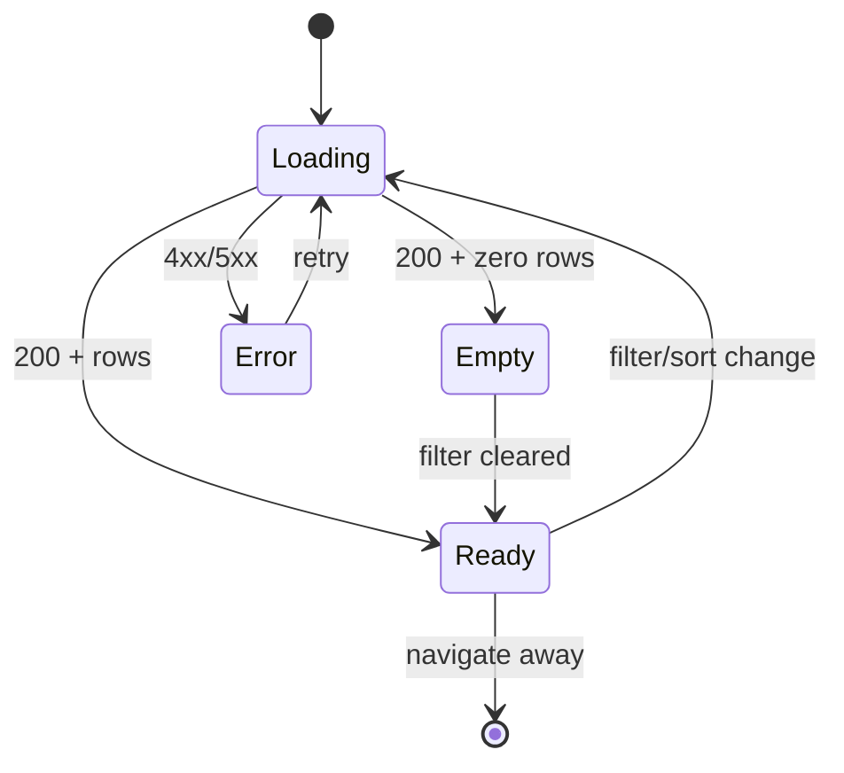

# Admin Dashboard Redesign — User flows

> Companion to [`plan.md`](plan.md) and [`tdd.md`](tdd.md).

## 1. Happy path

| # | User does | UI shows | System does | Telemetry |
|---|-----------|----------|-------------|-----------|
| 1 | Signs in as platform admin, opens `/dashboard` | Hero + quick actions (Manage Schools / Lessons / AP Cert) + program-health section loading skeletons | `GET /api/admin/dashboard/program-health` | `program_health.viewed` |
| 2 | — | Five summary cards: Total, Active, Ahead, Slightly Behind, Behind | Aggregates from response | — |
| 3 | — | Term 2 widget: "Week N · X% elapsed" (default Qld) | `termProgress` from calendar | — |
| 4 | — | Sortable table of all schools with columns populated | Rows from API | — |
| 5 | Clicks **School Name** | Navigates to `/admin/schools?school={slug}` | — | `drilldown` |
| 6 | Clicks **Culture** indicator | Navigates to `/admin/culture-ratings` with school context | — | `drilldown` |
| 7 | Clicks **Lessons Completed %** | Navigates to lesson history for school | — | `drilldown` |
| 8 | Changes **State** filter to NSW | Table refreshes; summary recalculates | Refetch with `state=NSW` | `filtered` |
| 9 | Sorts by **Schedule** descending | Behind schools first | Client or server sort | — |

## 2. Error states

| Trigger | User-visible state | Recovery path | Test ref |
|---------|-------------------|---------------|----------|
| Session expired | Redirect to sign-in | Re-authenticate | flows-only |
| Not admin | "No dashboard available for your role" (existing fallback) | — | existing |
| API 403 | Inline alert: "You don't have access to program health data" | Contact platform admin | tdd #6 |
| API 500 | Alert + Retry button | Retry refetch | tdd #8 |
| Network offline | Toast + cached data if any | Retry when online | tdd #8 |
| Term calendar missing for state | Widget: "Term dates not configured for {state}" | Admin seeds calendar | schedule-engine |
| No schools match filters | Empty table: "No schools match these filters" | Clear filters | tdd #10 |
| Culture data absent | Culture column shows **NA** | — | tdd #4 |

## 3. Alternate flows

### 3.1 Cancel / navigate away

- User filters table then navigates to school — no dirty state; filters not persisted in URL optional (nice-to-have: sync to query string like schools-section).

### 3.2 Retry

- React Query retry on program-health query (2 attempts) + manual Retry on error banner.

### 3.3 Deep link

- `/dashboard` only — no deep link to filtered view in MVP.

### 3.4 Empty state

- Zero schools in system: summary cards show 0; table empty state with link to Manage Schools.

### 3.5 Loading

- Skeleton cards matching 5 summary + table row skeletons; no layout shift when hero already rendered.

### 3.6 Permissions denied

- Non-admin users never see `ProgramHealthSection` — existing role-based dashboard routing unchanged.

### 3.7 Mobile

- Table horizontal scroll or stacked cards on `sm`; filters wrap; tap targets ≥44px.

## 4. State diagram

## 5. Manual smoke (pre-merge)

1. Local admin user → `/dashboard` → verify 5 summary cards and table load.
2. Confirm quick actions show **Manage Schools**, **Manage Lessons**, **Manage AP Cert**.
3. Pick one Active school — verify Schedule column is not NA.
4. Click School Name — lands on school admin.
5. Set State filter — row count changes.
6. Sign in as teacher — program-health block not shown.

## 6. Acceptance summary

- [ ] Happy path §1 steps pass manual smoke
- [ ] Error rows §2 covered by tests or manual notes
- [ ] Schedule-engine child tests green
- [ ] Notion Sprint 3 tasks updated as PRs merge
