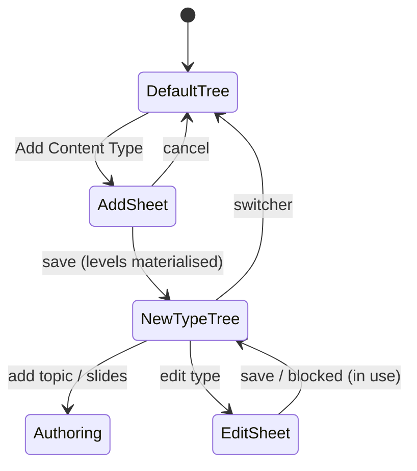

# Content Types - User flows

> Companion to [`plan.md`](plan.md) and [`tdd.md`](tdd.md).

## 1. Happy paths

### 1.1 Admin creates a content type

| # | User does | UI shows | System does |
|---|-----------|----------|-------------|
| 1 | Opens `/admin/content` | Content tree with new **Content Type** switcher (Default selected) | stages fetched with `contentTypeId` |
| 2 | Clicks **Add Content Type** | Sheet: name, level count, dynamic level-name rows (add/remove/reorder) | - |
| 3 | Enters "Thursday Island", 3 levels, names each level | Row count matches level count; save enabled | zod validates count match |
| 4 | Saves | Toast; switcher now lists the new type; tree shows 3 empty levels | POST creates type + materialises 3 stage rows |
| 5 | Selects a level | Empty state: "Add your first topic" | - |

### 1.1b Admin duplicates a type as a template

| # | User does | UI shows | System does |
|---|-----------|----------|-------------|
| 1 | Add Content Type -> **Start from: copy of Default** | Level rows prefill from Default and lock (structure copies exactly; reshape after) | - |
| 2 | Names it "Thursday Island", saves | Progress state, then the new type selected in the switcher with the full cloned tree | transactional deep copy: stages, topics, slides, resource links |
| 3 | Opens Level 2, replaces the culturally adapted topics/slides | Normal editing tools | edits touch only the clone; Default untouched |

### 1.2 Admin authors lessons per type

| # | User does | UI shows | System does |
|---|-----------|----------|-------------|
| 1 | With "Thursday Island" selected, adds a topic to Level 1 | add-topic drawer (unchanged UX) | topic created under that type's stage |
| 2 | Opens topic slides, uploads/authors slides, saves | existing slides drawer | bulk-save resolves topic within the active type |
| 3 | Switches back to Default | Default tree exactly as today | cache keyed per type; no cross-bleed |

### 1.3 Admin adds a school on a type

| # | User does | UI shows | System does |
|---|-----------|----------|-------------|
| 1 | Add New School wizard | New **Content Type** dropdown beside State/Sector, preselected "Default" | - |
| 2 | Picks "Thursday Island", completes wizard | Schools table shows a Content Type column; filterable | school row saved with `content_type_id` |
| 3 | Teacher at that school opens the lesson wizard | Recommendations drawn only from Thursday Island levels | orchestrator filters stages by the school's type |
| 4 | Teacher opens school resources | Only resources for that type's topics (+ globals) | tree endpoint passes `contentTypeId` |

### 1.4 Teacher selects mixed-level classes (M1b, if commissioned)

| # | User does | UI shows | System does |
|---|-----------|----------|-------------|
| 1 | Selects 2+ classes at different levels | Guidance panel, never a blank screen: why the selection cannot be one combined lesson | mixed-level detection on `yearCodes` |
| 2 | Reads options | Three actions: **Back**, **pick one class**, **compromise lesson** | - |
| 3 | Picks compromise lesson | Recommendation step prefilled with the compromise topic | compromise query on recommendations API |

## 2. Error states

| Trigger | User-visible state | Recovery path | Test ref |
|---------|-------------------|---------------|----------|
| Duplicate type name | Inline field error on the sheet | rename | tdd #1, #8 |
| Level names != level count | Save disabled + row-level hint | fix rows | tdd #1, #12 |
| Delete a type in use | Blocking dialog: "in use by N schools / has topics" (409) | reassign schools or archive idea deferred | tdd #4, #9 |
| Delete/demote Default | Action not offered; API rejects | - | tdd #3 |
| Remove a level that has topics | Row locked with in-use warning | move/delete topics first | tdd #5 |
| Type with no published topics | Wizard shows existing "no recommendation" guidance, not a blank | author content | tdd #7 |
| Copy fails mid-way | Error toast; no partial type appears anywhere | retry the duplicate | tdd #5b |
| API 401/403 | existing auth redirects / inline alert | re-auth / request access | tdd #8 |
| Network failure on sheets | Toast + retry, sheet state preserved | retry | component tests |

## 3. Alternate flows

- **Cancel mid-sheet:** closing the Add/Edit sheet discards cleanly; no orphan type without levels (create is transactional)
- **Deep link:** `/admin/content?type={id}` selects the switcher (nice-to-have; falls back to Default on bad id)
- **Legacy clients mid-deploy:** endpoints without `contentTypeId` serve Default, so pre-deploy tabs keep working
- **Mobile/dark:** sheets and guidance panel get the responsive + dark-mode pass before UAT

## 4. State diagram (content-type admin)

## 5. Manual smoke (pre-merge, doubles as Glenn's UAT script)

1. Create "Thursday Island" (3 levels) -> switcher lists it, 3 empty levels render
1b. Duplicate Default -> clone renders the full tree; edit one cloned slide; confirm Default unchanged
2. Author one topic + slides in Level 1 -> saves, reorder persists
3. Switch to Default -> tree identical to production today (regression check)
4. Add a school on the new type -> column + filter show it
5. Sign in as that school's teacher -> wizard recommends only Thursday Island content; resources scoped
6. Existing school (Default) full regression: wizard, slides, resources unchanged
7. (M1b) Select two classes at different levels -> guidance panel with three working actions
8. Attempt to delete the in-use type -> blocked with clear message

## 6. Acceptance summary

- [ ] §1 happy paths pass manual smoke on the Vercel preview (Glenn UAT)
- [ ] §2 error rows covered by tests or manual notes
- [ ] Default-tree regression (smoke #3, #6) explicitly verified
- [ ] Seed script run with Glenn's confirmed Thursday Island data
- [ ] Sign-off recorded + release notes written (PM tasks in the quote)
