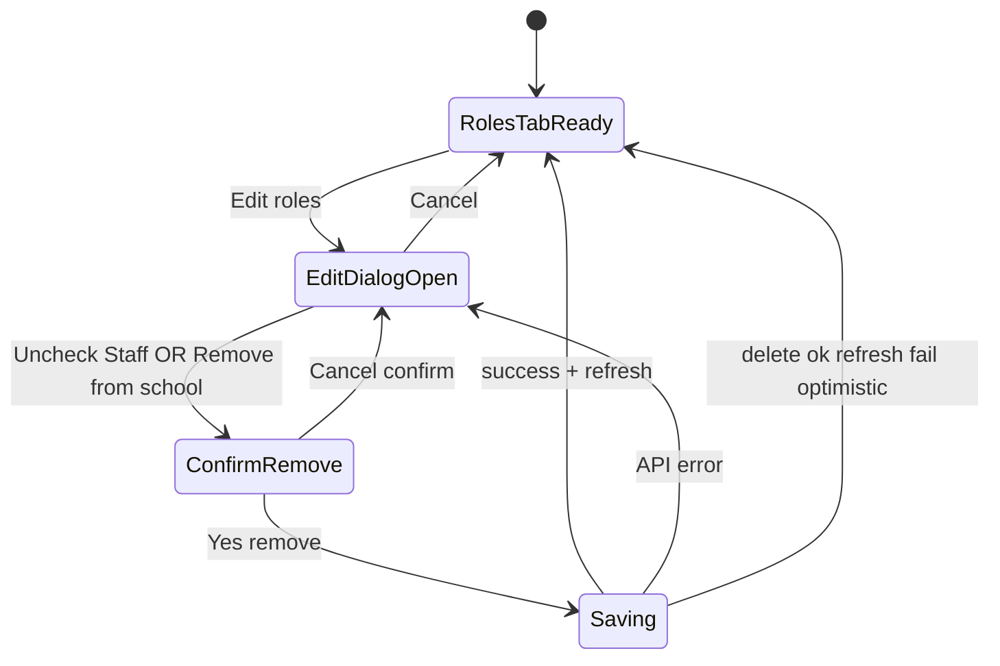

# Roles refresh after school removal — User flows

> Companion to [`plan.md`](plan.md) and [`tdd.md`](tdd.md).

## 1. Happy path

### 1A — Remove from school (footer button)

| # | User does | UI shows | System does | Telemetry |
|---|-----------|----------|-------------|-----------|
| 1 | Admin → Schools → Users → opens user → **Roles** tab | Roles grouped by school | — | n/a |
| 2 | Clicks **Edit** on a school block | **Edit Roles for {School}** dialog | Loads current role checkboxes | — |
| 3 | Clicks **Remove from school** (left footer, destructive text) | **Remove User from School** confirm (`max-w-md`) | — | — |
| 4 | Clicks **Yes, Remove from School** | Confirm shows spinner; then both dialogs close | Deletes all `user_roles` for that `schoolId`; `onUserUpdate` → list refetch + `GET /users/:id` → `setSelectedUser` | n/a |
| 5 | — | **Roles** tab: that school block **gone**; drawer **stays open** | School users table may no longer list user (expected) | — |

### 1B — Remove via uncheck Staff + Save

| # | User does | UI shows | System does |
|---|-----------|----------|-------------|
| 1–2 | Same as 1A steps 1–2 | Edit Roles dialog | — |
| 3 | Unchecks **Staff** | — | — |
| 4 | Clicks **Save Changes** | Same confirm as 1A step 3 | — |
| 5 | Confirms **Yes, Remove from School** | Same as 1A steps 4–5 | Same backend path as footer button |

## 2. Error states

| Trigger | User-visible state | Recovery path | Test ref |
|---------|--------------------|---------------|----------|
| Role delete API fails | Edit dialog stays open; destructive alert if `error` prop set | Fix issue; retry Save or Remove from school | manual |
| Delete succeeds, `userById` fails | Dialogs close; toast: profile could not refresh; Roles tab still correct via optimistic filter | Close/reopen user; or retry navigation | tdd #4, manual |
| User lacks `canMutateTargetUser` | Edit / Remove controls hidden or disabled (existing) | — | existing |
| Network offline on save | Toast / console error; dialogs open | Retry when online | manual |
| Partial delete (one role fails mid-loop) | Error surfaced; do not call success refresh | Retry; admin checks server state | manual (edge) |

## 3. Alternate flows

### 3.1 Cancel — confirmation

- **Trigger:** Cancel on **Remove User from School**.
- **State:** Confirm closes; Edit Roles dialog still open; checkboxes unchanged.
- **Acceptance:** No API calls.

### 3.2 Cancel — edit dialog

- **Trigger:** Cancel on Edit Roles.
- **State:** Dialog closes; Roles tab unchanged.
- **Acceptance:** No API calls.

### 3.3 Drawer stays open after removal (school context)

- **Trigger:** User removed from school currently open in Admin → Schools.
- **Behavior:** URL `id` remains; drawer open on Roles tab; user absent from school users table.
- **Acceptance:** No auto-close; no cleared `id` param.

### 3.4 Admin → Users regression

- **Trigger:** Same edit/remove flow from `/admin/users?id=...&tab=roles` (or roles section).
- **Behavior:** `onUserUpdate` refetches global list **and** `userById`.
- **Acceptance:** School block removed after success (tdd #7).

### 3.5 Empty Roles tab

- **Trigger:** User had only one school; removal succeeds.
- **State:** Existing empty copy (“no roles”) if no platform roles either.
- **Acceptance:** No stale school card.

### 3.6 Loading state

- **Trigger:** Save / confirm in progress.
- **State:** `isSaving` disables actions; spinner on confirm primary button.
- **Acceptance:** No double submit.

### 3.7 Permissions denied

- **Trigger:** Viewer cannot mutate target user.
- **Acceptance:** Same as today; no new bypass.

### 3.8 Add Role dialog unchanged

- **Trigger:** Open **Add Role** (not edit).
- **Acceptance:** No **Remove from school** footer button; add flow unchanged.

### 3.9 Mobile / small viewport

- **Acceptance:** Narrow confirm dialog readable; footer stacks if needed (`flex-col-reverse sm:flex-row` pattern from `@workspace/ui` DialogFooter).

### 3.10 School settings users card

- **Trigger:** User detail from school settings uses same drawer pattern.
- **Acceptance:** Shared `parseUserWithRoles` + refresh after `onUserUpdate`.

## 4. State diagram



## 5. Acceptance summary

- [ ] §1A and §1B manual steps pass on local/staging.
- [ ] §2 error rows verified or documented as acceptable risk.
- [ ] §3.3 drawer behavior confirmed on Admin → Schools URL with `userTab=roles`.
- [ ] §3.4 Admin → Users regression done.
- [ ] Unit tests in [`tdd.md`](tdd.md) §1 green.
- [ ] `pnpm lint:architecture` clean.

## 6. Manual test URL (reference)

```
/admin/schools?school={slug}&tab=users&id={userId}&userTab=roles
```

Example from bug report: Brandon State School, user `334fce4a-595b-4527-9f8f-4cfe2ffb9008`.
