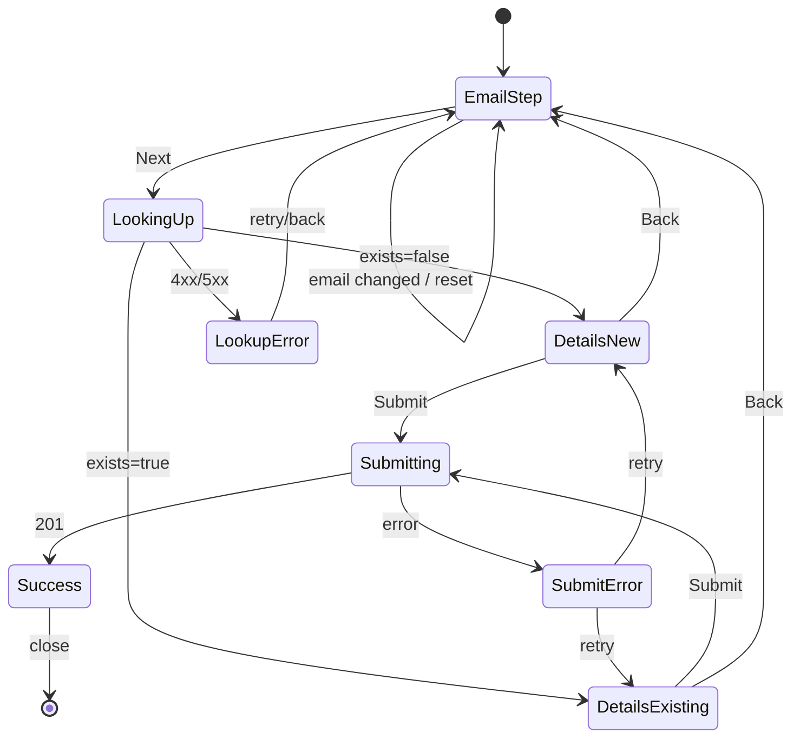

# Add existing user to school — User flows

> Companion to [`plan.md`](plan.md) and [`tdd.md`](tdd.md). Every state listed here must have a corresponding test in `tdd.md`.

## 1. Happy path

### 1a. School admin — new user at school

| # | User does | UI shows | System does |
|---|-----------|----------|-------------|
| 1 | Opens Add User on school Users tab (`?dialog=add-user`) | Step 1: email field only | — |
| 2 | Enters new email, clicks Next | Loading on Next | `GET /api/users/lookup?email=&schoolId=` → `exists: false` |
| 3 | — | Step 2: empty first/last name, role checkboxes (Staff locked on) | — |
| 4 | Fills names, selects AP Teacher / School Admin, submits | Spinner on submit | `POST /api/users/new` creates auth user + profile, assigns `SCHOOL_STAFF` + optional roles |
| 5 | — | Success state, dialog closes, table refreshes | User row visible with roles |

### 1b. School admin — existing user not yet at school

| # | User does | UI shows | System does |
|---|-----------|----------|-------------|
| 1 | Enters existing email (e.g. teacher at another school), Next | Loading | Lookup → `exists: true`, names prefilled |
| 2 | — | Step 2: names **disabled**, prefilled from profile | — |
| 3 | Selects roles, submits | Success | No `createUser` failure; assigns roles at this `schoolId` (add-only) |

### 1c. School admin — user already at this school

| # | User does | UI shows | System does |
|---|-----------|----------|-------------|
| 1 | Enters email already on school roster, Next | Step 2: names disabled + roles **pre-checked** to current school roles | Lookup returns `schoolRoleKeys` |
| 2 | Optionally checks additional role, submits | Success (even if no new roles) | Idempotent assign; no duplicate rows |

### 1d. Platform admin — AddUserSheet

Same email-first pattern on step 1; subsequent steps retain user type → school/role → confirm. Remove blocking “user already exists” panel; use prefill + continue (assign to another school / edit roles drawer optional as secondary actions only if still needed).

### 1e. CSV / bulk import

| # | User does | UI shows | System does |
|---|-----------|----------|-------------|
| 1 | Uploads CSV with mixed new/existing emails | Progress UI | Each row: resolver finds or creates user, assigns roles; no row failure for `email_exists` |

## 2. Error states

| Trigger | User-visible state | Recovery path | Test ref |
|---------|--------------------|---------------|----------|
| Invalid email format (client) | Inline under email; Next disabled | Fix email | manual |
| Lookup 401 | Redirect / sign-in | Re-authenticate | tdd #9 |
| Lookup 403 | Toast: no permission | Cancel | tdd #8 |
| Lookup network failure | Toast + retry on Next | Retry | manual |
| Lookup 500 | Toast with generic message | Retry; contact support if persists | tdd #5–7 |
| Submit 403 | Toast: unauthorized | Cancel | tdd #10 |
| Submit validation 400 | Inline / toast from API message | Fix form | tdd #10 |
| Submit 500 (non-email_exists) | Toast with error message | Retry submit | tdd #10 |
| ~~Duplicate email / email_exists~~ | **Removed** — treated as success path 1b | — | tdd #10 |
| Role assign partial failure | Warning: user added, some roles failed | Assign roles via user drawer | existing behavior |
| Missing SCHOOL_STAFF role config | Error: contact support | — | manual |

## 3. Alternate flows

### 3.1 Cancel

- **Trigger:** Close dialog or Cancel.
- **State:** Discard form; remove `dialog=add-user` from URL.
- **Acceptance:** No user/role changes.

### 3.2 Retry

- **Trigger:** Failed lookup or submit.
- **State:** User taps Next or Submit again.
- **Acceptance:** Idempotent; no duplicate roles.

### 3.3 Partial save / drafts

- n/a — no drafts.

### 3.4 Deep link entry

- **URL:** `/admin/schools?school={slug}&tab=users&dialog=add-user`
- **Behavior:** Dialog opens on step 1 (email).
- **Acceptance:** Works when school loaded in drawer.

### 3.5 Empty state

- n/a — add user is always from populated school context.

### 3.6 Loading state

- **Lookup:** Next button shows spinner; fields disabled briefly.
- **Submit:** Primary button loading.
- **Acceptance:** No double-submit.

### 3.7 Permissions denied

- School admin without `school:manage-school-user-roles` does not see Add User (existing gate).
- Lookup returns 403 if `schoolId` mismatch.

### 3.8 Offline

- **UI:** Standard fetch error toast.
- **Acceptance:** No crash.

### 3.9 Email change after lookup

- **Trigger:** User edits email on step 1 or goes Back from step 2.
- **Behavior:** Clear names, roles, `exists` flag; require Next → lookup again.
- **Acceptance:** Step 2 never shows stale data from previous email.

### 3.10 Mobile / small viewport

- Dialog `max-w-md`; stacked fields.
- **Acceptance:** Same flow as desktop.

## 4. State diagram

## 5. Acceptance summary

- [ ] Happy paths §1a–1e verified (manual or automated).
- [ ] Error rows §2 covered by tests or manual QA.
- [ ] Alt flows §3.1, 3.2, 3.9 verified.
- [ ] State diagram matches implementation.
- [ ] No telemetry required for MVP.
