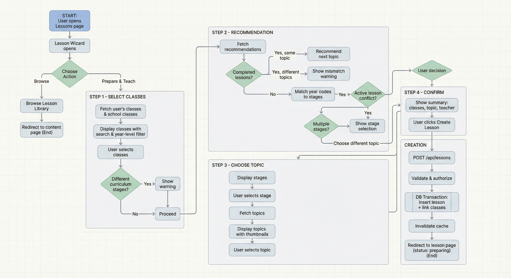

# Lesson Creation Flow

## Flowchart

## Step-by-step Summary

### 1. Initial Choice

The user opens the Lesson Wizard and chooses between browsing the lesson library or preparing a new lesson.

### 2. Select Classes

The user picks one or more classes from their school. Classes are split into "My Classes" and "All Classes" with search and year-level filtering. A warning is shown if the selected classes span different curriculum stages.

### 3. Recommendation

The system fetches a smart recommendation based on the selected classes:

- **Classes have completed lessons on the same topic** -- recommend the next incomplete topic in that stage.
- **Classes have completed lessons on different topics** -- show a topic mismatch warning.
- **No completed lessons** -- match class year codes to curriculum stages and recommend the first topic from the matched stage. If multiple stages are detected, the user is prompted to select one.

The system also checks for active lesson conflicts (e.g., an in-progress lesson sharing the same classes).

### 4. Choose Topic (optional)

If the user accepts the recommendation, this step is skipped. Otherwise, they browse curriculum stages and select a topic manually. Topics are displayed with thumbnails, slide counts, and recommended badges.

### 5. Confirm

A summary screen shows the selected classes, topic, and teacher name. The user clicks "Create Lesson" to proceed.

### 6. Lesson Creation

A `POST /api/lessons` call triggers:

1. Server-side input validation.
2. Authorization checks (feature access and role-based).
3. A database transaction that inserts the lesson record and links it to the selected classes via the `lessonClasses` junction table.

The lesson is created with status `preparing`.

### 7. Redirect

The user is redirected to the new lesson's page at `/schools/{schoolSlug}/lessons/{lessonId}`.

## Key Files

### Frontend Components

| File | Role |
| --- | --- |
| `components/organisms/lesson-wizard.tsx` | Main wizard orchestrator |
| `components/organisms/lesson-wizard-classes.tsx` | Step 1 -- Class selection |
| `components/organisms/lesson-wizard-recommendation.tsx` | Step 2 -- Recommendations |
| `components/organisms/lesson-wizard-topic.tsx` | Step 3 -- Topic selection |
| `components/organisms/lesson-wizard-confirm.tsx` | Step 4 -- Confirmation |
| `app/(main)/schools/[school_id]/lessons/page.tsx` | Lessons list page (triggers wizard) |

### API Layer

| File | Role |
| --- | --- |
| `app/api/lessons/route.ts` | Create lesson endpoint |
| `app/api/lessons/recommendations/route.ts` | Recommendations endpoint |
| `entities/lessons/api/endpoints.ts` | Client-side API wrapper |

### Server Layer

| File | Role |
| --- | --- |
| `server/lessons/lessons.service.ts` | Business logic |
| `server/lessons/lessons.repo.ts` | Database operations |
| `server/lessons/lessons.validators.ts` | Input validation |

### Data Model

| File | Role |
| --- | --- |
| `drizzle/schema.ts` | Database schema (lessons, lessonClasses tables) |
| `drizzle/relations.ts` | Drizzle ORM relations |
| `types/lesson-wizard.ts` | Wizard-specific TypeScript types |
