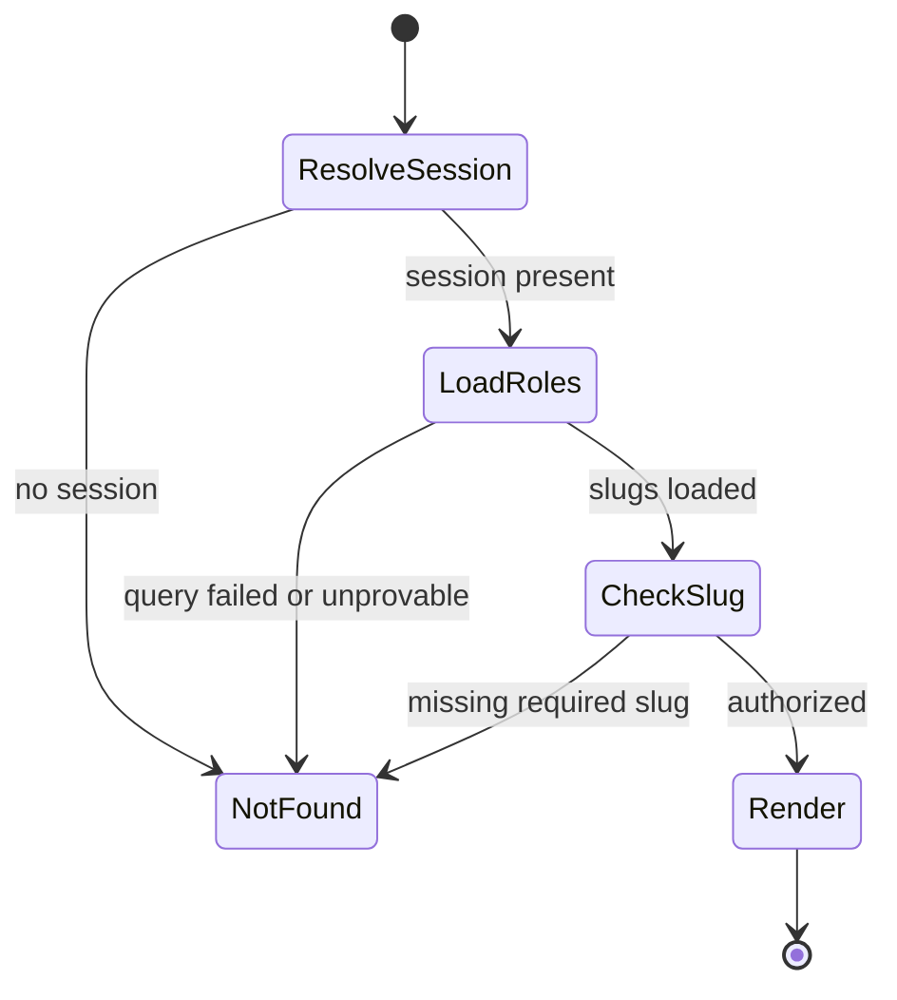

# Admin panel + RBAC — User flows

> Companion to [`plan.md`](plan.md) and [`tdd.md`](tdd.md). Admin routes use **fail-closed `notFound()`** instead of visible “access denied” copy (**anti-enumeration**).

## 1. Happy path

| # | User does | UI shows | System does | Telemetry |
|---|-----------|----------|-------------|-----------|
| 1 | Opens `/admin` while signed in with **≥1 admin capability** (e.g. `sandbox.access`) | Admin home with **only** modules they have | Server loads session + role slugs; renders cards | default page view if Analytics on |
| 2 | Clicks **Sandbox** | Sandbox index (`/admin/sandbox`) listing children | Asserts `sandbox.access`; lists registry | — |
| 3 | Opens `/admin/sandbox/pug-system?scenario=all-accept&step=0` | PUG sandbox with dock | Same gate; child SC loads | — |
| 4 | Uses dock / steps | Scenario updates | In-memory sandbox state only | optional `console.debug` (dev) |

## 2. Error / denial states (all user-visible: **404**)

Every failure to **prove** required access maps to **`notFound()`** in MVP. Operators use **logs** with stable codes (see [`tdd.md`](tdd.md) #4).

| Trigger | User-visible state | Recovery | Telemetry | Test ref |
|---------|--------------------|----------|-----------|----------|
| Not signed in | **404** | Sign in does not auto-reveal admin; user uses normal app login then deep-link again | default / none specific | flows §3.4 |
| Signed in, missing `sandbox.access` for `/admin/sandbox/**` | **404** | Operator grants role + refreshes | none specific | tdd #1 |
| Signed in, zero admin roles, visits `/admin` | **404** | Grant at least one admin role | none specific | tdd #1 |
| Role query throws / DB unavailable | **404** | Ops checks logs `RBAC_ROLE_QUERY_FAILED` (or chosen code); fix DB | none specific | plan §8 |
| Deep link to sandbox child without role | **404** | Same as missing role | none specific | tdd #3 context |

> **Intentionally not used on `/admin*`:** permission toasts, 403 pages, or “contact admin” copy (leaks existence).

## 3. Alternate flows

### 3.1 Deep link (`/admin/sandbox/...`)

- **Behavior:** Same server gate as navigation from `/admin`; **404** if unauthorized.
- **Acceptance:** No client-only redirect that exposes admin strings in the address bar to anon users.

### 3.2 Legacy `/sandbox/*`

- **Behavior:** **Redirect** (301/308) or middleware rewrite to `/admin/sandbox/*` for one release if implemented; otherwise **404** at old paths after cutover.
- **Acceptance:** Bookmarks recover without 404 when redirect is enabled.

### 3.3 Partial admin (has `news.editor`, not `sandbox.access`)

- **Behavior:** `/admin` shows **News** entry when that feature ships; **Sandbox** card absent; direct `/admin/sandbox` → **404**.
- **Acceptance:** Matches Bullyproof-style filtered nav.

### 3.4 Loading

- **UI:** Suspense fallback on admin layout (skeleton or null) **without** rendering forbidden module chrome before role resolution completes.
- **Acceptance:** No flash of sandbox dock for unauthorized users.

### 3.5 Offline / mobile

- **Same as rest of app:** no special admin PWA behavior in MVP; 404 rules unchanged.

## 4. State diagram (gate)

## 5. Acceptance summary

- [ ] `/admin` and `/admin/sandbox/**` enforce RBAC; env flag removed.
- [ ] MCP **`apply_migration`** applied for `roles` / `user_roles` + seeds; Drizzle journal matches **`list_migrations`**.
- [ ] Vitest items in [`tdd.md`](tdd.md) §1 #1–4 green.
- [ ] [`../sandbox/plan.md`](../sandbox/plan.md) paths and cross-links updated in implementation PR.
- [ ] `pnpm lint:architecture` clean.
