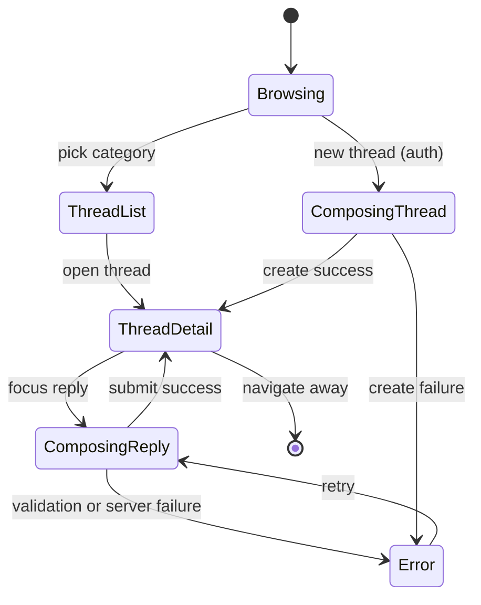

# Forums — User flows

> Companion to [`plan.md`](plan.md) and [`tdd.md`](tdd.md). MVP telemetry focuses on **successful creates**; other telemetry rows are optional unless instrumented.

## 1. Happy path

### 1.1 Anonymous reader

| # | User does | UI shows | System does | Telemetry |
|---|-----------|----------|-------------|-----------|
| 1 | Opens `/forums` | Category cards/grid (seeded categories) | RSC loads categories | — |
| 2 | Clicks a category (e.g. **Looking for team**) | Thread list (title, author snippet, reply count, updated time) | Drizzle query, pagination if many | — |
| 3 | Clicks a thread | Original post + nested replies (Reddit-style indent) | Load thread by `(category_slug, thread_slug)`; load replies; `buildReplyTree` | — |

### 1.2 Authenticated — new thread

| # | User does | UI shows | System does | Telemetry |
|---|-----------|----------|-------------|-----------|
| 1 | From category list, clicks **New thread** (or equivalent) while signed in | Composer: title, body, optional tags | No persist yet | — |
| 2 | Fills required fields, submits | Submit loading state | `createForumThreadAction` validates, inserts thread + junction tags, `revalidatePath` | `forum_thread_created` |
| 3 | Success | Redirect or in-place navigation to **thread detail URL** | — | — |

### 1.3 Authenticated — reply and nested reply

| # | User does | UI shows | System does | Telemetry |
|---|-----------|----------|-------------|-----------|
| 1 | On thread page, focuses **reply** on a top-level comment | Inline composer | — | — |
| 2 | Submits reply | New reply appears in tree | `createForumReplyAction` with `parent_reply_id` null | `forum_reply_created` |
| 3 | Clicks **Reply** under another user’s comment, submits | Indented child under that comment | `createForumReplyAction` with `parent_reply_id` set; depth check | `forum_reply_created` |

### 1.4 Manual smoke (MVP acceptance)

1. Incognito: `/forums` → pick **general** → open any thread → confirm nested layout readable on narrow width.
2. Signed in: post thread in **feature-requests** with one tag → appears in list → add nested reply → refresh → tree stable.
3. Delete own reply → disappears for anonymous reader (soft-delete policy).

## 2. Error states

Server actions return **`ok: false`** with **`code`** + **`message`** unless noted.

| Trigger | User-visible state | Recovery path | Telemetry | Test ref |
|---------|--------------------|---------------|-----------|----------|
| Required title/body missing | Inline / banner errors; submit disabled where client validates | Fix fields | — | tdd #4–5 |
| Body/title over max length | Inline error | Shorten text | — | tdd #4–5 |
| Not signed in (write) | Redirect to auth with `returnTo` | Sign in | — | flows-only |
| Session expired mid-submit | Error toast + sign-in CTA | Re-auth | — | flows-only |
| `UNAUTHORIZED` / no session on server | Same | Sign in | — | tdd #7 |
| `FORBIDDEN` / not owner on edit/delete | Toast + no mutation | — | — | tdd #7 |
| `CATEGORY_NOT_FOUND` | Toast; stay on safe page | Pick another category | — | tdd #4 |
| `THREAD_SLUG_TAKEN` or unique violation | Inline message suggesting edit title | Change title/slug path | — | tdd #6 |
| `PARENT_REPLY_INVALID` (wrong thread / missing parent) | Toast | Refresh thread | — | tdd #3–5 |
| `REPLY_DEPTH_EXCEEDED` | Toast explaining max depth | Reply higher in tree | — | tdd #3 |
| `THREAD_LOCKED` (future) | Toast | — | — | deferred |
| Optimistic / race on slug | Server returns conflict code | User retries with new title | — | tdd #6–7 |
| DB / unknown server error | Toast “Something went wrong” + generic code id in dev | Retry | optional `track()` failure bucket | tdd #7 |

## 3. Alternate flows

### 3.1 Cancel

- **Trigger:** User closes composer or navigates back before submit.
- **State:** No row written.
- **Acceptance:** No partial thread/reply in DB.

### 3.2 Retry

- **Trigger:** Transient failure after submit.
- **State:** User clicks submit again (no idempotency key required for MVP unless duplicate rows observed — **optional** client-generated idempotency key documented in implementation).
- **Acceptance:** No duplicate thread if server already succeeded (prefer **redirect** on success to make double-submit benign).

### 3.3 Partial save / drafts

- **MVP:** **No** auto-save drafts for threads/replies (same posture as news manual save). Optional localStorage draft follow-up.

### 3.4 Deep link entry

- **MVP URLs:** `/forums`, `/forums/[categorySlug]`, `/forums/[categorySlug]/[threadSlug]` only.
- **Behavior:** Invalid category → **404**; unknown thread slug in category → **404**; deleted thread → **404** or “removed” page (pick one at implementation; document).
- **Acceptance:** No infinite redirects.

### 3.5 Reply permalink (deferred)

- Phase 2: `?reply=<uuid>` scroll + highlight — not MVP.

### 3.6 Empty state

- **Category with zero threads:** Empty illustration + **New thread** CTA (if signed in) or sign-in CTA (if anonymous).
- **Acceptance:** Matches [`plan.md`](plan.md) seed strategy (categories never empty of *boards*, threads may be empty).

### 3.7 Loading state

- **UI:** Skeletons for list and thread shell.
- **Acceptance:** Layout matches final chrome to reduce CLS.

### 3.8 Permissions denied

- **MVP:** Only **ownership** errors for mutations; no role-gated boards unless added later.
- **Acceptance:** Action returns `FORBIDDEN` without leaking other users’ PII.

### 3.9 Offline

- **UI:** Browser-native failed fetch on action → toast “Network error”.
- **Acceptance:** No uncaught throws from actions.

### 3.10 Mobile / small viewport

- **Adjustments:** Reply tree uses horizontal indent with **max indent cap** in CSS (e.g. stop indent after depth N visually) to avoid unusable narrow columns; full-width composer.
- **Acceptance:** No forced horizontal page scroll for default content widths.

## 4. State diagram

## 5. Acceptance summary

- [ ] §1.1–1.3 happy paths work in dev with seeded categories.
- [ ] §1.4 manual smoke completed before calling MVP done.
- [ ] §2 error codes covered by unit tests where pure (`tdd.md` §1).
- [ ] §3 alternate flows either implemented or explicitly “deferred” with no broken UX.
- [ ] `forum_thread_created` / `forum_reply_created` fire on success with non-PII payloads ([`plan.md`](plan.md) §9).
