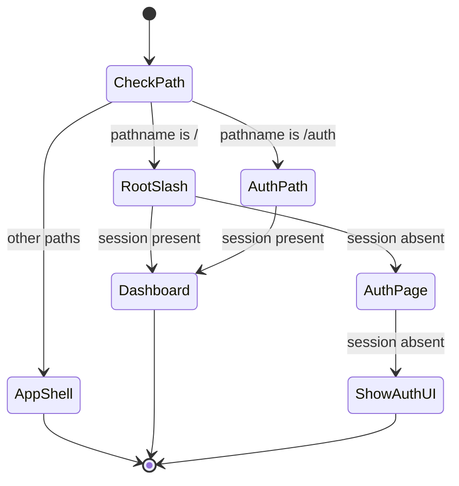

# Header breadcrumb alignment — User flows

> Companion to [`plan.md`](plan.md) and [`tdd.md`](tdd.md).

## 1. Happy path

| # | User does | UI shows | System does | Telemetry |
|---|-----------|----------|-------------|-------------|
| 1 | Opens `/` while **signed in** | Brief transition; lands on **`/dashboard`** | Middleware (or fallback page) redirects | — |
| 2 | Opens `/` while **signed out** | **`/auth`** sign-in hub | Middleware redirects to `/auth` | — |
| 3 | On **`/dashboard`**, views header | **Star** (link to `/`) + separator + **“Dashboard”** crumb (current page) | Client `usePathname` renders breadcrumb | — |
| 4 | Navigates to **`/news`** | Star (link to `/`) + separator + **News** crumb with **icon + label** (≤3 segments) | Path updates; breadcrumb re-renders | — |
| 5 | Deep link to a **≥4**-segment path under a mapped main route | Star + crumb where first main-nav segment shows **icon only** + further **text** crumbs | Pure model applies threshold | — |
| 6 | Clicks a **non-last** crumb | Navigates to that prefix URL | Client navigation | — |
| 7 | Opens **`/auth`** while **signed in** | Redirect to **`/dashboard`** | Middleware (or server guard) | — |

## 2. Error states

| Trigger | User-visible state | Recovery path | Telemetry | Test ref |
|---------|--------------------|---------------|-----------|----------|
| `getUser` throws in middleware (network / Supabase down) | **`/`** does not infinite-redirect; user may see **`app/page.tsx`** fallback or next response as documented | Restore Supabase; retry | — | Manual §5 |
| `NEXT_PUBLIC_SUPABASE_*` unset in dev | Console warning (existing); redirect for **`/`** may be skipped | Set env; hard refresh | — | Manual §5 |
| Malformed pathname (unexpected) | Breadcrumb still renders safe labels | None | — | tdd #7 |
| Missing icon map entry for segment | Text-only crumb via `formatSegment` | — | — | tdd #6 |

## 3. Alternate flows

### 3.1 Deep link entry

- User opens e.g. `/match/123/veto` directly.
- **Behavior:** Breadcrumb builds from pathname; only **first main-nav** segment gets icon rules; `123` / `veto` are text segments.
- **Acceptance:** No client-only redirect loop; last segment is current page.

### 3.2 Mobile / small viewport

- **Behavior:** Same DOM; rely on `@workspace/ui` breadcrumb overflow/ellipsis if available.
- **Acceptance:** Header does not break sidebar trigger layout; tap targets for star link meet existing header standards.

### 3.3 Signed-in bookmark to `/auth`

- Covered in happy path #7 — immediate redirect to `/dashboard`.

### 3.4 Offline

- **Behavior:** Cached shell may show stale path; no special offline banner required in MVP.
- **Acceptance:** No uncaught throws when revisiting app offline.

## 4. State diagram

## 5. Manual verification — middleware / `/` (before merge)

- [ ] Signed **out**: `GET /` → **302/307** to `/auth` (or final URL `/auth`).
- [ ] Signed **in**: `GET /` → redirect to **`/dashboard`**.
- [ ] Signed **in**: `GET /auth` → redirect to **`/dashboard`**.
- [ ] Signed **out**: `GET /auth` → **200** with sign-in CTAs.
- [ ] Env **unset** (local): no redirect loop; fallback documented behavior.
- [ ] **`pnpm lint:architecture`** clean at repo root.

## 6. Acceptance summary

- [ ] Header shows supersolt-style breadcrumb with **spinning star** root per [`plan.md`](plan.md).
- [ ] Sidebar nav icons/URLs match shared module.
- [ ] Unit tests in [`tdd.md`](tdd.md) §1 pass.
- [ ] Manual matrix §5 complete.
- [ ] No telemetry requirement for MVP.
