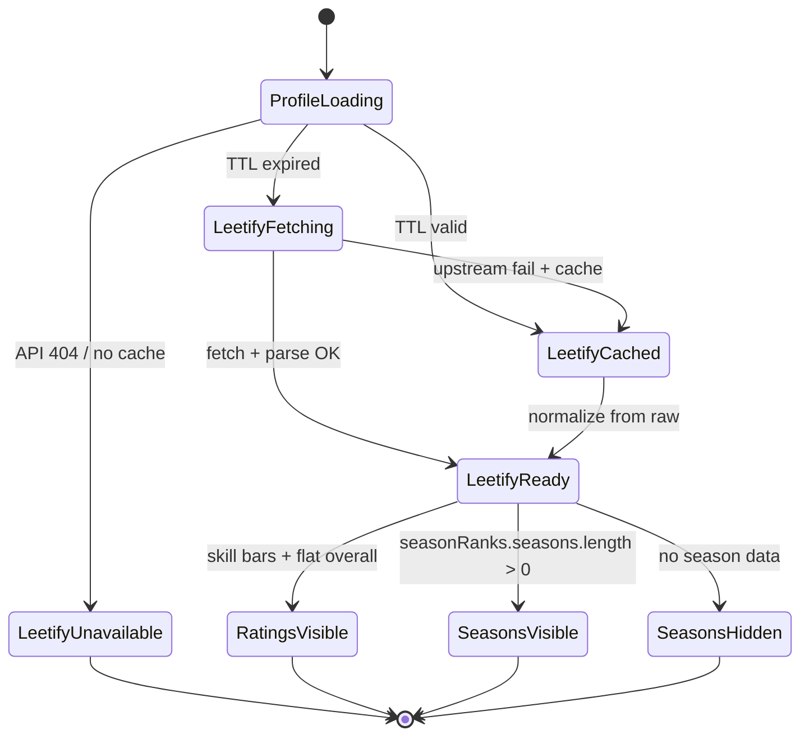

# Leetify snapshot ratings & season history — User flows

> Companion to [`plan.md`](plan.md) and [`tdd.md`](tdd.md).

## 1. Happy path

| # | User does | UI shows | System does | Telemetry |
|---|-----------|----------|-------------|-----------|
| 1 | Opens `/players/<steamid64>` | Profile header + loading skeletons on Leetify sections | Page mounts; RQ fetches `/api/leetify/profile/[id]` | — |
| 2 | — | `LeetifyRatingsCard` animates skill bars; overall rating shows flat Leetify % (not CT+T sum) | Route returns cached snapshot or fetches Leetify v3 API; `archiveLeetify` parses flat rating + seasons; appends row | — |
| 3 | — | `LeetifySeasonHistoryCard` grid: season cards (Beta → S4) with match count, win %, Premier min/max badges, Competitive numeric min/max | Response includes `seasonRanks` from column or re-derived from `raw` | — |
| 4 | Clicks “View on Leetify” | External tab to leetify.com profile | No server action | — |

## 2. Error states

| Trigger | User-visible state | Recovery path | Telemetry | Test ref |
|---------|-------------------|---------------|-----------|----------|
| Invalid steamid64 in API URL | 400 JSON error | Fix URL | — | route validation |
| Leetify profile never fetched / 404 | Ratings card: “Leetify data unavailable”; season card hidden | Player may not have Leetify account | — | tdd #6 |
| Leetify API down, stale cache exists | Cached ratings + seasons (re-derived from `raw` if needed) | Auto-refresh after 6h TTL | — | tdd #8 |
| Leetify API down, no cache | 404 on route; cards unavailable | Retry on revisit or manual refresh | — | flows §3.2 |
| `games[]` empty in raw | Skill ratings from `recentGameRatings`; season card hidden | — | — | tdd #6 |
| Season with zero CS2 matches | Season card omitted from grid | — | — | tdd #5 |
| Premier games absent | `premierRating` null; season rows may show matches/WR without Premier min/max | — | — | tdd #6 |
| Manual refresh rate limited | 429 from refresh route (existing) | Wait `retryAfterSeconds` | — | parent feature |
| Parse partial failure | Archive still stores `raw`; nullable parsed columns | Next force fetch re-parses | — | tdd #6 |

## 3. Alternate flows

### 3.1 Stale cache (< 6h TTL)

- **Trigger:** Profile visit within Leetify TTL.
- **Behavior:** Serve latest snapshot row; if `premier_rating` / `season_ranks` null (pre-migration row), re-derive from `raw` in `normalizeLeetify` without upstream fetch.
- **Acceptance:** Season grid appears for profiles with archived `raw` containing `games[]` even before manual refresh.

### 3.2 Manual refresh

- **Trigger:** `POST /api/players/[id]/refresh` (existing, rate-limited).
- **Behavior:** `archiveLeetify({ force: true })` fetches Leetify, inserts new snapshot with all parsed columns.
- **Acceptance:** Newest `fetched_at` row has non-null columns when `games[]` present.

### 3.3 Cancel

N/A — read-only profile panels.

### 3.4 Retry

- **Trigger:** User reloads page after transient Leetify failure.
- **Behavior:** Route retries fetch if stale/missing; otherwise serves cache.
- **Acceptance:** No duplicate user action required beyond reload.

### 3.5 Deep link

- **Route:** `/players/<steamid64>` unchanged.
- **Acceptance:** Leetify panels load from API sub-resource; no new routes.

### 3.6 Empty state

- **UI:** Season history section not rendered when `seasonRanks` null or `seasons.length === 0`.
- **Acceptance:** No empty grid placeholder box.

### 3.7 Loading state

- **UI:** Existing RQ loading on cards; season grid skeleton matches card grid layout.
- **Acceptance:** No layout shift when data arrives.

### 3.8 Permissions denied

N/A — public read-only data.

### 3.9 Offline

- **UI:** RQ error state on cards if fetch fails and no cache.
- **Acceptance:** Cached React Query data may still show prior visit data.

### 3.10 Mobile / small viewport

- **Breakpoint:** `sm` / `md`
- **Adjustments:** Season cards stack 1 column on mobile; 2–3 columns on desktop (mirrors Leetify screenshot).
- **Acceptance:** Premier badges readable; no horizontal scroll.

## 4. State diagram

## 5. Manual smoke checklist

- [ ] Reference profile overall Leetify rating matches ~1.02% (not CT+T sum).
- [ ] Season Four card shows ~260 matches, ~66% win rate, Premier 25,404–29,145.
- [ ] No FACEIT row in season cards.
- [ ] PlayerHeader Premier badge still placeholder (unchanged).
- [ ] After refresh, DB latest row has `premier_rating` and `season_ranks` populated.

## 6. Acceptance summary

Feature is done when:

- [ ] Happy path §1 verified via manual smoke §5.
- [ ] Error rows §2 covered by unit tests tdd #1–8, #10–11.
- [ ] Alternate flows §3.1–3.2, 3.5–3.6, 3.10 documented and verified.
- [ ] Migration `0023` applied locally + remotely; types regenerated.
- [ ] `pnpm lint:architecture` clean.
