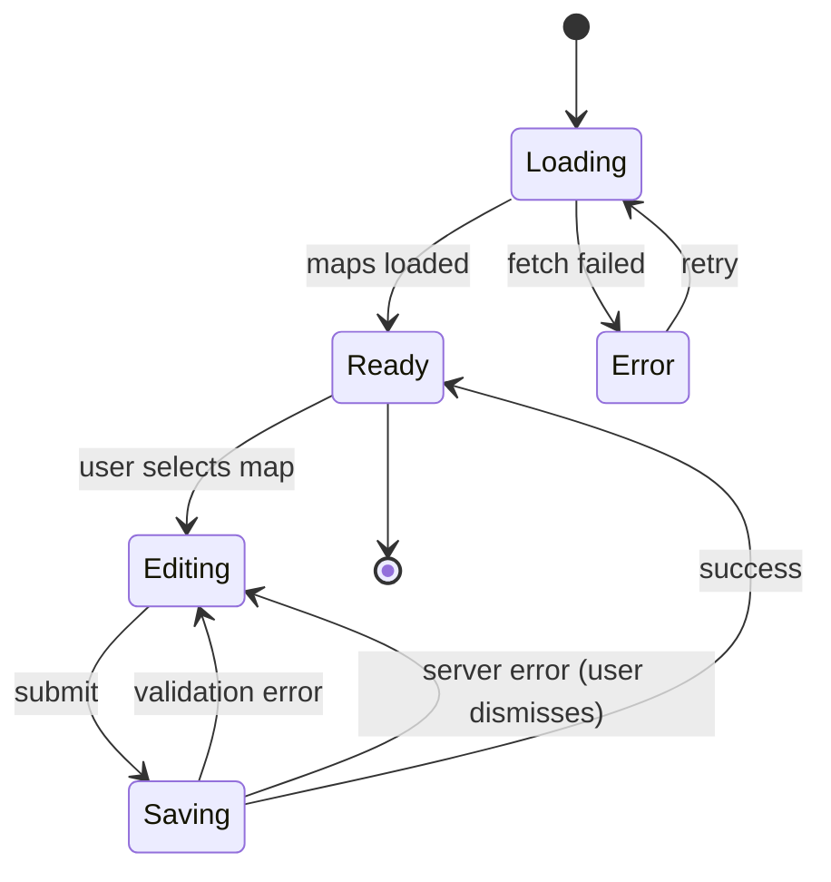

# Media storage, canonical maps, and utility admin — User flows

> Companion to [`plan.md`](plan.md) and [`tdd.md`](tdd.md).

## 1. Happy path — utility admin (`/admin/utility`)

**Pre:** User is signed in and has **`developer`** role (`roles.slug = 'developer'` via `user_roles`).

| # | User does | UI shows | System does | Telemetry |
|---|-----------|----------|-------------|-------------|
| 1 | Opens `/admin/utility` | Map list (or empty) + “Add / edit” entry | Server loads `maps` (and `map_pools` for pickers) with Drizzle | — |
| 2 | Selects a map, edits `display_name`, `pool`, `radar_image_url`, `is_active`, `sort_order` | Form fields populated | No-op until save | — |
| 3 | Clicks **Save** | Submit disabled / spinner | `PATCH` (or Server Action) validates, updates row, sets **`updated_at`** | `utility_admin_map_upsert` `{ ok: true, map_slug, pool_slug }` |
| 4 | Uploads radar asset via “Upload” (if present) | Progress or success | Handler mints signed URL; client `PUT`s to Storage; optional second call to persist URL on `maps` | `utility_admin_storage_sign` then upsert event |
| 5 | Returns to list | Updated values visible | Revalidate path or refetch | — |

**Manual smoke (until E2E):** run through steps 1–3 on staging after migration; confirm public **`/utility/[mapSlug]`** still resolves for an active map.

## 2. Error states

Maps to tests in [`tdd.md`](tdd.md) §1.

| Trigger | User-visible state | Recovery | Telemetry | Test ref |
|---------|--------------------|----------|-----------|----------|
| Required field missing | Inline error, submit disabled | Fix field | — | tdd #3 |
| Invalid URL / slug format | Inline error | Fix field | `utility_admin_map_upsert` `{ ok: false, code: 'validation' }` | tdd #3 |
| Not signed in | Redirect to auth or 404 per admin convention | Sign in | — | tdd #4 |
| Signed in, not **developer** | **404** on `/admin/utility` (avoid enumerating admin) | — | — | tdd #5 |
| RLS / 403 on save | Toast: not allowed | — | `utility_admin_map_upsert` `{ ok: false, code: 'forbidden' }` | tdd #5 |
| Network failure on load | Banner + **Retry** | Retry fetch | — | flows-only |
| 5xx on save | Toast + support copy; **no** automatic double-submit | User retries save after fix | `utility_admin_map_upsert` `{ ok: false, code: 'server' }` | tdd #5 |
| Signed URL mint succeeds but **PUT** to Storage fails | Inline message on upload widget | Re-request signed URL, retry upload | `utility_admin_storage_sign` + client-visible error | manual |
| Upload exceeds size / wrong MIME | Inline error before upload | Pick valid file | — | tdd #2 |

**Concurrency (v1):** **Last write wins** — no compare-and-set; two admins may overwrite each other; document only.

## 3. Alternate flows

### 3.1 Cancel

- **Trigger:** Navigate away with dirty form.
- **Behavior:** Optional browser **`beforeunload`** or in-app “Discard changes?” if dirty — MVP may skip dialog if low risk; if skipped, document as known gap.
- **Acceptance:** No partial server write until **Save**.

### 3.2 Retry

- **Trigger:** Failed **load** of map list.
- **Behavior:** **Retry** button re-fetches — safe.
- **Writes:** User explicitly clicks **Save** again (not auto-retry).

### 3.3 Partial save / drafts

- **Not in MVP** — single save to row; no autosave draft row.

### 3.4 Deep link

- **Example:** `/admin/utility?map=mirage` (optional).
- **Behavior:** If query present, pre-select map after load; invalid slug → ignore query, show list.
- **Acceptance:** No infinite redirect.

### 3.5 Empty state

- **No maps** after migration: show empty table + copy “Seed maps via SQL or create first row” (implementation copy).
- **Acceptance:** Page does not error.

### 3.6 Loading

- Skeleton or spinner for list + form shell.
- **Acceptance:** No layout jump on common breakpoints.

### 3.7 Permissions denied

- Non-developer hitting URL: **404** (recommended) or read-only shell — **pick 404** for MVP (**[`plan.md`](plan.md)**).

### 3.8 Offline

- **Banner** “You’re offline” if detected; block **Save** and upload.
- **Acceptance:** No uncaught throw.

### 3.9 Mobile

- Form stacks vertically; tap targets per `@workspace/ui` defaults.
- **Acceptance:** Usable at `sm` width for emergency edits.

## 4. State diagram

## 5. Acceptance summary

- [ ] Happy path §1 passes manual smoke on staging.
- [ ] Every §2 row has a mapped test in **`tdd.md`** or explicit “manual” exception.
- [ ] §3 alt flows documented; LWW documented for concurrent admin.
- [ ] Telemetry events match **`plan.md`** §9 and fire only from **server** code.
