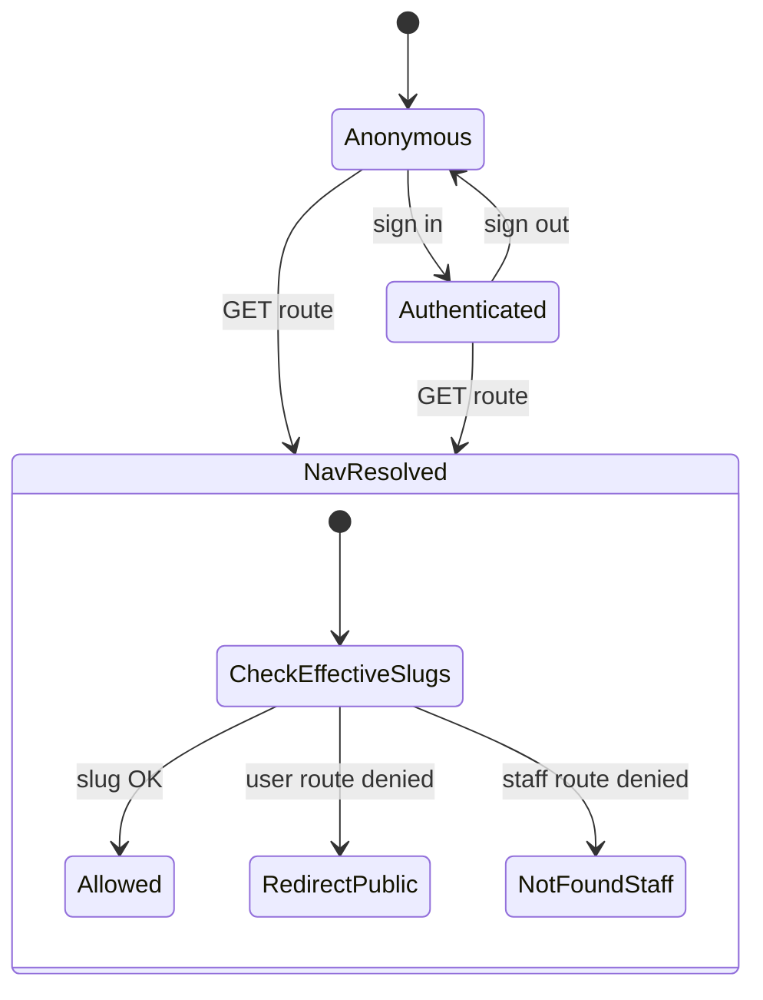

# Navigation RBAC — User flows

> Companion to [`plan.md`](plan.md) and [`tdd.md`](tdd.md).

## 1. Happy path

### 1.1 Anonymous visitor browses public areas

| # | User does | UI shows | System does | Telemetry |
|---|-----------|----------|-------------|-----------|
| 1 | Opens site `/` | Public home in main shell (not `/auth`) | `middleware` passes through; `app/page.tsx` renders public root | — |
| 2 | Opens `/news`, `/forums`, `/media` | Full section chrome | Layout gate allows — anonymous slugs match | — |
| 3 | Opens `/teams`, `/players` | List/detail views | Gate allows | — |
| 4 | Opens `/theory`, `/utility` | Content | Gate allows | — |
| 5 | Sees sidebar | Community + partial Competitive + Knowledge groups; **Play** visible **disabled** (tooltip) | Sidebar filters from effective slugs; Play uses `DisabledMenuItem` unless `developer` | — |

### 1.2 Signed-in member

| # | User does | UI shows | System does | Telemetry |
|---|-----------|----------|-------------|-----------|
| 1 | Signs in | Sidebar gains **Scrims**, **Tournaments**, **Dashboard** (when slugs present) | `/api/me` returns expanded effective slugs (DB + templates) | — |
| 2 | Opens `/scrims` | Page loads | Layout asserts `nav.scrims` (or equivalent) | — |

### 1.3 Developer

| # | User does | UI shows | System does | Telemetry |
|---|-----------|----------|-------------|-----------|
| 1 | Has `developer` slug | **Play** link **enabled** | Nav enables link | — |
| 2 | Opens `/play` | Experience loads | Server gate passes | — |

### 1.4 Admin-area user

| # | User does | UI shows | System does | Telemetry |
|---|-----------|----------|-------------|-----------|
| 1 | Has `developer` and/or `sandbox.access` / `news.editor` | **Admin** entry (children per existing rules) | `AppSidebar` prefix unchanged in spirit | — |
| 2 | Opens `/admin` | Admin shell | Existing admin layout gates | — |

### 1.5 Signed-in root redirect (optional, per implementation)

| # | User does | UI shows | System does | Telemetry |
|---|-----------|----------|-------------|-----------|
| 1 | Visits `/` while signed in | Redirect to `/dashboard` (if implemented) | Middleware or page-level redirect | — |

## 2. Error states

| Trigger | User-visible state | Recovery path | Telemetry | Test ref |
|---------|--------------------|---------------|-----------|--------|
| Anonymous hits `/dashboard` | Redirect to `/` or `/news` (chosen default) | Navigate to allowed section | — | tdd #5 |
| Anonymous hits `/stats` | Same redirect | Same | — | tdd #5 |
| Member hits `/admin` without capability | **404** (`notFound`) | None | — | tdd #5 |
| Session expired mid-navigation | Next navigation shows signed-out sidebar; route may redirect to sign-in **only** where business rules require auth for **data** | Re-auth | — | flows-only |
| Supabase unreachable in middleware | App still loads per existing `updateSession` behavior | Retry | — | existing |

> **Note:** No telemetry for **denied** route attempts in MVP ([`plan.md`](plan.md) §9).

## 3. Alternate flows

### 3.1 Deep link to forbidden route

- **Trigger:** User bookmarks `/stats` while anonymous.
- **Behavior:** Server layout runs resolver → **redirect** (non-staff route).
- **Acceptance:** No infinite redirect loop; final URL is stable.

### 3.2 Deep link to staff route without role

- **Trigger:** `/admin` as anonymous or member without admin slugs.
- **Behavior:** **`notFound()`** (match admin-panel anti-enumeration stance).
- **Acceptance:** No detailed error body.

### 3.3 Stale client profile after grant

- **Trigger:** Operator assigns template in DB while user stays on SPA.
- **Behavior:** Until refresh, sidebar may be stale; **next navigation** hits server layout with fresh DB read.
- **Acceptance:** Optional `router.refresh()` when grant UI exists — otherwise documented limitation.

### 3.4 Loading / shell

- **UI:** Sidebar shows skeleton or last-known items briefly.
- **Acceptance:** No crash when `role_slugs` undefined → treat as anonymous until hydrated.

### 3.5 Mobile / collapsed sidebar

- **Acceptance:** Disabled Play still shows tooltip/hover affordance per existing `NavMain` patterns.

## 4. State diagram

## 5. Acceptance summary

This feature is "done" when:

- [ ] Anonymous users can load `/` and public sections without `/auth` redirect.
- [ ] Sidebar matches effective capability matrix for anon / member / developer / admin.
- [ ] Server denies inconsistent deep links per §2.
- [ ] Vitest cases in [`tdd.md`](tdd.md) §1 pass.
- [ ] `pnpm lint:architecture` clean from repo root on touched paths.
