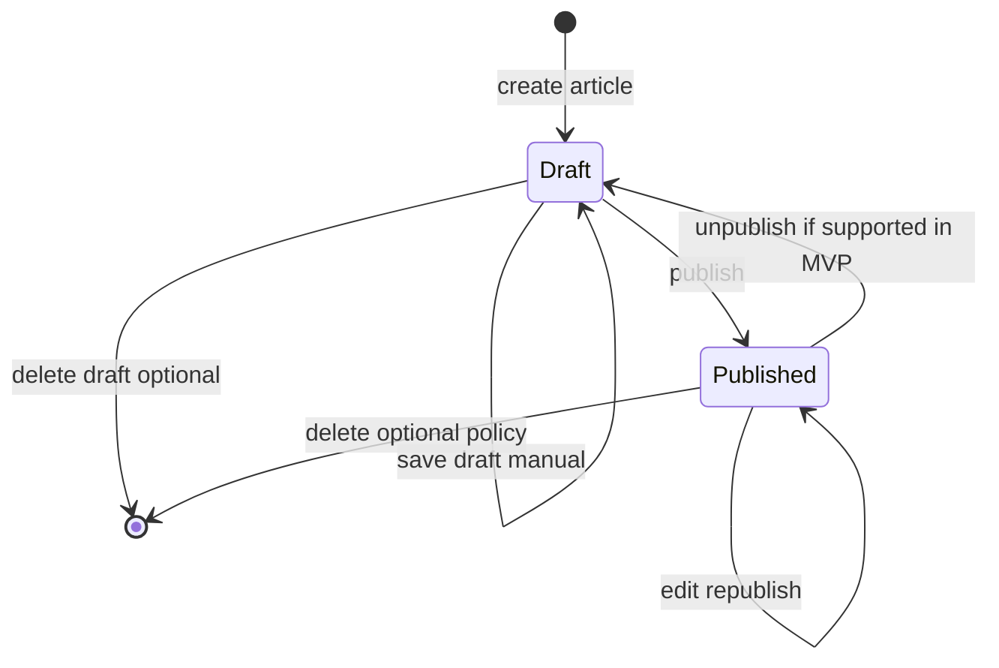

# News — User flows

> Companion to [`plan.md`](plan.md) and [`tdd.md`](tdd.md). Map each error row to a unit/integration test where applicable.

## 1. Happy path

### 1.A — Reader (public)

| # | User does | UI shows | System does | Telemetry |
|---|-----------|----------|-------------|-----------|
| 1 | Opens **`/news`** | List or **empty state** (“No articles yet”) | Query **published** rows only | (automatic page view) |
| 2 | Clicks an article | Detail: title, body rendered from JSON, dates | Load by **slug** | Optional `track('news_article_view', { slug })` if added |
| 3 | Opens bad slug | **404** page | `notFound()` | — |

### 1.B — Editor (staff)

| # | User does | UI shows | System does | Telemetry |
|---|-----------|----------|-------------|-----------|
| 1 | Signs in, navigates to **admin news** | List of drafts + published (per product rules) | SC + Drizzle, role gate in layout | — |
| 2 | Creates new article | TipTap empty, title/slug fields | Server action creates **draft** | — |
| 3 | Edits body, clicks **Save draft** | Success feedback (toast optional); no navigation | Action persists `body_json` | — |
| 4 | Clicks **Publish** | Redirect or inline success; article on public list | `status = published`, `published_at` set | `track('news_published', { slug })` |
| 5 | Opens public **`/news/[slug]`** | Same content as preview | Public read path | page view |

## 2. Error states

| Trigger | User-visible state | Recovery path | Telemetry | Test ref |
|---------|--------------------|---------------|-----------|----------|
| Public URL for **draft-only** article | **404** (no leak) | N/A for readers | — | unit: route/data guard |
| Missing article slug | **404** | — | — | — |
| Not signed in, hits **admin** | Redirect to **sign-in** with `returnTo` | Sign in | — | manual |
| Signed in, **no `news.editor`** | **403** or redirect to home with message | Request role from ops | optional `track` | manual |
| **Save** / **publish** validation error | **Inline banner** above editor + field hints; **TipTap content unchanged** | Fix fields, retry | optional `news_editor_save_failed` | [`tdd.md`](tdd.md) #5 |
| Duplicate **slug** | Banner + “slug taken” + suggest alternate | Change slug | optional track | [`tdd.md`](tdd.md) #1–2 |
| DB / 500 on action | Banner + generic failure; retry | Retry save | optional track | manual |
| Role **revoked** mid-session | Next action fails with permission message | Re-login or stop | — | manual |
| `body_json` oversize or malformed | Action rejects; banner explains limit | Shrink content | — | [`tdd.md`](tdd.md) #4 |

## 3. Alternate flows

### 3.1 Cancel

- **Trigger:** Navigate away from editor with unsaved changes.
- **MVP:** Browser **`beforeunload`** optional; no mandatory confirm (keep MVP small) — **upgrade later** with dirty tracking.
- **Acceptance:** User understands unsaved loss is possible without confirm in MVP (document in UI copy).

### 3.2 Retry

- **Trigger:** User clicks **Retry** after transient failure (if provided).
- **Acceptance:** Same payload resubmitted; **no duplicate** article if action is idempotent on `articleId` (updates by id, not “always insert”).

### 3.3 Partial save / drafts

- **MVP:** **Manual “Save draft” only** — no autosave (**[`plan.md`](plan.md)**).
- **Storage:** `news_articles` row with `status = draft`.
- **Acceptance:** Refresh editor route reloads same draft for authorized editor.

### 3.4 Deep link entry

- **Public:** `/news/[slug]` — server resolves; draft → **404**.
- **Admin:** `/news/admin/.../edit/[id]` — missing id → **404**; forbidden → **403**.

### 3.5 Empty state

- **Public list:** Friendly empty state; optional link to rest of site (not required to show editor CTA to anonymous users).
- **Editors:** Empty admin list shows **“Create article”**.

### 3.6 Loading

- **Public:** `loading.tsx` skeletons optional.
- **Acceptance:** Avoid layout jump when swapping skeleton → content.

### 3.7 Permissions denied

- No publish/delete buttons without role; server actions double-check (**never UI-only**).

### 3.8 Offline

- **MVP:** Native browser behavior; optional small “offline” banner **post-MVP** if product wants it.

### 3.9 Mobile / small viewport

- **Acceptance:** Article readable without horizontal scroll; editor usable at `sm` breakpoint (TipTap toolbar may collapse).

## 4. State diagram

If **unpublish** is deferred from MVP, remove that transition in implementation and note in `plan.md`.

## 5. Acceptance summary

- [ ] §1.A reader path works with **zero or more** published articles.
- [ ] §1.B editor can create draft, save manually, publish; article appears on public list.
- [ ] §2: each row has owner (test or manual note).
- [ ] §3.3 manual save-only behavior verified.
- [ ] §4 diagram matches implemented `status` values.
- [ ] Vercel Analytics package installed, **`<Analytics />`** rendered, **dashboard enabled** per [`plan.md`](plan.md) §9.
