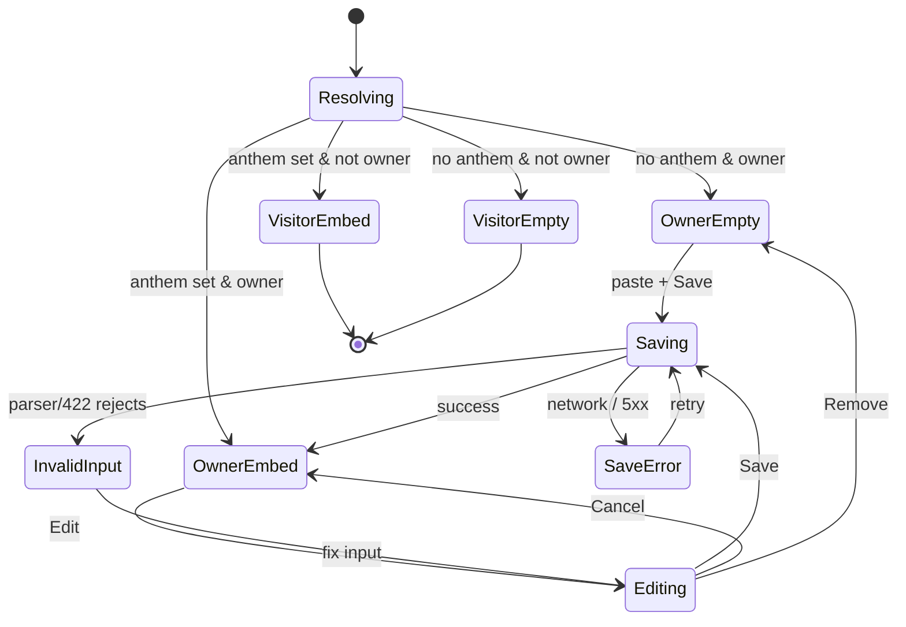

# Player Anthem — User flows

> Companion to [`plan.md`](plan.md) and [`tdd.md`](tdd.md). Telemetry is a non-goal (no provider), so the column reads "—".

## 1. Happy path (owner sets an anthem)

| # | User does | UI shows | System does |
|---|-----------|----------|-------------|
| 1 | Lands on own `/players/@me` | Empty "Add your anthem" editor (owner only) | Resolve returns `anthemUrl = null`, `isOwner = true` |
| 2 | Pastes a Spotify or SoundCloud track link, Save | Spinner; input disabled | `PATCH /api/me/anthem` → `parseAnthem` → persist canonical |
| 3 | — | SoundCloud → player in the anthem card (spinning CD artwork + brand play/pause + title/artist, volume fades 1→10 over 5s, `#t=` start) + a compact control in the app header; Spotify → inline card embed. Owner sees Edit/Remove | UI swaps; `router.refresh()` |
| 4 | Visitor opens the profile | SoundCloud anthem plays from the card / app-header control; Spotify shows the inline embed; provider auto-detected | Resolve returns stored canonical |

## 2. Error states

| Trigger | User-visible state | Recovery | Test ref |
|---------|--------------------|----------|----------|
| Empty input on Save | Inline "Paste a Spotify or SoundCloud track link" | Paste a link | tdd #16 |
| Unsupported link (album/playlist/set/other host) | Inline "That doesn't look like a Spotify or SoundCloud track link" | Edit input | tdd #6, #16 |
| Server rejects (422) | Inline "Paste a Spotify or SoundCloud track link" | Edit input | tdd #16 |
| Auth missing/expired | Toast "Please sign in again"; editor hidden on reload | Re-auth | tdd #10 |
| Network / 5xx on Save | Toast "Could not save anthem" | Retry | flows-only |
| SoundCloud Widget API fails to load | Controls render but `toggle()` is a no-op (anthem silently inert) | — (graceful degrade) | flows-only |
| DB CHECK rejects value | 400/422 (parser should pre-empt) | n/a | tdd #12 |

## 3. Alternate flows

- **3.1 Cancel:** owner opens editor on a set anthem, clicks Cancel → editor closes, embed unchanged, no PATCH.
- **3.2 Retry:** retry after network/5xx re-runs the same idempotent PATCH.
- **3.3 Remove:** `PATCH { url: null }` clears the column; owner editor reverts to empty, the card player + app-header control disappear.
- **3.4 Deep link:** visitor opens `/players/@someone` directly; card player (SoundCloud) or card embed (Spotify) if set, nothing if not; steam-only/non-members never show it.
- **3.5 Empty state:** owner → paste prompt; visitor → nothing.
- **3.6 Loading:** state arrives via server props (no client fetch flash); embeds use `loading="lazy"`.
- **3.7 Permissions:** non-owners never see Edit/Remove; RLS blocks any direct write.
- **3.8 Autoplay blocked (browser policy):** SoundCloud may not start with sound until the visitor interacts once; on first play it eases the volume 1→10 over 5s and seeks to the `#t=` start offset. Spotify is always click-to-play.
- **3.9 SoundCloud catalog miss / iOS:** an off-catalog or streaming-disabled track simply won't play; on iOS `setVolume` is ignored (system volume).
- **3.10 Layout:** both controls are a row — play button, spinning vinyl disc (44px card / 32px header), title + artist. The header control is centred in the bar; the Spotify embed spans full width at 152px (`width="100%"`, no horizontal scroll).

## 4. State diagram

## 5. Acceptance summary

- [x] Happy path works for both providers (manual smoke).
- [x] Parser reject branches covered by unit tests (#1–#7 green).
- [ ] Integration/component/e2e (#8–#17) — documented follow-up needing DB/RTL/Playwright harness.
- [x] Raw input never reaches an iframe `src`.
- [x] No telemetry emitted.
