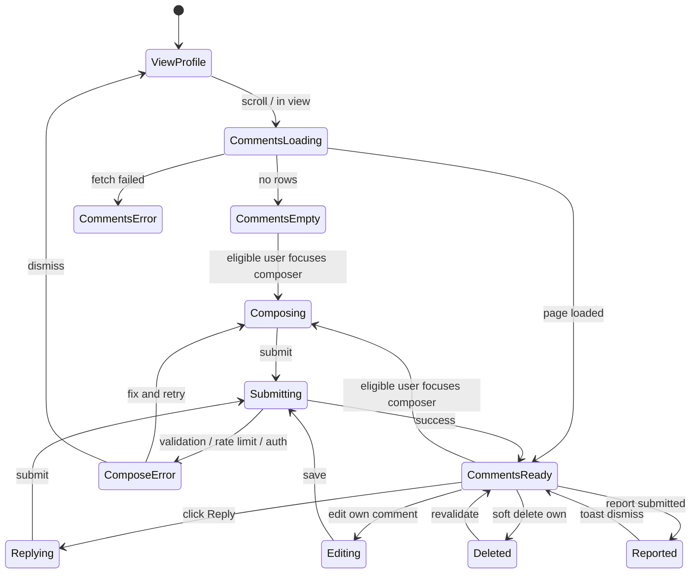

# Player profile comments — User flows

> Companion to [`plan.md`](plan.md) and [`tdd.md`](tdd.md). MVP telemetry focuses on **successful creates**, trust vote updates, and reports.

## 1. Happy path

### 1.1 Anonymous reader

| # | User does | UI shows | System does | Telemetry |
|---|-----------|----------|-------------|-----------|
| 1 | Opens `/players/@jourdain` (or steamid64 URL) | Profile header with **trust chips** in stats row (may be `0 legit · 0 suspicious`) | RSC loads trust counts from `player_profile_trust_votes` | — |
| 2 | Scrolls to comments card (`#profile-comments`) | Comment list (newest top-level first) or empty state | Load first page (~20 top-level) + nested replies | — |
| 3 | Clicks **Load more** (if present) | Older top-level comments append | Cursor query | — |

### 1.2 Signed-in, not Steam-linked

| # | User does | UI shows | System does | Telemetry |
|---|-----------|----------|-------------|-----------|
| 1 | Views comments section | Read-only list; composer hidden | — | — |
| 2 | Clicks **Sign in** / **Link Steam** CTA | Auth or Steam link flow | `returnTo` current profile URL | — |

### 1.3 Steam-linked member — comment with trust signal

| # | User does | UI shows | System does | Telemetry |
|---|-----------|----------|-------------|-----------|
| 1 | Focuses composer on another player's profile | Textarea + emoji picker + optional **Legit / Suspicious** toggle (neither required) | Eligibility `canWrite: true`, `canVote: true` | — |
| 2 | Writes text, picks emoji, selects **Legit**, submits | Loading on submit | `createPlayerProfileCommentAction`: insert comment + upsert trust vote in transaction; rate-limit checks; `revalidatePath` profile | `player_profile_comment_created`, `player_profile_trust_vote_updated` |
| 3 | Success | Comment at top of list with legit badge; header chip count +1 | — | — |

### 1.4 Nested reply (depth ≤ 3)

| # | User does | UI shows | System does | Telemetry |
|---|-----------|----------|-------------|-----------|
| 1 | Clicks **Reply** on a comment | Inline composer under parent | — | — |
| 2 | Submits reply (optional trust change) | Indented reply (oldest-first among siblings) | Create with `parent_comment_id`; depth guard | `player_profile_comment_created` (+ trust event if signal changed) |
| 3 | Replies at max depth | New reply appears at depth cap (sibling attach policy per implementation) | Depth check | — |

### 1.5 Profile owner self-comment (no self-vote)

| # | User does | UI shows | System does | Telemetry |
|---|-----------|----------|-------------|-----------|
| 1 | Owner opens own profile | Composer visible; **Legit / Suspicious toggles hidden or disabled** | `canVote: false` | — |
| 2 | Posts comment without trust tag | Comment appears | Insert only; no trust upsert | `player_profile_comment_created` |

### 1.6 Edit / delete own comment

| # | User does | UI shows | System does | Telemetry |
|---|-----------|----------|-------------|-----------|
| 1 | Clicks **Edit** on own comment | Inline edit with emoji picker | — | — |
| 2 | Saves new body / changes trust tag | Updated content | `updatePlayerProfileCommentAction`; trust upsert if signal changed (rate limit on vote change) | optional trust event |
| 3 | Clicks **Delete** | Comment removed from public list | Soft delete (`deleted_at`) | — |

### 1.7 Report comment

| # | User does | UI shows | System does | Telemetry |
|---|-----------|----------|-------------|-----------|
| 1 | Clicks **Report** on a comment | Optional reason field + confirm | — | — |
| 2 | Submits | Toast “Report received” | Insert report row (idempotent) | `player_profile_comment_reported` |

### 1.8 Header trust chips → scroll

| # | User does | UI shows | System does | Telemetry |
|---|-----------|----------|-------------|-----------|
| 1 | Clicks `✓ N legit` or `⚠ N suspicious` in header stats row | Smooth scroll to `#profile-comments` | — | — |

### 1.9 Manual smoke (MVP acceptance)

1. **Incognito:** open `/players/@jourdain` → see comments (or empty state) + trust chips → no composer.
2. **Steam-linked user A:** post comment with **Suspicious** on user B's profile → header suspicious count increments → refresh → persists.
3. **User A:** change vote to **Legit** via new comment or edit → header counts shift (one voter, not two).
4. **Profile owner B:** reply to a comment without trust toggles → succeeds.
5. **Nested reply:** depth 1 → 2 → 3 → attempt depth 4 → blocked with clear message.
6. **Report:** submit report → second report same comment → idempotent success, no duplicate row.
7. **Mobile width (~375px):** comment thread readable; emoji picker usable; no horizontal scroll.

## 2. Error states

Server actions return **`ok: false`** with **`code`** + **`message`** unless noted.

| Trigger | User-visible state | Recovery path | Telemetry | Test ref |
|---------|--------------------|---------------|-----------|----------|
| Empty body | Inline error; submit disabled (client) | Enter text | — | tdd #4 |
| Body > 1000 chars | Inline counter / error | Shorten | — | tdd #4 |
| Not signed in | Sign-in CTA with `returnTo` | Sign in | — | flows-only |
| Signed in, Steam not linked | “Link Steam to comment” CTA | Complete Steam link | — | tdd #6 |
| `UNAUTHORIZED` | Same as above | Sign in | — | tdd #10 |
| `STEAM_NOT_LINKED` | Link Steam CTA | Link Steam | — | tdd #6 |
| `SELF_VOTE_NOT_ALLOWED` | Toast; trust toggles hidden for owner | Post comment without vote | — | tdd #7 |
| `FORBIDDEN` (edit/delete other's) | Toast | — | — | tdd #10 |
| `PARENT_INVALID` | Toast | Refresh page | — | tdd #3–4 |
| `DEPTH_EXCEEDED` | Toast: max reply depth | Reply higher in thread | — | tdd #3 |
| `RATE_LIMIT_COMMENTS` | Toast: try again tomorrow | Wait | — | tdd #8 |
| `RATE_LIMIT_TRUST_VOTE` | Toast: vote change limit | Wait 24h | — | tdd #9 |
| `COMMENT_NOT_FOUND` | Toast | Refresh | — | tdd #10 |
| Session expired mid-submit | Toast + sign-in | Re-auth | — | flows-only |
| Network / server error | Toast “Something went wrong” | Retry submit | — | tdd #10 |
| Report own comment | Toast or disabled control | — | — | tdd #5 |

## 3. Alternate flows

### 3.1 Cancel

- **Trigger:** User closes inline reply composer or navigates away before submit.
- **State:** Confirm if composer dirty (optional); else discard.
- **Acceptance:** No partial row in DB.

### 3.2 Retry

- **Trigger:** Transient failure after submit.
- **State:** User clicks submit again.
- **Acceptance:** Prefer redirect/revalidate on success so double-submit does not duplicate; optional client idempotency key if duplicates observed in QA.

### 3.3 Partial save / drafts

- **MVP:** **No** comment drafts. Optional `localStorage` composer draft follow-up.

### 3.4 Deep link entry

- **URL:** `/players/[id]` only (no comment permalink in MVP).
- **Behavior:** Unknown player → **404** (existing resolver); valid profile always shows comments section.
- **Acceptance:** `#profile-comments` fragment scrolls to card on load.

### 3.5 Empty state

- **UI:** Message circle icon + “No comments yet. Be the first…” + composer (if eligible).
- **Acceptance:** First comment transitions to list without full page reload.

### 3.6 Loading state

- **UI:** Skeleton for comments card matching final layout; header chips show `0` or skeleton counts.
- **Acceptance:** No layout shift when data arrives.

### 3.7 Permissions denied

- **Read:** always allowed for public profiles.
- **Write:** gated on Steam link; owner cannot vote on self.
- **Acceptance:** CTAs match eligibility; no raw Supabase errors exposed.

### 3.8 Offline

- **UI:** Submit disabled or toast on failed action.
- **Acceptance:** No uncaught throw; user can still read cached page if available.

### 3.9 Mobile / small viewport

- **Breakpoint:** `sm` (640px) and below.
- **Adjustments:** Full-width composer; indented replies with max indent cap; emoji picker as bottom sheet or popover fitting viewport.
- **Acceptance:** Tap targets ≥44px; trust chips wrap in stats row.

### 3.10 Trust vote change without new comment

- **Trigger:** User edits existing comment and changes legit ↔ suspicious (or adds signal where none was).
- **Behavior:** Upsert `player_profile_trust_votes`; subject to **1 change / 24h** rate limit.
- **Acceptance:** Header counts update; prior comment's displayed tag may remain historical snapshot on old rows.

### 3.11 Deleted comment vs trust vote

- **Trigger:** User deletes a comment that had attached trust signal.
- **Behavior:** Comment hidden (soft delete); **trust vote row remains** until user explicitly changes vote via a later eligible action.
- **Acceptance:** Document in UI FAQ/tooltip optional; header count unchanged on delete-only.

## 4. State diagram

## 5. Acceptance summary

This feature is "done" when:

- [ ] Every row in §1 (happy path + §1.9 manual smoke) passes.
- [ ] Every row in §2 has a corresponding unit test (tdd #1–10) or documented manual check.
- [ ] Alternate flows §3.1–3.11 verified or explicitly N/A for MVP.
- [ ] Dummy [`comments-card.tsx`](../../../components/organisms/comments-card.tsx) removed from production profile path.
- [ ] Migration applied via MCP in journal order; advisors reviewed.
- [ ] Telemetry events fire with documented payloads.
- [ ] `pnpm lint:architecture` clean from repo root.
