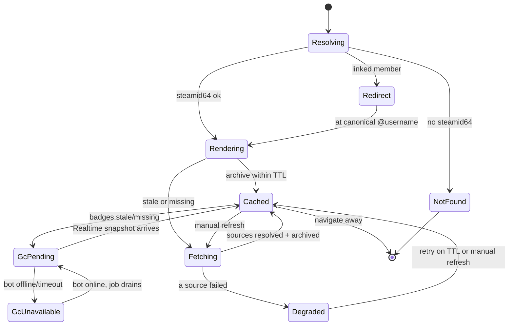

# Players directory & profiles — User flows

> Companion to [`plan.md`](plan.md) and [`tdd.md`](tdd.md). Every state here must have a corresponding test in `tdd.md`.

## 1. Happy path

| # | User does | UI shows | System does | Telemetry |
|---|-----------|----------|-------------|-----------|
| 1 | Lands on `/players/<identifier>` | Skeleton panels (or cached data if archived) | Server resolves identifier → steamid64; if linked member, 302 → `/players/@username` | `players.profile.viewed` |
| 2 | — | Cached Steam/Faceit/Leetify panels render immediately if archived | Page renders newest snapshot per source from DB | — |
| 3 | — | Panels with stale/missing data show inline spinner | React Query hooks call `/api/<source>/profile/<id>`; each does DB-first-then-fetch-and-archive | `players.source.fetched` |
| 4 | — | Each panel fills in independently as its fetch resolves | Snapshots appended; parsed columns updated | `players.source.fetched` |
| 5 | — | Badges panel shows "Loading badges…" | `/api/cs2/profile/<id>` returns cached or enqueues `player_cs2_gc_jobs` + POSTs bot control | `players.gc.enqueued` |
| 6 | — | Badges panel live-updates with medals/coins/ranks | Bot worker calls `requestPlayersProfile`, writes snapshot; client receives Supabase Realtime row | `players.gc.updated` |
| 7 | Clicks "Refresh" (optional) | Button disabled w/ cooldown | `/api/players/<id>/refresh` forces re-fetch of all sources (rate-limited) | `players.refresh.clicked` |

## 2. Error states

Every row maps to a test in [`tdd.md`](tdd.md) §1.

| Trigger | User-visible state | Recovery path | Telemetry | Test ref |
|---------|--------------------|---------------|-----------|----------|
| Identifier not resolvable (no steamid64) | 404 "Player not found" with search box | User retries with a different identifier | `players.resolve.failed` | tdd #2, #12 |
| Steam vanity unresolved | Inline "Couldn't resolve that Steam URL" | User pastes SteamID64 instead | `players.resolve.failed` | tdd #2 |
| One source upstream down/timeout | That panel shows degraded "Stats unavailable, showing last known" (cached) or "unavailable"; other panels unaffected | Auto-retry on next visit/TTL; manual refresh | `players.source.failed` | tdd #11 |
| Faceit 401 (bad/missing key) | Faceit panel "Faceit data unavailable" (logged as config error, not user-facing detail) | Operator sets `FACEIT_API_KEY` | `players.source.failed` | tdd #11 |
| Leetify shape changed | Leetify panel degraded; raw JSONB still stored | Defensive parser; fix mapper later | `players.source.failed` | tdd #5, #11 |
| GC bot offline / not configured | Badges panel "Badges not available right now" (job stays queued) | Operator starts `pnpm cs2-gc-bot`; job drains later, Realtime updates | `players.source.failed` | tdd #9, #10 |
| GC request times out / no GC data for steamid | Badges panel "No in-game badge data" | Retry on next TTL; queue serializes retries | `players.source.failed` | tdd #9 |
| Manual refresh rate-limited | Toast "Please wait before refreshing again" + countdown | Wait for cooldown | `players.refresh.clicked` (throttled=true) | tdd (route) |
| Supabase Realtime drop | Badges panel falls back to polling the GC route | Transparent; polling backstops live update | — | tdd #10 |
| Network failure (client) | Affected panel "Network error, retry" | Retry button re-runs the source query | `players.source.failed` | tdd #11 |

## 3. Alternate flows

### 3.1 Deep link by each identifier

- **Examples:** `/players/76561198...` (steamid64), `/players/s1mple` (faceit/vanity), `/players/@niko` (member).
- **Behavior:** server resolves and 302s to canonical; missing → 404; never a client-only redirect loop.
- **Acceptance:** each identifier type lands on the same canonical profile.

### 3.2 Canonical redirect to `@username`

- **Trigger:** resolved steamid64 is linked to an intradark account.
- **State:** 302 from `/players/<steamid64>` (or faceit/vanity) → `/players/@username`.
- **Acceptance:** no redirect loop; archive remains keyed by steamid64.

### 3.3 External (unclaimed) player

- **Trigger:** resolved steamid64 has no matching `user_profiles.steam_profile_id`.
- **State:** profile renders with `players.user_profile_id = NULL`; stats display normally; subtle "Not an intradark member" affordance.
- **Acceptance:** data is archived and "waits"; when that Steam account later links intradark, mapping is set automatically and the canonical URL becomes `@username`.

### 3.4 Empty state (first-ever visit)

- **UI:** all panels skeleton, then fill as fetches resolve; `players` row created on first observe.
- **Acceptance:** first visit triggers fetch+archive for all sources; subsequent visits are cache hits within TTL.

### 3.5 Loading state

- **UI:** skeletons match final panel layout (no layout shift); badges panel has its own pending state.
- **Acceptance:** skeleton visible within 100ms; replaced without flash.

### 3.6 Manual refresh

- **Trigger:** "Refresh" button.
- **State:** forces re-fetch of all sources; rate-limited (e.g. 1/5min per IP+steamid); idempotent (re-runs same archive append logic).
- **Acceptance:** no duplicate spurious snapshots beyond one per source per refresh; cooldown enforced.

### 3.7 Directory index

- **Trigger:** `/players`.
- **State:** search bar (steam URL / steamid64 / faceit name / `@name`) + list of claimed members and recently-fetched externals.
- **Acceptance:** search resolves and routes to canonical; list links to profiles.

### 3.8 Permissions

- **State:** all profiles public in MVP (no auth required to view). Writes only via service role.
- **Acceptance:** anon can read; anon cannot write (RLS); GC jobs not publicly visible.

### 3.9 Mobile / small viewport

- **Breakpoint:** `sm` (640px).
- **Adjustments:** panels stack vertically; tabs become a scrollable/segmented control; full-width refresh button.
- **Acceptance:** no horizontal scroll; tap targets ≥44px.

## 4. State diagram

## 5. Acceptance summary

This feature is "done" when:

- [ ] Every row in §1 (happy path) has a passing E2E or manual smoke step.
- [ ] Every row in §2 (errors) has a passing test in `tdd.md`.
- [ ] Every alt flow in §3 has documented acceptance and a passing test or manual verification note.
- [ ] State diagram in §4 matches the implementation.
- [ ] Telemetry events in §1 and §2 fire with the documented payloads.
- [ ] `pnpm lint:architecture` is clean and no `ARCHITECTURE.md` change was needed.
