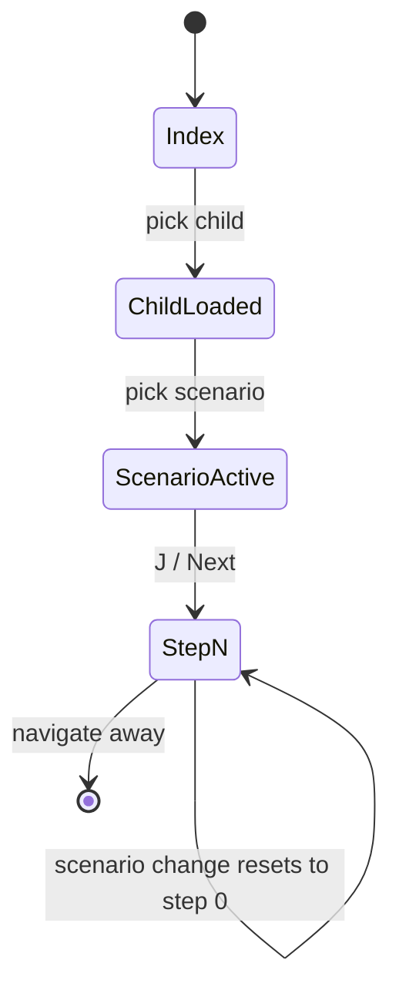

# Sandbox — User flows

> Companion to [`plan.md`](plan.md) and [`tdd.md`](tdd.md). Covers the **parent** shell only; each child triad ([pug-system](pug-system/flows.md), [onboarding](onboarding/flows.md)) owns its own flow content.

## 1. Happy path

| # | User does | UI shows | System does | Telemetry |
|---|-----------|----------|-------------|-----------|
| 1 | Lands on **`/admin/sandbox`** (with `sandbox.access`) | Index page lists children with name + description + last-step badge | Reads child registry from `entities/sandbox/registry.ts` | — |
| 2 | Clicks a child link (e.g. "PUG system") | Navigates to **`/admin/sandbox/pug-system`** | Route resolves to `<PugSystemSandbox />` wrapped in `SandboxShell` | — |
| 3 | Picks a scenario in the dock | Dock highlights selected; main view re-renders to scenario start | Update context state + URL `?scenario=...` | `console.debug` |
| 4 | Clicks "Next step" (or hits `J`) | Main view advances; dock step indicator increments | Update context + URL `?step=...` | `console.debug` |
| 5 | Copies URL, opens in second tab | Same scenario + step restored | `useSandboxUrlState` initializes from URL on mount | — |

## 2. Error states

Every row maps to a test in [`tdd.md`](tdd.md) §1.

| Trigger | User-visible state | Recovery path | Telemetry | Test ref |
|---------|--------------------|---------------|-----------|----------|
| Invalid `?scenario` (unknown id) | Snap to default scenario; subtle inline notice "unknown scenario, using default" | User picks another scenario from the dock | — | tdd #2 |
| Invalid `?step` (out of range) | Snap to step `0` | User clicks Next or picks a step | — | tdd #3 |
| Missing **`sandbox.access`** (or not signed in) | Next.js **`notFound()`** (404) | Operator grants role in `user_roles` + refresh | — | tdd #7 |

## 3. Alternate flows

### 3.1 Shareable URL

- **Trigger:** any state change (scenario, step) writes `?scenario=`/`?step=` into the URL.
- **Acceptance:** copying the URL and opening in a new tab/incognito restores the same view.

### 3.2 Keyboard shortcuts

- `J` — next step (clamped at `steps.length - 1`).
- `K` — previous step (clamped at `0`).
- Documented in dock tooltip and the index page.
- **Acceptance:** shortcuts ignored when typing inside an input/textarea.

### 3.3 Reduced motion

- Dock open/close + step transitions honor `prefers-reduced-motion: reduce`.
- **Acceptance:** no animations when the OS-level preference is set.

### 3.4 Mobile / small viewport

- **Breakpoint:** `sm` (640px).
- **Adjustments:** dock collapses to a bottom sheet; step-jumper becomes a full-width control.
- **Acceptance:** no horizontal scroll; tap targets ≥44px.

### 3.5 Env flag off

- Index, child routes, and the sidebar entry are all hidden / 404. There is no half-state where the route is reachable but the dock fails to render.

## 4. State diagram

## 5. Acceptance summary

This feature is "done" when:

- [ ] Index lists every child registered in `entities/sandbox/registry.ts`.
- [ ] Dock + step-jumper work in both children.
- [ ] URL state is shareable across tabs and survives reload.
- [ ] Sidebar entry hidden when env flag is `false`.
- [ ] Manual smoke script in [`tdd.md`](tdd.md) §4 passes.
- [ ] State diagram in §4 matches the implementation.
