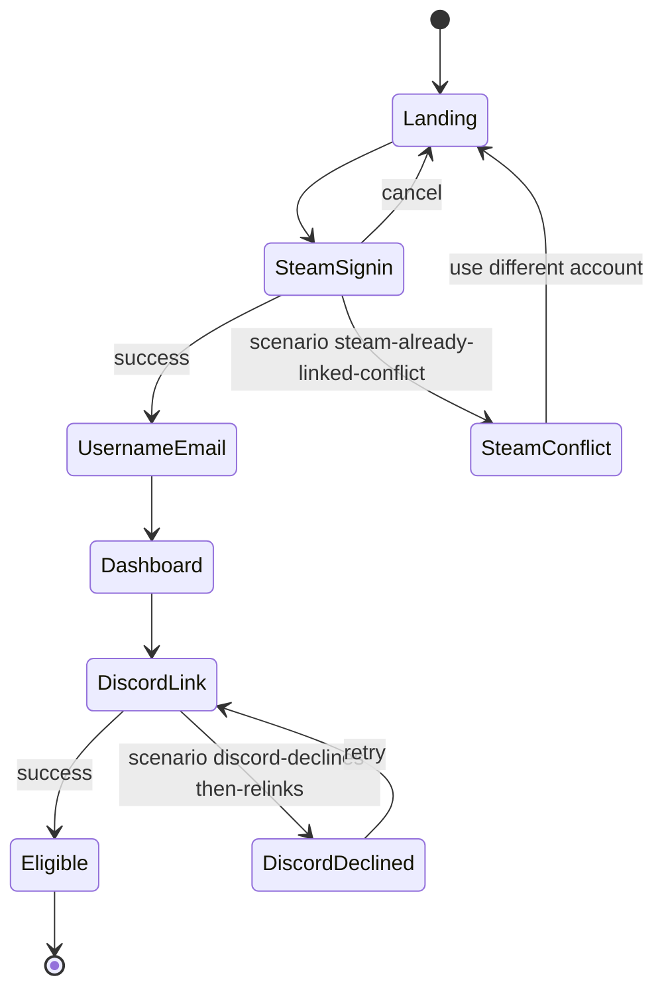

# Onboarding sandbox — User flows

> Companion to [`plan.md`](plan.md) and [`tdd.md`](tdd.md). Each row in §1 / §2 / §3 has a corresponding test in [`tdd.md`](tdd.md) §1 or a documented manual smoke step.

## 1. Happy path (`scenario = happy-onboarding`)

| # | User does | UI shows | System does | Telemetry |
|---|-----------|----------|-------------|-----------|
| 1 | Lands on **`/admin/sandbox/onboarding`** | `landing-step`: marketing CTA "Sign in with Steam" + sandbox dock | Init scenario `happy-onboarding`, eligibility state `not-signed-in` | `console.debug` |
| 2 | Clicks Next | `steam-signin-step`: simulated Steam OpenID confirmation screen | After 600ms, sandbox sets `steam-only` state behind the scenes | `console.debug` |
| 3 | Clicks Next | `username-email-step`: `<SteamUsernameEmailForm />` (extracted from real route) | Sandbox `onSubmit` is a no-op; advancing is via Next | `console.debug` |
| 4 | Clicks Next | `dashboard-step`: profile cards rendered from `FakeProfile`; `<DiscordLinkDialog />` auto-opens (because `state=steam-only`) | Step++; eligibility state stays `steam-only` until next step | `console.debug` |
| 5 | Clicks Next | `discord-link-step`: simulated Discord OAuth confirmation screen | After 600ms, sandbox sets `both-linked-not-banned` state | `console.debug` |
| 6 | Clicks Next | `eligible-step`: green "Ready to queue" badge + CTA "Open PUG sandbox" | Step++ | `console.debug` |

## 2. Scenario rows (alt flows replacing happy-path steps)

Every row maps to a test in [`tdd.md`](tdd.md) §1.

| Scenario | Differs at step | User-visible state | Recovery path | Test ref |
|----------|-----------------|--------------------|---------------|----------|
| `discord-declines-then-relinks` | `discord-link-step` | "Discord declined" toast + retry CTA on first attempt; second attempt succeeds | Click retry → success → continue to `eligible` | tdd #10 |
| `steam-already-linked-conflict` | between `steam-signin` and `username-email` | Conflict screen interposed: "This Steam ID is linked to another account" + "Use different Steam account" CTA | Click CTA → return to `landing-step` | tdd #11 |

## 3. Eligibility-state preview rows (dock-driven, applied at `dashboard-step`)

Switching the dock state selector while on `dashboard-step` re-renders the page with the corresponding `FakeProfile`. Each row is covered by a test in [`tdd.md`](tdd.md) §1 #6–#9 (and equivalent rows for the missing states).

| State | `dashboard-step` renders | Notes |
|-------|---------------------------|-------|
| `not-signed-in` | "Sign in with Steam" empty-state card | Mirrors [`dashboard/page.tsx`](../../../app/(main)/dashboard/page.tsx) signed-out branch |
| `steam-only` | Profile cards + `DiscordLinkDialog` auto-open | Mirrors current real-route behavior when `discord_user_id == null` |
| `discord-only` | Profile cards (no Steam) + "Link Steam to play" placeholder + `// TODO real UI` note | Surfaces a UX gap; see [`plan.md`](plan.md) §11 open question |
| `both-linked-not-banned` | Full profile + "Ready to queue" badge | Happy state |
| `banned` | Red banner "Account banned" + reason placeholder; queue actions disabled | New UI proposal — not yet built in real routes |
| `cooldown-active` | Yellow banner with mm:ss countdown until queue eligible; queue actions disabled until 0 | New UI proposal — not yet built in real routes |

## 4. Alternate flows

### 4.1 Cancel signin

- **Trigger:** at `steam-signin-step`, click Cancel CTA.
- **State:** UI returns to `landing-step`; eligibility state reset to `not-signed-in`.
- **Acceptance:** no `FakeProfile` ever set in context; `DiscordLinkDialog` does not appear later.

### 4.2 Mobile / small viewport

- **Breakpoint:** `sm` (640px).
- **Adjustments:** `DiscordLinkDialog` becomes a drawer; profile cards stack; dock collapses to a bottom sheet.
- **Acceptance:** no horizontal scroll; tap targets ≥44px.

### 4.3 Reduced motion

- Simulated 600ms pauses become instant when `prefers-reduced-motion: reduce`.

### 4.4 Reload mid-flow

- URL `?scenario` and `?step` round-trip; eligibility state is derived from `(scenario, step)` so reload is deterministic.

## 5. State diagram

## 6. Acceptance summary

This child sandbox is "done" when:

- [ ] Each of the 3 scenarios runs end-to-end via Next/Prev.
- [ ] All 6 eligibility states render correctly on `dashboard-step` via the dock selector.
- [ ] No real `/api/auth/*` or `/api/me` calls fire (verify Network tab).
- [ ] `SteamUsernameEmailForm` extraction does not regress the real route at [`/steam-username-email`](../../../app/steam-username-email/page.tsx).
- [ ] `FakeProfile` shape stays type-compatible with `getCurrentUserProfiles` return.
- [ ] State diagram in §5 matches implementation.
