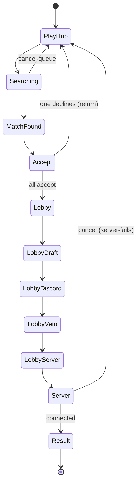

# PUG system sandbox — User flows

> Companion to [`plan.md`](plan.md) and [`tdd.md`](tdd.md). Each row in §1 / §2 / §3 must have a corresponding test in [`tdd.md`](tdd.md) §1 or a documented manual smoke step.

## 1. Happy path (`scenario = all-accept`)

| # | User does | UI shows | System does | Telemetry |
|---|-----------|----------|-------------|-----------|
| 1 | Lands on **`/admin/sandbox/pug-system`** | `play-hub-step`: `faceit-play-mock` party slot grid + sandbox dock | Init scenario `all-accept`, step `0` | `console.debug` |
| 2 | Clicks Next | `searching-step`: animated "Searching for a match…" pill | Step++ | `console.debug` |
| 3 | Clicks Next | `match-found-step`: 10/10 found banner + countdown | Step++ | `console.debug` |
| 4 | Clicks Next | `accept-phase-step`: all 10 players show green check | Step++ | `console.debug` |
| 5 | Clicks Next | `lobby-step` (sub-phase `draft`): 3-col grid + draft order | Step++; sub-phase init `draft` | `console.debug` |
| 6 | Clicks Next x3 | `lobby-step` cycles `draft` → `discord` → `veto` → `server` sub-phases | Sub-phase++ | `console.debug` per sub-phase |
| 7 | Clicks Next | `server-step`: connect string + 10/10 connected | Step++ | `console.debug` |
| 8 | Clicks Next | `result-step`: mock score 13–10, "Queue again" CTA | Step++ | `console.debug` |

> Note: the lobby's 4 sub-phases are an in-step nav (driven by sandbox state, not URL). Open question in [`plan.md`](plan.md) §11 covers whether to promote sub-phases to URL.

## 2. Scenario rows (alt flows replacing happy-path steps)

Every row maps to a test in [`tdd.md`](tdd.md) §1.

| Scenario | Differs at step | User-visible state | Recovery path | Test ref |
|----------|-----------------|--------------------|---------------|----------|
| `one-declines` | `accept-phase-step` | 9 green, 1 red, "Player donk-2 declined" banner, return-to-queue CTA | Click "Back to play" → reset to step `0` | tdd #6 |
| `server-fails` | `server-step` | 7/10 connected stalled, error code `SRV-503`, retry + cancel CTAs | Click retry → all 10 connect; click cancel → return to step `0` | tdd #8 |

## 3. Alternate flows

### 3.1 Cancel queue

- **Trigger:** at `searching-step`, click Cancel CTA.
- **State:** UI returns to `play-hub-step`; URL `?step=0`.
- **Acceptance:** no row written (none possible — sandbox); analytics N/A.

### 3.2 Per-player Discord toggle

- **Trigger:** dock exposes "advance N Discord joins" slider during `lobby-step` sub-phase `discord`.
- **State:** slider value drives `MatchLobbyMockProvider`'s assignment counts; concentric rings update live; team-column footers reflect counts.
- **Acceptance:** slider at `10` makes the existing auto-advance to next sub-phase fire (matches the existing [`discord-phase-panel.tsx`](../../../app/(main)/match/[id]/discord/discord-phase-panel.tsx) behavior, but driven from sandbox state instead of toggling player rows individually).

### 3.3 Mobile / small viewport

- **Breakpoint:** `sm` (640px).
- **Adjustments:** `lobby-step` 3-col grid stacks; team columns collapse into tabs; dock becomes a bottom sheet.
- **Acceptance:** no horizontal scroll; tap targets ≥44px.

### 3.4 Empty / loading

- N/A — sandbox state is synchronous and always populated from fixtures.

### 3.5 Reduced motion

- Searching-step animation disables when `prefers-reduced-motion: reduce`.

## 4. State diagram

## 5. Acceptance summary

This child sandbox is "done" when:

- [ ] Each of the 3 scenarios runs end-to-end via Next/Prev.
- [ ] URL `?scenario` and `?step` round-trip per parent contract.
- [ ] No real backend calls fire (verify Network tab during smoke).
- [ ] Lobby step composes the imported display organisms without touching the existing `/match/[id]/*` routes.
- [ ] State diagram in §4 matches implementation.
