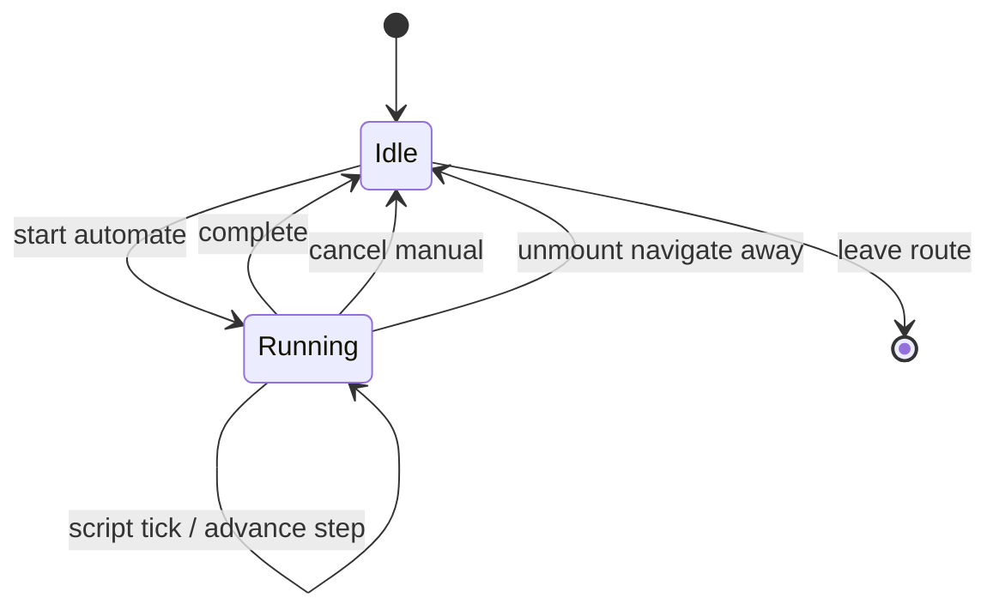

# Sandbox scenario right sidebar — User flows

> Companion to [`plan.md`](plan.md) and [`tdd.md`](tdd.md). **Telemetry:** dev-only logging in M1 — no production analytics rows in §1–§2.

## 1. Happy path

**Actor:** staff with **`sandbox.access`**. **Entry:** `/admin/sandbox/pug-system` (and `/admin/sandbox/onboarding` for parity).

| # | User does | UI shows | System does | Telemetry |
|---|-----------|----------|-------------|-----------|
| 1 | Opens pug sandbox | Main column shows current **step** body; **right sidebar** shows **scenario** module (not empty placeholder) | `PugSystemSandbox` **registers** slot content on mount | dev `console.debug` optional |
| 2 | Uses **step switcher** (prev/next or jump) | Sidebar + header readout update; main body switches | `setStepIndex` → `router.replace` updates `step` query | optional dev log |
| 3 | Expands **phase** accordion for current step | Phase-specific controls (e.g. invite accept/decline, counts) | Updates **mock context** / local registry-driven state | — |
| 4 | Chooses a **`preset`** from list or deep link | Controls hydrate from **TS registry**; URL carries `preset=` | Parse + validate **preset** id | optional dev log |
| 5 | Starts **automate sequence** | Visible **Running** state + **Cancel** | Scheduler applies scripted delays; may advance steps per script | dev log of phase transitions |
| 6 | Lets automate finish | Returns to **Idle**; URL reflects final `step` / `preset` | Timers complete; cleanup | — |
| 7 | Copies URL / shares link | Peer opens same **scenario**, **step**, **preset** | Normalize only if invalid | — |
| 8 | Navigates to non-sandbox route | Right sidebar returns to **default** (empty / future party UI) | Sandbox module **unregisters** on unmount | — |

## 2. Error states

| Trigger | User-visible state | Recovery path | Telemetry | Test ref |
|---------|--------------------|---------------|-----------|----------|
| Unknown **`preset`** id | Controls snap to **default preset**; optional **muted** one-line note in sidebar | Pick another preset or clear query | dev `console.debug` | [`tdd.md`](tdd.md) #1 |
| **`step`** out of range | Clamped to valid index (same spirit as today’s URL fixup) | Continue with valid step | dev log | [`tdd.md`](tdd.md) #5 |
| **`scenario`** unknown | Falls back to **defaultScenarioId** | Choose scenario from list | dev log | [`tdd.md`](tdd.md) #5 |
| Automate **timer error** (thrown in mock) | Automate **cancels**; inline muted error in sidebar | Retry **Run** | dev `console.error` optional | [`tdd.md`](tdd.md) #3–4 |
| User lacks **`sandbox.access`** | **404** from admin sandbox layout | Request access | — | out of scope here (admin-panel) |

## 3. Alternate flows

### 3.1 Cancel / manual override during automate

- **Trigger:** User changes **step**, **scenario**, **preset**, or material mock control while automate is **running**.
- **Behavior:** **Immediate cancel** — clear timers, clear running state, leave URL at current values unless normalize requires fixup.
- **Acceptance:** No further automated callbacks after cancel; [`tdd.md`](tdd.md) #3.

### 3.2 Navigate away mid-automate

- **Trigger:** Route change away from sandbox page.
- **Behavior:** **Unmount cleanup** — same as cancel.
- **Acceptance:** No ghost timers; returning to route does not auto-resume unless URL encodes an explicit autostart rule (if implemented later).

### 3.3 Deep link with automate flag

- **Trigger:** URL includes automate-related flag (exact name TBD in implementation).
- **Behavior:** Document whether first paint **auto-starts** or requires **Run** button click; **MVP default:** require explicit **Run** unless product later chooses autostart for demo links.
- **Acceptance:** Documented in `plan.md` / code comment + test if autostart is implemented.

### 3.4 Empty / default slot (non-sandbox)

- **UI:** Right sidebar shows **placeholder** (today’s “Future secondary panel content” or equivalent).
- **Acceptance:** No sandbox strings or scenario UI leaks.

### 3.5 Mobile / small viewport

- **Trigger:** Right sidebar collapsed to icon or narrow width.
- **Behavior:** **Open question** in [`plan.md`](plan.md) §11 — until resolved, accept OS/browser scroll inside sidebar; ensure controls remain reachable when expanded.
- **Acceptance:** No horizontal overflow in sidebar panel at `sm` breakpoint for representative preset panel.

### 3.6 Offline

- **Behavior:** Sandbox already client-only; **no** queued writes. Optional banner **deferred** unless product requests.

## 4. State diagram

## 5. Manual smoke (M1)

1. Sign in as user with **`sandbox.access`**.
2. Open **`/admin/sandbox/pug-system`** — sidebar shows scenario module; **no** bottom dock card.
3. Change **step** — URL updates; refresh restores.
4. Pick **preset** — URL updates; invalid preset normalizes.
5. Start **automate** — observe progression; **Cancel** stops further changes.
6. Open **`/admin/sandbox/onboarding`** — sidebar shows scenario + former dock-extra controls; bottom dock absent.
7. Navigate to **`/dashboard`** (or any non-sandbox page) — sidebar empty/default.

## 6. Acceptance summary

This feature is "done" when:

- [ ] §1 happy path steps **1–8** pass manual smoke (§5) or equivalent scripted test later.
- [ ] §2 rows have matching tests in [`tdd.md`](tdd.md) where marked.
- [ ] §3 alternate flows have acceptance met.
- [ ] §4 diagram matches implemented automate states.
- [ ] No production analytics added for this chrome in M1.
