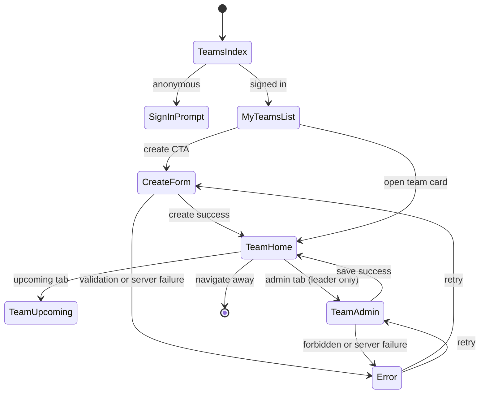

# Team pages — User flows

> Companion to [`plan.md`](plan.md) and [`tdd.md`](tdd.md). MVP telemetry: **success-only** `team_created` / `team_updated`; no forbidden/not-found tracking.

## 1. Happy path

### 1.1 Anonymous — view team

| # | User does | UI shows | System does | Telemetry |
|---|-----------|----------|-------------|-----------|
| 1 | Opens `/teams/falcons/home` (example slug) | Team header, roster, tabs (Home active; **Admin hidden**) | RSC: `getTeamBySlug`, `getTeamRoster` | — |
| 2 | Clicks **Upcoming** | Stub placeholder with team name | Same team context from layout | — |

### 1.2 Signed-in — My teams + create

| # | User does | UI shows | System does | Telemetry |
|---|-----------|----------|-------------|-----------|
| 1 | Opens `/teams` while signed in with linked Steam | Cards for teams they belong to + **Create team** | `getMyTeamsForUser(steamid64)` | — |
| 2 | Clicks **Create team** | Navigates to `/teams/new` | — | — |
| 3 | Enters team name (required), optional nickname/description/avatar URL; submits | Submit loading state | `createTeamAction` → transaction: `teams` + `player_teams` leader | `team_created` |
| 4 | Success | Redirect to `/teams/[slug]/home` | `revalidatePath('/teams')` | — |

### 1.3 Leader — Admin edit

| # | User does | UI shows | System does | Telemetry |
|---|-----------|----------|-------------|-----------|
| 1 | On team workspace, clicks **Admin** tab (visible only to leader) | Form pre-filled with name, nickname, description, avatar URL | RSC load team; leader gate | — |
| 2 | Edits fields, saves | Submit loading | `updateTeamAction` | `team_updated` |
| 3 | Success | Toast or inline success; if slug changed → redirect to new canonical URL | `revalidatePath` for team routes | — |

### 1.4 Manual smoke (MVP acceptance)

1. **Anonymous:** open a known team `/teams/[slug]/home` → roster renders; **Admin** tab not visible.
2. **Signed in + Steam:** `/teams` → **Create team** → land on home → roster shows creator as leader.
3. **Leader:** **Admin** → change name → save → home reflects change.
4. **Non-leader:** navigate directly to `/teams/[slug]/admin` → **404**.
5. **Team switcher:** select team in sidebar → navigates to `/teams/[slug]/home`; list matches memberships.

## 2. Error states

Server actions return **`ok: false`** with **`code`** + **`message`** unless noted.

| Trigger | User-visible state | Recovery path | Telemetry | Test ref |
|---------|--------------------|---------------|-----------|----------|
| Required name missing | Inline error on name field | Fix field | — | tdd #3 |
| Invalid slug format | Inline error on slug field (if exposed) | Fix slug | — | tdd #2 |
| Reserved slug (`admin`, `new`, …) | Inline error | Choose different slug | — | tdd #1–2 |
| Duplicate slug / unique violation | Inline: slug taken | Edit slug or name | — | tdd #8 |
| Not signed in (create) | Redirect to auth with `returnTo=/teams/new` | Sign in | — | flows-only |
| Steam not linked | Banner on create page + link to Steam connect | Link Steam | — | flows-only |
| `STEAM_REQUIRED` on server | Same message as client gate | Link Steam | — | tdd #7 |
| `FORBIDDEN` (not leader on update) | Error message; no mutation | — | — | tdd #5, #7 |
| Unknown team slug | **404** page | Return to `/teams` | — | flows-only |
| Non-leader `/admin` deep link | **404** (`notFound`) | — | — | flows-only |
| DB / unknown error | Inline/banner: "Something went wrong" | Retry submit | — | tdd #7 |
| Optimistic double-submit | Second submit disabled while pending | Wait | — | alt §3.2 |

## 3. Alternate flows

### 3.1 Cancel (create)

- **Trigger:** **Cancel** or browser back on `/teams/new`.
- **State:** No confirm if pristine; confirm if dirty (optional — prefer pristine-only MVP).
- **Acceptance:** No `teams` row written.

### 3.2 Retry / double-submit

- **Trigger:** User clicks submit twice or retries after transient error.
- **State:** Button **`disabled`** + spinner while action pending.
- **Acceptance:** No duplicate teams on double-click; success redirect makes retry benign.

### 3.3 Partial save / drafts

- **MVP:** **No** draft rows. Form state lost on navigate away.

### 3.4 Deep link entry

- **`/teams/[slug]/admin`** — leader: form loads; non-leader: **404**; unknown slug: **404**.
- **`/teams/new`** — signed-out: redirect auth; no Steam: blocking CTA.
- **Slug rename after bookmark** — old slug **404**; leader redirected to canonical slug on save (optional redirect-on-read if old slug stored — **MVP: 404 only**).

### 3.5 Empty state — My teams

- **Signed out on `/teams`:** Headline + **Sign in** CTA; no team cards.
- **Signed in, zero memberships:** Illustration + **Create team** CTA.
- **Acceptance:** CTA routes to `/teams/new` (with Steam gate).

### 3.6 Loading state

- **UI:** Skeleton for team header + roster on `[slug]/layout` and home.
- **Acceptance:** Skeleton matches final layout; no layout shift when data arrives.

### 3.7 Permissions denied

- **Admin tab:** **Hidden** for non-leaders (not merely disabled).
- **Admin route:** **`notFound()`** for non-leaders (no 403 leak).
- **Acceptance:** Members see Home + Upcoming only.

### 3.8 Offline

- **UI:** Failed server action → inline "Network error" / toast.
- **Acceptance:** No uncaught client throws.

### 3.9 Mobile / small viewport

- **Adjustments:** Tab bar scrolls horizontally or wraps; roster stacks; full-width CTAs.
- **Acceptance:** No forced horizontal page scroll at default widths; tap targets ≥44px.

## 4. State diagram

## 5. Acceptance summary

This feature is "done" when:

- [ ] §1.4 manual smoke passes.
- [ ] Every row in §2 with a **Test ref** has a passing Vitest test.
- [ ] Alternate flows §3.1–3.9 behave as documented.
- [ ] Dummy `TEAMS` arrays removed from `team-switcher` and `/teams` page.
- [ ] `0025_teams_slug` applied locally and on intradark Supabase; types regenerated.
- [ ] `pnpm lint:architecture` clean.
