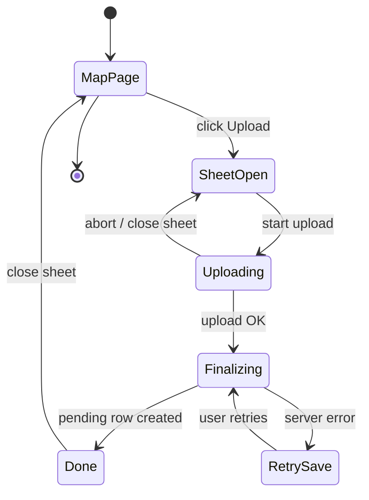

# Utility lineup — user upload — User flows

> Companion to [`plan.md`](plan.md) and [`tdd.md`](tdd.md).

## 1. Happy path

| # | User does | UI shows | System does | Telemetry |
|---|-----------|----------|-------------|-----------|
| 1 | Opens **`/utility/{mapSlug}`** | Radar + clusters + filter bar | Server loads **published** lineups only | existing `utility_map_view` |
| 2 | Clicks **Upload lineup** (signed in, has profile) | Sheet opens, step 1 metadata | No persist | `utility_lineup_submit_open` |
| 3 | Fills required fields, sets throw + land on radar mini-map | Pins update, labels optional | Client state only | — |
| 4 | Chooses video file | File name + size shown | Client validates type/size per server contract | — |
| 5 | Confirms upload | Progress bar + optional toast milestones | Client requests signed URL; **PUT** to Storage until complete | `utility_lineup_submit_upload_done` |
| 6 | Clicks **Submit** | Spinner on submit | Server action inserts **`utility_lineups`** with **`status = pending`**, **`video_object_path`**, **`author_profile_id`** | `utility_lineup_submit_finalize` |
| 7 | Success | Success message + sheet closes | `revalidatePath` for utility routes as needed | — |

**Guest / no profile:** Button opens sheet with **Sign in** / **Complete profile** CTA instead of upload (or disabled button with tooltip — pick one in implementation; document here when chosen).

## 2. Error states

| Trigger | User-visible state | Recovery | Telemetry | Test ref |
|---------|--------------------|----------|-----------|----------|
| Not signed in | CTA to sign in | Auth flow + return | — | tdd #7 |
| No `user_profiles` row | Explainer + link to onboarding | Create profile flow | — | plan §11 |
| File too large or wrong MIME | Inline error on file field | Pick another file | — | tdd #2 |
| Storage network error | Toast + **Retry upload** | Retries PUT from start or resume per client capability | `utility_lineup_submit_upload_done` `{ ok:false }` | tdd #8 |
| Upload OK, finalize fails | Message: save failed; **Retry save** without re-upload if path still valid | Re-call finalize action with same payload + path | `utility_lineup_submit_finalize` `{ ok:false }` | tdd #6 |
| Session expired on finalize | Toast + refresh sign-in | Re-auth | `utility_lineup_submit_finalize` | tdd #6 |
| Validation error from server | Field-level or summary error | Fix + submit | `utility_lineup_submit_finalize` | tdd #2 |
| Developer-only admin action | 403 toast / page | N/A for submitter | existing admin patterns | tdd #6 |

## 3. Alternate flows

### 3.1 Cancel / close sheet

- **Default:** Closing sheet or explicit **Cancel** runs **`AbortController`** on in-flight upload when no DB row exists yet; best-effort delete of partial Storage object if implementation supports it.
- **Acceptance:** No `pending` row without completed upload + finalize agreement (see [`plan.md`](plan.md) §2).

### 3.2 Retry finalize

- User taps **Retry save** after upload succeeded.
- **Acceptance:** Second finalize is **idempotent** (same client correlation id → same row, no duplicates) or server returns existing id — choose one and test.

### 3.3 Draft rows

- **MVP:** No **`draft`** rows for community users unless product changes; **`draft`** remains for internal/admin tooling. Optional: allow **`pending`** edit only before admin review — **deferred** unless specified.

### 3.4 Deep link

- No standalone `/submit` URL required for MVP; sheet is contextual to **`mapSlug`**.

### 3.5 Empty / first-time

- First upload: copy explains moderation delay.

### 3.6 Loading

- Sheet skeleton for first open; lazy-load heavy subcomponents if needed.

### 3.7 Permissions

- Non-developer cannot access admin moderation actions.

### 3.8 Offline

- Detect `navigator.onLine === false`; block upload start with clear message.

### 3.9 Mobile / small viewport

- Sheet full-screen on **`sm`**; radar tap targets ≥ **44px**; no horizontal scroll.

### 3.10 Admin moderation (happy path extension)

| # | Admin does | System | Telemetry |
|---|------------|--------|-----------|
| 1 | Opens admin utility queue | Lists `pending` | optional `utility_lineup_moderation_view` |
| 2 | Reviews row, clicks **Publish** | `status → published` | `utility_lineup_moderation_publish` |

**Official mark:** separate control sets **`intradark_verified = true`** only when curating Intradark-official content.

## 4. State diagram

## 5. Acceptance summary

- [ ] Happy path §1 steps work on staging with a **real** large file (manual).
- [ ] Every §2 row has automated coverage **or** explicit waiver in PR.
- [ ] §3.1 cancel/abort behavior verified.
- [ ] Admin §3.10 can publish a `pending` lineup.
- [ ] Milestone telemetry only (**[`plan.md`](plan.md)** §9).
