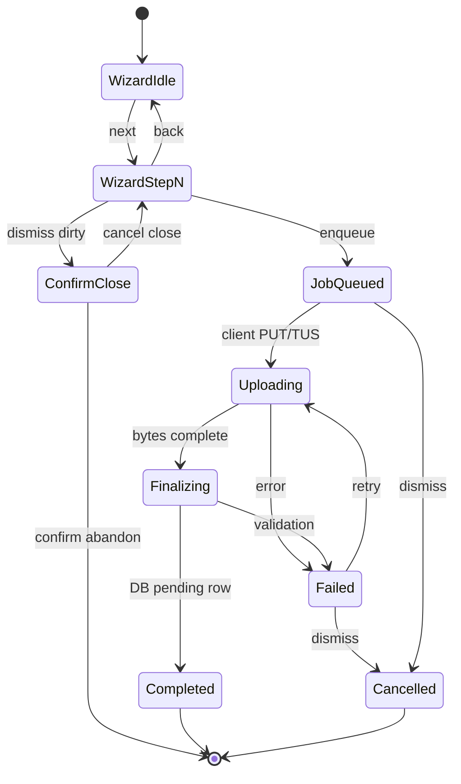

# Utility lineup upload — multi-step wizard — User flows

> Companion to [`plan.md`](plan.md) and [`tdd.md`](tdd.md).

## 1. Happy path

| # | User does | UI shows | System does | Telemetry |
|---|-----------|----------|-------------|-----------|
| 1 | Opens **`/utility/[mapSlug]`**, clicks upload | Wizard **step 1** — map defaults to current slug | No persistence | `utility_upload_wizard_opened` |
| 2 | Confirms/changes map, continues | Step 2 — video picker + validation hints | Local **`URL.createObjectURL`** preview | — |
| 3 | Picks valid video file | Preview + duration loaded | Client-side validation only | — |
| 4 | Places **throw** + label | Radar + inputs | Local state | — |
| 5 | Places **land** + label | Radar + inputs | Local state | — |
| 6 | Fills grenade meta | Form fields | Local state | — |
| 7 | Sets timestamps / still markers via scrubber | **`UtilityLineupVideoTimelineScrubber`** bound to **local** `<video>` | Local state | — |
| 8 | Taps **Enqueue upload** / finish | Wizard closes or shows “queued”; header shows job | Server **creates job** **`queued`**, reserves **`video_object_path`**; client starts **TUS/upload** | `utility_upload_job_enqueued` |
| 9 | Navigates elsewhere | Header progress updates | Storage upload continues | — |
| 10 | Upload completes | Header item → success / clears | **Finalize** → **`utility_lineups`** **`pending`**; job **`completed`** | `utility_upload_job_completed` |

## 2. Error states

| Trigger | User-visible state | Recovery | Telemetry | Test ref |
|---------|-------------------|----------|-----------|----------|
| Not signed in | CTA opens sign-in / toast | Sign in | — | manual |
| Missing profile | “Complete profile” message | Onboarding link | — | tdd #3 |
| Email not verified | “Verify email to upload” | Resend / settings | — | tdd #3 |
| Steam not linked | “Connect Steam” | Link flow | — | tdd #3 |
| Discord not linked | “Connect Discord” | Link flow | — | tdd #3 |
| Invalid video (size/type) | Inline error on step 2 | Pick another file | — | tdd #2 |
| Storage / network failure mid-upload | Header job **failed** + message | **Retry** / **Dismiss** | `utility_upload_job_failed` | tdd #4–7 |
| Signed URL expired | Same as failure | **Retry** (re-sign) | `utility_upload_job_failed` | integration |
| Finalize validation error | Failed job + code | Fix metadata offline impossible — **Dismiss** + new wizard | `utility_upload_job_failed` | integration |
| RLS denial (tampered job id) | Toast forbidden | — | — | tdd #5 |

## 3. Alternate flows

### 3.1 Close wizard with unsaved changes

- **Trigger:** Overlay click, **Escape**, or close button with dirty state.
- **UI:** Confirm: “You’re about to close — unsaved changes will be lost.”
- **Acceptance:** Cancel → stay; Confirm → discard local state; **`utility_upload_wizard_abandoned`** with **`step_index`**.

### 3.2 Retry failed job

- **Trigger:** **Retry** on failed header item.
- **Behavior:** Re-request signed URL; reuse **`File`** if still in client memory, else prompt **Pick video again**.
- **Telemetry:** **`utility_upload_job_retry_clicked`**.

### 3.3 Dismiss / cancel job

- **Trigger:** **Dismiss** on queued/uploading/failed.
- **Behavior:** Server sets **`cancelled`**; UI removes from header; Storage orphan policy per **`plan.md`** open question.

### 3.4 Multi-tab

- **Behavior:** Postgres is source of truth; each tab may poll/list jobs; **no** duplicate finalize if server enforces **idempotency** on **`job_id`**.

### 3.5 Offline at enqueue

- **UI:** Toast “Network required to enqueue”; stay on wizard.
- **Acceptance:** No orphaned **`queued`** row without client acknowledgment — prefer server create only on successful round-trip.

### 3.6 Mobile / small viewport

- **Behavior:** Full-screen dialog or bottom sheet pattern using **`@workspace/ui`** responsive variants; radar tap targets ≥ **44px**.

## 4. State diagram

## 5. Acceptance summary

- [ ] Happy path §1 manual smoke passes on staging.
- [ ] Every §2 row has automated coverage **or** documented waiver.
- [ ] §3.1 confirm dialog verified.
- [ ] Eligibility gates tested for each rejection reason.
- [ ] Telemetry §1 fires on staging (sanity check).
