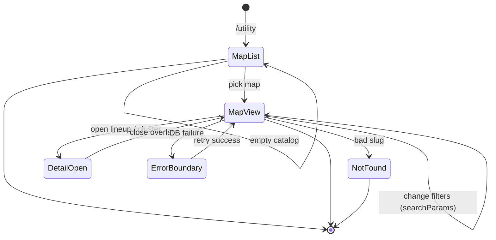

# Utility lineups — User flows

> Companion to [`plan.md`](plan.md) and [`tdd.md`](tdd.md). MVP is **read-heavy**; mutation flows are **placeholders** for phase 2.

## 1. Happy path

### 1.A — Browse maps

| # | User does | UI shows | System does | Telemetry |
|---|-----------|----------|-------------|-----------|
| 1 | Opens **`/utility`** | **Map cards** or **empty state** (“No maps yet”) | Drizzle: **`utility_maps`** where **`is_active`** | automatic page view |
| 2 | Clicks a map | Navigates to **`/utility/[mapSlug]`** | Resolve map by **slug**; load spots + **published** lineups | optional `track('utility_map_view', { map_slug })` |
| 3 | Sees radar + sidebar | Filters for grenade type + side; markers on radar at **land** spot positions | Apply **`searchParams`** → normalized filters → query | — |
| 4 | Clicks a **cluster** (count badge) or a single-land marker | **Detail overlay** (sheet/dialog): **screenshot**, **title/summary** (from description + spot labels), **YouTube embed** trimmed by **start/end ms** if set | Client island opens; data from server props or minimal state | optional `track('utility_lineup_open', { map_slug, lineup_id, … })` |
| 5 | Closes overlay | Returns to map view; filters unchanged | UI only | — |

### 1.B — Deep link

| # | User does | UI shows | System does | Telemetry |
|---|-----------|----------|-------------|-----------|
| 1 | Opens **`/utility/mirage?type=smoke&side=ct`** | Same as step 3–4 with filters applied | Coerce invalid values to defaults; still **200** if map exists | `utility_map_view` |

## 2. Error states

| Trigger | User-visible state | Recovery path | Telemetry | Test ref |
|---------|--------------------|---------------|-----------|----------|
| **`mapSlug`** not found or map **inactive** | **404** (`notFound()`) | User goes back to **`/utility`** | — | manual / route test optional |
| **DB / network failure** loading map page | **`error.tsx`** with **Retry** | Retry navigation | optional failure track | manual |
| **Valid map**, filters applied, **zero** lineups | **Inline empty state** on map area (“No lineups for these filters”) | User changes filters or resets | — | manual |
| **No maps** in database | **`/utility`** empty state | Wait for content / ops seed | — | manual |
| **Broken radar image URL** | **Broken image** treatment + alt text | Ops fixes URL in DB | — | manual |
| **Invalid YouTube URL** in data | Hide embed or show “Video unavailable” inline | Ops fixes row | — | [`tdd.md`](tdd.md) #5 |
| **Future:** user submits lineup without auth | *(deferred)* redirect to sign-in | — | — | — |
| **Future:** RLS denies write | *(deferred)* toast + no persist | — | — | — |

## 3. Alternate flows

### 3.1 Cancel

- **MVP read path:** user closes overlay — **no** server writes; no cancel semantics beyond UI dismiss.

### 3.2 Retry

- **Trigger:** **`error.tsx`** after server failure.
- **Acceptance:** Retry re-executes the **Server Component** request; no partial DB state for reads.

### 3.3 Partial save / drafts

- **MVP:** **N/A** for visitors. **`utility_lineups.status='draft'`** exists for **future** editor pipeline.

### 3.4 Deep link entry

- **Behavior:** **`/utility/[mapSlug]`** with arbitrary query — **server** resolves map; invalid slug → **404**; invalid query values → **coerced defaults**, **HTTP 200**.
- **Acceptance:** No client-only redirect loop; URL may be normalized when user uses **in-app** controls (optional).

### 3.5 Empty state

- **No maps:** `/utility` explains catalog is empty; optional link to home/news.
- **No lineups for filters:** message + suggest clearing filters (in-app control).

### 3.6 Loading

- **`loading.tsx`** skeleton for map list and map page where layout benefits.
- **Acceptance:** Avoid large layout shift when radar image loads (reserve aspect ratio box).

### 3.7 Permissions denied

- **MVP public read:** not applicable for **`SELECT` published** content.
- **Future staff:** align with **`roles` / `user_roles`** pattern from **[`../admin-panel/plan.md`](../admin-panel/plan.md)**.

### 3.8 Offline

- **MVP:** native browser behavior; optional small banner **post-MVP**.

### 3.9 Mobile / small viewport

- **Layout:** sidebar **stacks above** or **collapses into drawer** for narrow screens; radar remains usable (scroll if needed).
- **Acceptance:** Tap targets ≥ **44px**; marker hit areas large enough for touch; **no** horizontal overflow of main shell.

## 4. State diagram

## 5. Acceptance summary

This feature’s **MVP** is done when:

- [ ] [`plan.md`](plan.md) §2 **In scope** behaviors ship on **`/utility`** and **`/utility/[mapSlug]`**.
- [ ] **404** / **`error.tsx`** / **empty** states match §2 and §3.5.
- [ ] [`tdd.md`](tdd.md) **unit** rows **1–5** are green.
- [ ] **Manual smoke** (§1) passes once seeded or with empty states verified.
- [ ] `pnpm lint:architecture` passes from monorepo root.
- [ ] Optional telemetry events match [`plan.md`](plan.md) §9 if enabled.
