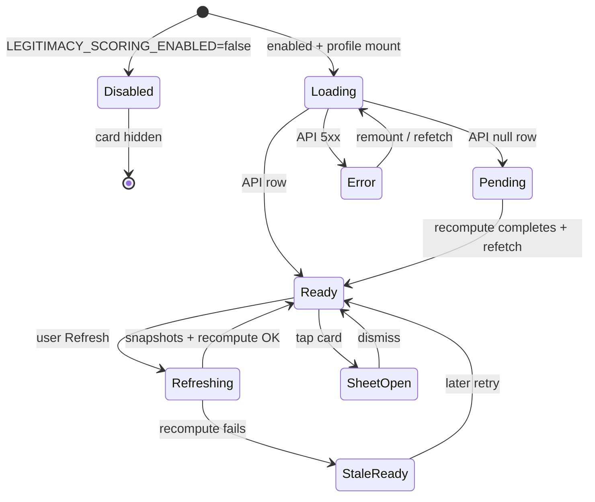

# Veritas player legitimacy score — User flows

> Companion to [`plan.md`](plan.md) and [`tdd.md`](tdd.md). Phase 1 only.

## 1. Happy path

| # | User does | UI shows | System does | Telemetry |
|---|-----------|----------|-------------|-----------|
| 1 | Opens `/players/{steamid64}` or `/players/@username` | Profile header loads; legitimacy card skeleton in stats column | Page resolves canonical id; parallel fetches for Steam/Leetify/FACEIT/GC | — |
| 2 | — | Legitimacy card: **score**, **tier badge**, top 2–3 drivers/flags, **confidence chip** | `GET /api/players/[id]/legitimacy` returns upserted row (or pending state if recompute not yet run) | — |
| 3 | Taps legitimacy card | Breakdown **Sheet** opens with per-axis 0–100, penalties, `computed_at` footer | Client already has breakdown jsonb from step 2 | `player_legitimacy_breakdown_opened` `{ tier }` |
| 4 | Dismisses Sheet | Returns to header card | — | — |

**System path (background):** on snapshot refresh or stale archive fetch, `recomputeLegitimacy` assembles `LegitimacyInput` from latest DB rows, runs pure scorer, upserts `player_legitimacy_scores`, emits `player_legitimacy_recomputed`.

## 2. Error states

| Trigger | User-visible state | Recovery path | Telemetry | Test ref |
|---------|-------------------|---------------|-----------|----------|
| No legitimacy row yet (first visit) | Tier **Unverified**, “Score pending”, Low confidence | Wait for snapshot archive + recompute; or click Refresh | — | tdd #20, manual |
| Partial data (e.g. Steam only) | Score with Low confidence chip; shrink toward 50 | Link more platforms (FACEIT/Leetify) over time | `player_legitimacy_recomputed` low `coverage_bucket` | tdd #10–11 |
| `GET /api/players/[id]/legitimacy` 500 | Skeleton → “Unable to load score” (no fake numbers) | Retry on navigation or Refresh | — | manual |
| Invalid steamid64 in API | N/A (route 400) | — | — | tdd #20 |
| Recompute throws during archive | Profile panels still update; legitimacy shows **last** row or pending | Automatic retry on next refresh | server log only | tdd #16 |
| `LEGITIMACY_SCORING_ENABLED=false` | Legitimacy card hidden or “Temporarily unavailable” | Ops re-enables env | — | tdd #19 |
| VAC / ban detected | Tier toward Suspicious; risk flags in card | — | server recompute event | tdd #8, #13 |

## 3. Alternate flows

### 3.1 Manual refresh sync

- **Trigger:** User clicks profile **Refresh**.
- **Behavior:** `POST /api/players/[id]/refresh` refetches sources → each archive helper calls `recomputeLegitimacy` → client invalidates `["players", steamid64, "legitimacy"]` on refresh success.
- **Acceptance:** Legitimacy card updates within same session without full page reload.

### 3.2 GC badge lag

- **Trigger:** GC snapshot arrives via Realtime after initial page load.
- **Behavior:** Existing `useGcBadges` subscription; additionally invalidate legitimacy query when GC row is new (or on GC fetch complete).
- **Acceptance:** Score may update after medals/VAC from GC; Sheet `computed_at` reflects later recompute.

### 3.3 Deep link entry

- **Trigger:** Direct navigation to `/players/@user` or raw steamid64.
- **Behavior:** Same as happy path; canonical redirect unchanged from parent feature.
- **Acceptance:** Legitimacy card renders for anon viewers.

### 3.4 Loading state

- **Trigger:** Legitimacy query in flight.
- **UI:** Skeleton matching compact card layout (no layout shift in header grid).
- **Acceptance:** Skeleton visible immediately; replaced by data or empty state.

### 3.5 Empty / thin player

- **Trigger:** Brand-new player, no third-party stats.
- **UI:** **Unverified** tier, not Suspicious; Low confidence.
- **Acceptance:** Matches algorithm edge case (low S → no coherence suspicion).

### 3.6 Cancel (Sheet)

- **Trigger:** Sheet close button, overlay click, Escape.
- **Acceptance:** Sheet closes; no server mutation.

### 3.7 Permissions denied

- **Phase 1:** n/a — public read by design.

### 3.8 Offline

- **Phase 1:** Deferred (no offline banner). Browser may show cached React Query data if available.

### 3.9 Mobile / small viewport

- **Breakpoint:** `sm` and below.
- **Adjustments:** Sheet is full-width bottom sheet (default `@workspace/ui` Sheet behavior); drivers list wraps.
- **Acceptance:** No horizontal scroll; tap targets ≥44px on card.

## 4. State diagram

## 5. Manual smoke checklist

Phase 1 is "done" when:

- [ ] Happy path §1 steps 1–4 verified on a player with Leetify + Steam data.
- [ ] Thin new player shows Unverified (§3.5).
- [ ] Manual Refresh updates legitimacy (§3.1).
- [ ] Kill-switch hides card (§2 row).
- [ ] Breakdown Sheet shows axes + `computed_at` (§1 step 3).
- [ ] Telemetry events visible in Vercel Analytics (spot-check).
- [ ] Every §2 row mapped in [`tdd.md`](tdd.md) §6 has a passing test or manual note.

## 6. Cross-references

- Plan: [`plan.md`](plan.md)
- TDD: [`tdd.md`](tdd.md)
- Algorithm: [`docs/veritas-algorithm.md`](../../veritas-algorithm.md)
