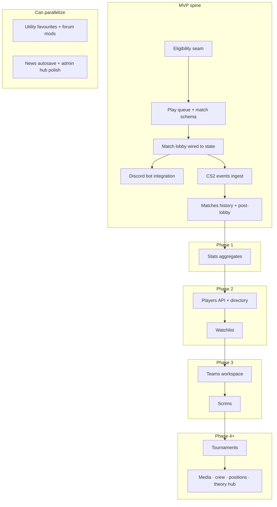

# Intradark module expansion recommendations

> **Purpose:** Identify which modules under `apps/intradark/` are still scaffolded or partial, and recommend how to build them out using existing patterns in the repo.
>
> **Audience:** Maintainers planning feature work; pair with [roadmap.md](roadmap.md) for phasing and [CONTEXT.md](../CONTEXT.md) for domain vocabulary.
>
> **Last reviewed:** 2026-06-07

---

## How to read this document

### Maturity ratings

| Rating | Meaning |
|--------|---------|
| **Shipped** | Real persistence, server actions or API, and production UI for the core happy path |
| **Partial** | Meaningful UI or backend exists, but relies on mocks, hardcoded data, or missing seams |
| **Scaffold** | Route shell only (`MainSectionShell` “Coming soon”, empty API, or placeholder copy) |

### Build-out pattern (repeat for every module)

The repo has converged on a consistent shape. New or expanded modules should follow it:

1. **Schema + RLS** in `drizzle/` → mirror in `server/db/schema.ts` → apply via Supabase MCP in order.
2. **Entity module** at `entities/<domain>/` with:
   - `lib/queries.ts` — Drizzle reads (Server Components only)
   - `actions.ts` or `actions/` — mutations via server actions
   - `lib/` — Zod schemas, pure helpers (Vitest here)
   - `components/` — domain UI (not `components/` shell)
3. **Thin routes** under `app/(main)/<segment>/` that compose entity exports.
4. **RBAC** — add `nav.<segment>` capability + `route-permission.ts` mapping; gate via `NavRouteGate` layout.
5. **Feature triad** — run `/build-feature` to produce `docs/features/<slug>/{plan,tdd,flows}.md` before large slices.

Reference implementations: **`entities/utility-lineups/`** (deepest), **`entities/news/`** (CMS MVP), **`entities/forums/`** (community MVP).

---

## Current state at a glance

```
Shipped (core path works)
  utility-lineups · news · forums · rbac (infra)

Partial (needs real backend or completion)
  match-lobby · sandbox · play · players · admin · content · teams · theory (callouts only)

Scaffold (entity module does not exist)
  stats · watchlist · scrims · tournaments · media · matches · crew · positions · theory (index)
```

| Module / route | Entity folder | Rating | Primary gap |
|----------------|---------------|--------|-------------|
| Utility lineups | `entities/utility-lineups/` | Shipped | Polish + deferred features (favourites, rejection flow) |
| News | `entities/news/` | Shipped (MVP) | Autosave, search, moderation roles beyond `news.editor` |
| Forums | `entities/forums/` | Shipped (MVP) | Mod tools, votes, notifications; doc status stale |
| RBAC | `entities/rbac/` | Shipped (infra) | Capability coverage as new routes ship |
| Match lobby | `entities/match-lobby/` | Partial | Entirely mock — no match state machine |
| Sandbox | `entities/sandbox/` | Partial | Dev simulator only; not production |
| Play hub | *(none — organism in `components/`)* | Partial | `faceit-play-mock.tsx` — no queue backend |
| Players | `entities/players/` | Partial | Hooks call missing `/api/steam/*` routes; stub mutations |
| Admin | `entities/admin/` | Partial | Lib-only; no unified admin entity UI |
| Content | `entities/content/` | Partial | Shared slug helpers only |
| Teams | *(none)* | Partial | Hardcoded `TEAMS` array |
| Theory | *(reuses utility-lineups for callouts)* | Partial | Index page is scaffold |
| Stats, watchlist, scrims, tournaments, media, matches, crew, positions | *(none)* | Scaffold | `MainSectionShell` only |

---

## Priority 1 — Core PUG loop (MVP spine)

These modules block the end-to-end pickup-game experience described in [pug-system-spec.md](pug-system-spec.md). The sandbox and match-lobby UI are **design-complete mocks**; the missing work is almost entirely **backend-owned match state**.

### 1. Play hub (`/play`)

**Current:** `app/(main)/play/page.tsx` renders `components/organisms/faceit-play-mock.tsx` (~800 lines, `DUMMY_USER`, no persistence).

**Gap:** No queue pool, eligibility checks, accept phase, or transition into a real match ID.

**Recommended build-out:**

| Layer | Work |
|-------|------|
| **Schema** | `queue_entries` (user, mode, region, joined_at, left_at), `matches` (status enum: forming → accept → lobby → live → finished), `match_players` (team, accept state, steam_id64) |
| **Entity** | Create `entities/pug/` (or `entities/matchmaking/`) owning queue + match formation — keep `faceit-play-mock` visuals but wire to server state via React Query or SSE |
| **Actions** | `joinQueue`, `leaveQueue`, `acceptMatch`, `declineMatch` — all validate **Eligibility** from CONTEXT.md (Steam + Discord + email verified) |
| **API** | Optional lightweight `/api/queue/status` for polling; prefer server actions + RSC for initial load |
| **RBAC** | Today `/play` requires `developer` in `route-permission.ts` — flip to `nav.play` for eligible members when backend ships |
| **Tests** | Pure helpers: ELO bucket selection, accept timeout logic, dodge cooldown calculation |

**Seam to preserve:** Keep `entities/sandbox/pug-system/` as the UX lab; extract shared display components from mock into `entities/match-lobby/` so sandbox and production share the same phase panels once state is real.

**Suggested slug:** `play-queue-ux` (see [roadmap.md](roadmap.md)).

---

### 2. Match lobby (`entities/match-lobby/`)

**Current:** Polished 4-phase UI (draft → Discord → veto → server) driven by `MatchLobbyMockProvider` and `MatchVetoMockProvider` with hardcoded `MOCK_TEAM_NORTH` / `MOCK_TEAM_SOUTH` in `entities/match-lobby/lib/mock-data.ts`.

**Gap:** Phase transitions are client toggles, not backend state. Routes under `app/(main)/match/[id]/*` never load a real match.

**Recommended build-out:**

| Phase | MVP (per pug-system-spec) | Post-MVP |
|-------|---------------------------|----------|
| **Team assignment** | Auto-balance by internal ELO — replace draft page mock | Captain draft UI (already sketched in sandbox) |
| **Discord** | Wire `match-lobby-mock-context` Discord counts to bot HTTP (`app/api/discord/bot/match/start`) | Reconnect flows, stricter readiness |
| **Map selection** | Backend picks map from pool — simplify veto route for MVP | Full interactive veto (`MatchVetoMockProvider` → real state) |
| **Server connect** | Real connect string + join readiness from match record | Live scoreboard from CS2 events |

**Architecture:**

1. Add **`entities/match/`** (or extend `match-lobby`) with `lib/match-phase.ts` — single function `resolveActivePhase(match)` used by layout redirect logic (replace `match/[id]/page.tsx` hard redirect to draft).
2. Replace mock providers with **`MatchSessionProvider`** that hydrates from server-fetched match + subscribes to updates (polling or Realtime later).
3. Keep mock providers as **`MatchLobbySandboxProvider`** aliases for sandbox-only routes — real seam, two adapters (per improve-codebase-architecture skill).
4. Discord bot contract already exists: `discord-bot/match-session.ts`, `app/api/discord/bot/match/{start,end}/route.ts` — match entity should emit events the bot consumes.

**Suggested slug:** `match-lobby-phases` with optional child triad `match-lobby-phases/discord-phase/`.

---

### 3. CS2 events + match history (`/matches`)

**Current:**

- `app/api/cs2/events/route.ts` — logs JSON with `Bearer dev-secret`, no persistence.
- `app/(main)/matches/page.tsx` — scaffold shell.

**Gap:** No durable match results, no post-lobby scoreboard, no feed for stats module.

**Recommended build-out:**

| Layer | Work |
|-------|------|
| **Schema** | `match_events` (raw ingest), `match_results` (normalized score, map, duration, player stats JSON), link to `matches.id` |
| **Ingest** | Replace dev secret with per-server API keys; idempotent event dedup by `(match_id, sequence)` |
| **Entity** | `entities/matches/` — queries for history list, detail with scoreboard component |
| **UI** | Replace `/matches` scaffold with paginated history; post-lobby route or modal from match lobby `result` phase |
| **Downstream** | Stats and player profiles consume `match_results` — do not duplicate stat tables per source |

**Suggested slugs:** `cs2-events-ingestion`, `post-match-results`.

---

### 4. Discord bot runtime

**Current:** `discord-bot/index.ts` + HTTP control plane partially wired; env in `env.example`.

**Gap:** Bot lifecycle not fully tied to match state machine; voice readiness still mocked in lobby UI.

**Recommended build-out:**

1. Document and enforce the **match → bot** contract in one ADR (channel create, move, teardown on match end).
2. Make Next.js match actions call bot HTTP atomically (start on lobby enter, end on result).
3. Expose bot health in admin dashboard (`/api/discord/bot/health` already exists).
4. Integration tests with mocked Discord gateway for channel name templates and permission checks.

**Suggested slug:** `discord-bot-runtime`.

---

### 5. Auth + eligibility (cross-cutting, not an entity)

**Current:** Steam and Discord OAuth routes exist; dashboard prompts for Discord link; onboarding sandbox simulates the flow.

**Gap:** Eligibility is not a single seam reused by queue, utility upload, and play hub.

**Recommended build-out:**

1. Add **`entities/eligibility/`** (or `entities/me/`) with `getEligibility(session)` returning `{ ready, missing: ('steam'|'discord'|'email')[] }`.
2. Use in: play queue join, utility upload wizard (`utility-lineup-upload-eligibility.ts` already partial), dashboard badges.
3. Align with sandbox onboarding steps — production routes should mirror the same gates without mock fixtures.

**Suggested slugs:** `steam-supabase-auth`, `discord-account-linking`, `user-profile-api` (roadmap index).

---

## Priority 2 — Partial modules to expand

### 6. Players (`entities/players/`)

**Current:**

- `entities/players/hooks/queries.ts` fetches `/api/steam/...`, `/api/faceit/...`, etc. — **those API routes do not exist**.
- `app/api/players/route.ts` returns `{ players: [] }`.
- `players/[id]/page.tsx` uses `PlayerProfileMock` and showcase data.
- `hooks/mutations/create.ts` is a stub.

**Recommended build-out:**

| Step | Detail |
|------|--------|
| 1 | **API adapters** — `app/api/steam/vanity-to-id64/route.ts`, cached profile fetchers with rate limits and server-only API keys |
| 2 | **Schema** | `player_profiles` (steam_id64 PK, cached external JSON blobs, `updated_at`) — optional `player_search` index for directory |
| 3 | **Queries** | Server-side aggregation in `entities/players/lib/fetch-player-profile.ts`; client hooks call thin `/api/players/[steamId64]` BFF routes |
| 4 | **Directory** | Replace `players/page.tsx` stub with search + pagination over profiles linked to platform users |
| 5 | **UI** | Migrate `components/organisms/player-profile/` into entity; remove `PlayerProfileMock` when live data works |
| 6 | **Tests** | Cache TTL logic, vanity URL resolution, graceful degradation when Faceit/Leetify unavailable |

**Relationship:** Phase 2 in roadmap — enriched by `match_results` once PUG loop ships.

**Suggested slug:** `players-directory-profiles`.

---

### 7. Teams (`/teams`)

**Current:** `TEAMS` hardcoded in `app/(main)/teams/page.tsx` and `team-switcher.tsx`; subpages show slug only.

**Recommended build-out:**

| Layer | Work |
|-------|------|
| **Schema** | `teams`, `team_members` (role: owner/captain/member), `team_invites` |
| **Entity** | `entities/teams/` — roster CRUD, team switcher reads from session user's memberships |
| **UI** | Home (announcements, roster), Upcoming (scrims link later), settings for captains |
| **RBAC** | `nav.teams` already gated; add `teams.manage` for roster edits |

Start with **single-team membership** before org hierarchies. Remove hardcoded arrays in one commit when DB reads land.

**Suggested slug:** `teams-workspace`.

---

### 8. Theory (`/theory`)

**Current:** Index is scaffold; **`/theory/callouts`** and **`/theory/callouts/[mapSlug]`** already use `utility-lineups` queries + `MapCalloutsEditorClient`.

**Recommended build-out:**

1. **Do not duplicate callouts** — extend `entities/utility-lineups/` with read-only callout browser for non-admin theory routes (editor stays admin/theory staff).
2. Replace theory index with **curriculum hub**: links to callouts, future nade theory articles, cross-links to `/utility/[mapSlug]`.
3. Optional **`entities/theory/`** only when you add theory-specific content tables (guides, embeds) — until then, compose from utility-lineups + news patterns.

**Suggested slug:** `knowledge-utility-pages` (parent) with callouts as existing partial.

---

### 9. Admin (`entities/admin/`)

**Current:** Lib-only helpers (`auth-session.ts`, `role-slugs.ts`, `admin-sandbox-paths.ts`); `app/(main)/admin/page.tsx` has placeholder cards.

**Recommended build-out:**

1. **`entities/admin/components/`** — unified admin hub cards driven by capability map (news editor, utility moderation, maps, sandbox links, future mod queue).
2. Wire **forums moderation** when `forums.moderate` capability exists.
3. Remove stale “placeholder” copy on news card — `/news/admin` is live.
4. Staff **audit log** table optional; start with structured `console`/Vercel logs + `rbac-log-codes.ts` pattern.

Keep admin thin — domain admin UIs stay in their entities (`news/admin`, `admin/utility/pending`, `admin/maps`).

---

### 10. Sandbox (`entities/sandbox/`)

**Current:** High-quality dev simulators for PUG loop and onboarding; not player-facing.

**Recommended build-out (maintenance, not expansion):**

1. When production match state lands, **sync sandbox step labels** with real phase names and keep mock levers as overrides.
2. Add sandbox scenario for **failed eligibility** and **queue dodge** — already partially in pug-system presets.
3. Do not duplicate production logic inside sandbox — import from `entities/pug/` / `entities/match/` once they exist.

Sandbox is **complete for its purpose**; treat it as a consumer of production modules going forward.

---

## Priority 3 — Scaffold routes (new entity modules)

These routes use `MainSectionShell` with no children — see `app/(main)/stats/page.tsx` as the canonical pattern.

| Route | Proposed entity | Minimum viable product | Depends on |
|-------|-----------------|------------------------|------------|
| **`/matches`** | `entities/matches/` | Paginated match history, detail scoreboard | CS2 ingest + PUG loop |
| **`/stats`** | `entities/stats/` | Personal aggregates from `match_results` | Matches entity |
| **`/watchlist`** | `entities/watchlist/` | Saved players/teams list per user | Players, teams |
| **`/scrims`** | `entities/scrims/` | Scheduled 5v5 blocks, invite links | Teams, match infra |
| **`/tournaments`** | `entities/tournaments/` | Bracket registration shell | Scrims + match infra |
| **`/media`** | `entities/media/` | VOD/clips library or curated embeds | Storage patterns from utility-lineups |
| **`/crew`** | `entities/crew/` | Friend graph / party persist beyond session | Auth, players |
| **`/positions`** | `entities/positions/` | Role analytics ( opener / anchor ) from match stats | Stats + ingest depth |

**Recommendation:** Do not scaffold all eight in parallel. Follow roadmap phases:

- **Phase 1:** `matches` → `stats`
- **Phase 2:** `players` depth → `watchlist`
- **Phase 3:** `teams` → `scrims`
- **Phase 4:** `tournaments`
- **Phase 5–6:** `media`, `forums` depth, `theory`, `crew`, `positions`

For each new entity, run **`/build-feature`** before coding — none of these have feature triads yet.

---

## Shipped modules — remaining expansion

These work today but have documented follow-ups.

### Utility lineups (`entities/utility-lineups/`)

**Shipped:** Map browser, radar clustering, admin maps/spots/callouts, user upload wizard, moderation queue, enemy POV, tests.

**Expand next (from feature plans):**

| Feature | Notes |
|---------|-------|
| **Favourites / saved lineups** | User-scoped join table; client toggle on detail overlay |
| **Rejected status + moderator reason** | Extend moderation actions; notify author |
| **Callout labels on radar** | Data exists in `map_callouts`; draw labels in radar layer |
| **Full-text search** | Postgres `tsvector` on description + spot labels |
| **Resumable upload polish** | TUS already partially wired — harden slow-network UX |
| **Doc hygiene** | Update `docs/features/utility-lineups/plan.md` status from Planned → Implemented |

### News (`entities/news/`)

**Expand next:** Autosave, RSS/sitemap, featured hero on `/news`, cross-link to forums threads, image uploads via existing media storage seam.

### Forums (`entities/forums/`)

**Expand next:**

| Feature | Notes |
|---------|-------|
| **Moderation** | `forums.moderate` capability, lock/pin/delete-any |
| **Rich editor** | TipTap parity with news or constrained markdown |
| **Votes / reactions** | New tables; keep reply tree immutable |
| **Doc hygiene** | Update plan status from Planned → Implemented (MVP) |

### RBAC (`entities/rbac/`)

**Expand as routes ship:** Add capabilities for each new `nav.*` segment; avoid hardcoding `developer` for `/play` long term; document role templates in admin UI.

### Content (`entities/content/`)

**Expand only if needed:** Slug collision across news + forums is already centralized. Add shared **published visibility** helpers if more content types appear (media, theory guides).

---

## Cross-cutting infrastructure gaps

| Gap | Impact | Recommendation |
|-----|--------|----------------|
| **`types/supabase.ts` not generated** | Drift between Drizzle and Supabase client types | Run `generate_typescript_types` after migrations; wire into `utils/supabase/*` |
| **No dedicated REST layer** | Fine for RSC + server actions; mobile/bot clients blocked | Add HTTP API only when forums plan’s “mobile / Steam bot” follow-up starts |
| **Test coverage holes** | `match-lobby`, `sandbox`, `players` untested | Vitest for pure phase logic; defer E2E per existing tdd posture |
| **ADR folder empty** | Architecture decisions live only in feature plans | Record match-state ownership, Discord contract, ingest auth as ADRs when built |
| **`components/` vs `entities/`** | Match lobby still split across both | Migrate `components/organisms/match-lobby/*` into `entities/match-lobby/` as part of match-lobby-phases work |

---

## Suggested build sequence

Aligned with [roadmap.md](roadmap.md) MVP first, then platform phases.



### Concrete next steps (if starting now)

1. **`/build-feature play-queue-ux`** — schema + entity + wire play page off mock.
2. **`/build-feature match-lobby-phases`** — replace mock providers with match session adapter; MVP map pool selection (no veto UI).
3. **`/build-feature cs2-events-ingestion`** — persist events; unlock `/matches`.
4. **`/build-feature players-directory-profiles`** — implement missing Steam API routes; fix broken hooks.
5. Update stale feature plan statuses (forums, utility-lineups) to match repo reality.

---

## Architecture rules (do not skip)

From [ARCHITECTURE.md](../../../ARCHITECTURE.md) and existing modules:

- Domain code lives in **`entities/<domain>/`**, not `components/`.
- **No browser Supabase client** in entity UI for reads — Server Components + Drizzle.
- **Server actions** return `{ ok: true, data } | { ok: false, code, message }` (forums pattern).
- **RBAC** via capabilities, not ad-hoc role string checks in pages.
- **Migrations** only under `apps/intradark/drizzle/`; apply in order to remote Supabase.
- **Deletion test:** if a new module is only re-exporting callers’ logic, merge it upward — prefer depth over file count.

---

## Summary

| Category | Modules | Action |
|----------|---------|--------|
| **Blocking MVP** | Play, match-lobby, CS2 ingest, matches, Discord bot, eligibility | Replace mocks with backend-owned match state; highest ROI |
| **Partial UI, no backend** | Players, teams | Add schema + API adapters; remove hardcoded/mock data |
| **Scaffold only** | Stats, watchlist, scrims, tournaments, media, crew, positions | Create entity modules per roadmap phase; run build-feature first |
| **Shipped, extend** | Utility-lineups, news, forums | Favourites, moderation, search, doc status updates |
| **Dev tooling** | Sandbox, admin lib | Keep as consumers of production seams; don’t fork business logic |

The product surface is wide, but **depth is concentrated in utility-lineups and content (news/forums)**. The competitive spine (**PUG loop**) has strong UX prototypes in sandbox and match-lobby and needs **persistent match state** as the single highest-leverage deepening effort.
