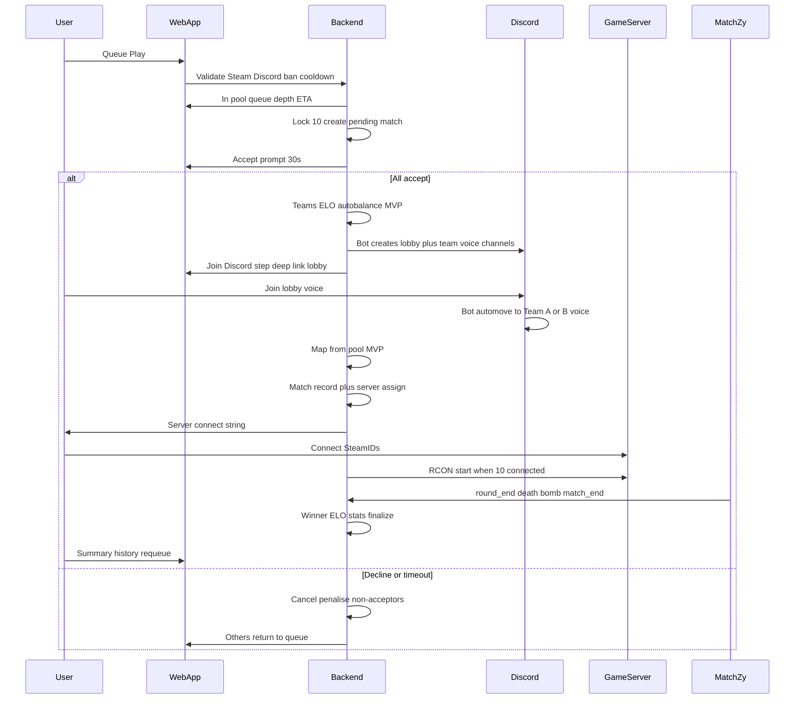

# Product spec and user flows — intradark PUG (MVP → Faceit-style)

**Artifact:** This document lives at `apps/intradark/docs/pug-system-spec.md` (version-controlled with the intradark app).  
**Owner:** intradark maintainers (update via PR when flows or contracts change).

Related code touchpoints are cited relative to `apps/intradark/`.

---

## Vision and scope

- **Product:** Competitive CS2 pickup games (PUGs) with web-driven matchmaking, acceptance, server assignment, and post-match history—aligned with Faceit-style polish over time.
- **Game:** Counter-Strike 2, 5v5, standard competitive rules as enforced by the game server + MatchZy.
- **Identity:** Steam sign-in; SteamID is canonical for in-game identity.
- **Secondary link:** Discord required for queue eligibility (per flow below); integration depth is phased (see [Discord scope](#discord-scope-mvp-vs-post-mvp)).

---

## Definitions

| Term | Meaning |
|------|---------|
| **Eligible** | Signed in, Steam + Discord linked, not banned, no active queue cooldown. |
| **Queue pool** | Set of players waiting for a match (same queue mode / region as configured). |
| **Pending match** | Ten players locked; awaiting accept phase outcomes. |
| **Accept dodge** | Declined accept or accept timeout when others were willing. |
| **Discord lobby phase** | After web accept: bot-created channels; players enter lobby voice; bot moves them to team channels before map veto. |
| **Live match** | Server has force-started; rounds count toward result. |

---

## Core system principles

Include these verbatim in stakeholder-facing summaries:

- **Website** handles matchmaking + readiness (accept phase).
- **Server** only executes matches.
- **MatchZy** is the match **engine**, not the UX controller for ready-up.
- **SteamID** is the source of truth for player identity.
- **All match state** is owned by the **backend**, not the game server.

**Ordering note:** After web accept (§4), the pipeline is **team allocation (§5) → Join Discord / bot staging (§6) → map veto (§7)** so team voice routing is known before veto.

---

## MVP vs post-MVP scope (frozen)

This freeze aligns the **seven MVP priorities** with shippable slices. Anything not listed under MVP is explicitly deferred unless pulled forward by a separate decision.

### MVP (first milestone)

**Goal:** End-to-end loop: queue → accept → match record → connect → force start → results → history.

| Area | MVP behavior |
|------|----------------|
| **Teams** | **Auto-balance** by internal ELO/MMR (no captains). |
| **Maps** | **No captain veto UI.** Backend selects one map from a configured pool (e.g. random weighted or preset rotation). Full veto flow is post-MVP. |
| **Discord** | **Required link** for eligibility. **§6 Join Discord phase** (bot-created lobby + team channels, auto-move from lobby) is the target flow **before map veto**; ship order may still sequence minimal Discord first—see ADR. |
| **Live UI** | Optional; backend stores events even if no live scoreboard ships. |
| **External stats** | Optional enrichment (Faceit, Leetify); not blocking queue. |

### Post-MVP / Faceit-style

- Captain-driven team selection and **interactive map veto** (full §5 / §7 beyond MVP auto-balance and pool-only map).
- Extended **Discord** polish (channel lifecycle, reconnect, stricter rules) on top of the §6 baseline.
- **Live match** spectator/score UI from streamed events.
- Stricter anti-abuse, league seasons, regions as separate products.

---

## Canonical user flows (§1–§13)

### 1. Onboarding

- User signs in via **Steam**.
- User links **Discord** account.
- System creates/updates **user profile**.
- System fetches **external stats** (optional: Faceit, Leetify, etc.).
- User is marked **eligible to queue**.

### 2. Queue entry

- User clicks **Play** / **Queue** (sidebar: enable `Play` when implemented—currently disabled in `components/organisms/app-sidebar.tsx`).
- System validates:
  - Steam linked
  - Discord linked
  - Not banned / cooldown-free
- User is added to **active queue pool**.
- UI shows:
  - Players in queue (count or list — finalize in UI spec)
  - Estimated wait time

### 3. Match formation

- When **10 eligible players** are in queue:
  - Lock those 10 players
  - Remove them from queue
  - Create **pending match**
- Start **Accept Phase**

### 4. Accept phase (website = ready system)

- All 10 players receive **Accept Match** prompt.
- Timer: **~30 seconds**

**If all 10 accept** → proceed to match setup.

**If any decline or timeout** → cancel match → **penalise non-accepting players** → return others to queue.

See [Penalty matrix](#penalty-matrix).

### 5. Team allocation

- **MVP:** **Auto-balance** teams based on ELO/MMR → **Team A (5)** / **Team B (5)**.
- **Post-MVP:** Two captains (e.g. highest ELO) with pick order.

Teams must be fixed **before** the Join Discord phase so the bot knows which voice channel each player belongs in.

### 6. Join Discord phase (before map veto)

Runs **after** all players have **accepted on the website** (§4) and teams exist (§5). **Before** map veto (§7).

- **Discord bot** creates match-scoped voice layout for this match (names/structure ADR), for example:
  - A **lobby** voice channel (staging).
  - **Team A** voice channel.
  - **Team B** voice channel.
  - Optional: category, text channels, or permissions scoped to the match.
- **Website** transitions to a **Join Discord** step: show invite/deep link, short instructions, and readiness indicator per player (optional).
- Players join the **lobby** voice channel first.
- Bot **identifies** members via **linked Discord account** ↔ roster (Steam-backed identity in backend).
- When a player is detected in the lobby channel, the bot **auto-moves** them into the correct **Team A** or **Team B** voice channel (no manual pick).
- **Completion rule (ADR):** e.g. all 10 moved to team channels, or timeout then proceed / cancel—must be explicit for map veto timing.
- **Then** proceed to **map veto** (§7).

### 7. Map veto

- **Post-MVP (full spec):** Map pool loaded; alternating captain bans until one map remains; timeout → auto-ban random remaining.
- **MVP:** Skip interactive veto; backend chooses map from pool (see [MVP vs post-MVP](#mvp-vs-post-mvp-scope-frozen)).

### 8. Match preparation

- System creates or **updates** **match record** (if not created earlier—ADR).
- System **assigns server** from pool.
- System **configures server:** map, teams, player SteamIDs, match ID (implementation-specific: plugin config, env, or RCON file write—ADR).
- **Discord:** Channels from §6 remain for comms until match teardown (cleanup ADR).
- Players receive:
  - **Server connect string**
  - Any remaining **Discord** context (e.g. stay in team voice for the game)

### 9. Player connection phase

- Players connect to server.
- Backend tracks **connected SteamIDs** (from game server plugin/MatchZy reports—must match expected roster).

**If all 10 expected players connected** → trigger match start (**RCON**, e.g. `.start`).

**Else** → wait / enforce **timeout** (policy TBD in ops; document max wait and cancel behavior).

### 10. Match start (no ready-up UX)

- **MatchZy** ready system is **bypassed**.
- Server **force-starts** match via command.
- Match goes **LIVE** immediately.

### 11. Live match tracking

- **MatchZy** sends events to backend, e.g.:
  - `round_end`
  - `player_death`
  - bomb events
  - `match_end`
- Backend:
  - stores **raw events**
  - updates **match state**
  - updates **live UI** (optional)

### 12. Match completion

- Match ends (win condition reached).
- Backend:
  - determines **winner**
  - updates **ELO/MMR**
  - stores **stats**
  - finalises **match record**
- Server:
  - resets / becomes **available** again

### 13. Post-match experience

- Players see **match summary** (score, stats e.g. K/D).
- **Match page**: persistent history + **shareable link** (e.g. `/matches/[id]` — add when implementing).
- Players can **queue again**.

---

## Authority model and event contract

### Source of truth

| Concern | Authority |
|---------|-----------|
| Account identity (web) | Auth provider + linked Steam / Discord IDs stored in DB. |
| In-game identity | **SteamID** on events must match roster for the match. |
| Match outcome & stats | **Backend** derives from normalized **MatchZy** events + roster; game server is not the ledger. |
| Raw telemetry | Append-only **event store** (JSON payloads as received, with match ID correlation). |

### HTTP ingestion: `POST /api/cs2/events`

**Current stub:** `app/api/cs2/events/route.ts` (Bearer auth, logs body).

**Target contract (implement next):**

1. **Authentication:** Shared secret or per-server token in `Authorization: Bearer <token>` (rotate in env; never commit secrets).
2. **Correlation:** Every payload includes stable **`match_id`** (internal UUID or opaque ID issued at match creation) so events aggregate correctly.
3. **Idempotency:** Optional `event_id` or dedupe hash to tolerate retries from MatchZy/network.
4. **Ordering:** Assume partially ordered delivery; reconciliation uses round numbers and `match_end` as terminal.
5. **Minimum event types for MVP result capture:**  
   - `match_end` (winner/score if provided)  
   - If needed, aggregate from `round_end` until `match_end` is reliable.

**Example shape (illustrative—not final schema):**

```json
{
  "match_id": "uuid",
  "event_type": "match_end",
  "event_id": "optional-unique-id",
  "payload": { "winner_side": "ct", "score": { "ct": 13, "t": 10 } }
}
```

Extend with `round_end`, `player_death`, etc., as needed for stats and live UI.

### RCON and force start

- **Trigger:** Backend (or trusted worker) sends start only when **ten SteamIDs** expected for the match have reported connected—or equivalent proof from plugin.
- **Command:** Environment-specific (e.g. MatchZy/admin command). Store as config, not hardcoded in client.
- **Failure:** Retry policy + timeout; if start fails, match may move to **admin/cancel** state (ADR).

---

## Discord scope (MVP vs post-MVP)

| Capability | MVP | Post-MVP |
|------------|-----|----------|
| Link Discord account for eligibility | Yes | Yes |
| **§6** Bot creates lobby + team channels per match | Target for intended flow (may ship incrementally) | Same + polish (permissions, cleanup, reconnect) |
| Lobby join → **auto-move** to Team A/B voice | Yes (core behavior per §6) | Hardening (edge cases, AFK in lobby) |
| Post CS2 connect string to players | Yes | Automated + richer messaging |

Bot permissions, guild placement, channel naming, and **teardown** after match belong in a **Discord integration ADR** (includes automove rules and rate limits).

---

## Penalty matrix (draft — tune before launch)

| Situation | Suggested behavior |
|-----------|---------------------|
| Decline accept | Short queue cooldown + strike toward escalating ban |
| Accept timeout (AFK) | Same as decline unless evidence of client bug |
| Technical disconnect during accept | Appeal path; default treat as timeout unless infra fault |
| Fails **§6** (no lobby join / automove by deadline) | Treat as ADR: cooldown or block map veto until resolved |
| Disconnect after accept, before live | Penalty per ops policy; optional backfill from queue (post-MVP) |
| Abandon after live | Heavy penalty; leaver forgiveness optional |

Exact durations are **product/legal** decisions—replace placeholders before release.

---

## Data model sketch

Entities (names indicative): `users`, `user_identities` (Steam, Discord), `player_ratings`, `queue_sessions`, `matches`, `match_rosters`, `match_teams`, `server_assignments`, `match_events` (raw), `match_results` (aggregated).

Foreign keys and RLS (e.g. Supabase) should enforce: users read own profile and matches they participated in; admin roles for moderation.

---

## Metrics

- Queue wait time (p50/p90)
- Match completion rate (accepted → finished)
- Accept rate / dodge rate
- Forfeit / cancel reasons

---

## Risks and mitigations

- **Smurfing / alt accounts:** Link Steam + behavior metrics over time; out of MVP unless required.
- **Spoofed events:** Authenticate ingest; validate `match_id` and server token.
- **RCON exposure:** Restrict network; rotate credentials; audit commands.

---

## MVP implementation map (priorities → app surfaces → acceptance)

| # | Priority | Primary surfaces / APIs | Acceptance (high level) |
|---|----------|---------------------------|-------------------------|
| 1 | Queue system | Enable **Play**; new queue UI route (e.g. `app/(main)/play/` or dashboard tab); backend queue pool | User can enter/leave queue; sees pool size/ETA; ineligible users blocked with reason |
| 2 | Accept phase | Same flow + pending match UI; realtime updates optional | 10 players get 30s accept; outcomes match §4 |
| 3 | Match creation | Backend creates match + roster; internal `match_id` | Persisted match row before server assign |
| 4 | Server connect | Server assignment service + config to game server | Players receive connect string tied to `match_id` |
| 5 | Force-start match | RCON/worker + connection tracking | Match starts without MatchZy ready UX; goes live |
| 6 | Capture match result | `POST /api/cs2/events` + persistence | `match_end` (and deps) updates winner/score in DB |
| 7 | Store match history | `app/(main)/matches/page.tsx` + `matches/[id]` when ready | Finished matches listed; detail page shareable; stats summary visible |

**Code anchors:**

- Play / queue UI: `components/organisms/app-sidebar.tsx`
- Matches list/summary: `app/(main)/matches/page.tsx`
- Scrims (relationship TBD): `app/(main)/scrims/page.tsx`
- CS2 events: `app/api/cs2/events/route.ts`
- Server management (Redline lifecycle): `app/(main)/admin/servers/page.tsx`
- Profile demo data to replace: `lib/player-profile-showcase-data.ts`

---

## Mermaid — end-to-end sequence



---

## ADRs to lock separately

1. **Server pool:** Registration, health checks, RCON network layout.
2. **Map selection MVP:** Exact algorithm (random vs rotation) and map list owner.
3. **Connection tracking:** How server proves ten SteamIDs to backend (plugin events vs polling).
4. **Stats depth:** Which fields are MVP vs derived later from demos/GOTV.
5. **Discord bot (§6):** Guild/channel layout, bot permissions (`Move Members`, `Connect`, etc.), identity mapping web Discord ↔ roster, automove triggers (voice state events), lobby completion timeout before §7.

---

*Document generated from the intradark PUG plan; section numbers §1–§13 match canonical user flows for ticketing.*
