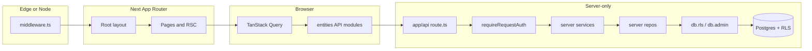

# Supersolt application overview

## What Supersolt is

Supersolt is a **Next.js App Router** hospitality operations product: venues, purchasing, menu/recipes, workforce, insights, and integrations (Square, Xero). Data lives in **Postgres** via **Drizzle ORM** with **Supabase RLS**; auth and sessions use **Supabase Auth** (`@supabase/ssr`). Client fetching uses **TanStack Query**; domain API helpers live under **`entities/*/api/`**.

## High-level request flow

1. **Middleware** refreshes the Supabase session.
2. **API routes** call `requireRequestAuth` → `RequestAuthContext` (`userId`, `appDb`, `tenantRoles`).
3. **Services** orchestrate RBAC checks and call repos inside `ctx.appDb.rls((tx) => …)`; sync/OAuth token writes use `ctx.appDb.admin`.
4. **Repos** take `tx: RlsTx` and query `@/server/db/schema`.
5. **`entities/`** holds client API wrappers and UI; no direct DB access.

## Authorization layers

| Layer | Location | Role |
|-------|----------|------|
| Postgres RLS | `db.rls` JWT transaction | Row visibility per `auth.uid()` |
| Tenant RBAC | `server/auth/rbac.ts` | Org admin, venue membership, role slugs |
| Nav / capabilities | `server/auth/capabilities.ts` | Dashboard and integration gates |
| Venue scope | `server/db/scope.repo.ts` | Resolve org/venue slugs to ids |

## Major directories

- **`server/`** — Repos, services, auth, DB clients (server-only).
- **`entities/`** — Domain slices: API endpoints, UI, models.
- **`drizzle/`** — Introspected schema mirror (`pnpm drizzle:pull`); migrations in **`supabase/migrations/`**.
- **`lib/api/`** — `requireRequestAuth`, optional `api` client aggregator.

See also [`AGENTS.md`](../../AGENTS.md) for agent-oriented data-access rules.
