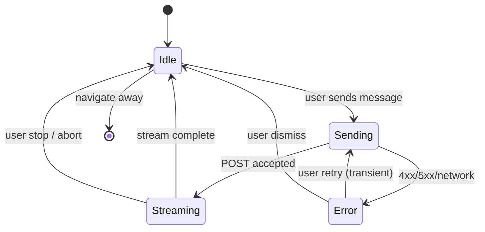

# AI agent: tools + inline UI widgets — User flows

> Companion to [`plan.md`](plan.md) and [`tdd.md`](tdd.md). Client-visible states align with tests in [`tdd.md`](tdd.md) §1 where marked.

## 1. Happy path

| # | User does | UI shows | System does | Telemetry |
|---|-----------|----------|-------------|-----------|
| 1 | Opens **`/agent`** (platform route; **not** under `[organisation]/[venue]`) | Empty thread + composer placeholder | Server page checks **auth only**; client mounts **without** a single implied venue | `agent.chat.request_started` (server log) when first POST is sent — optional until implemented |
| 2 | Types a question (e.g. “Show recent card payments for Venue A”) and sends | User bubble + assistant placeholder / streaming text | `POST` to **`/api/agent/chat`**; model may call **read-only** tools with **explicit** org/venue args where data is tenant-scoped | `agent.tool.invoked` on tool start (server log) |
| 3 | Waits for response | Streaming assistant text; then **inline widget** (e.g. table) under the assistant message | Tool runs on server after **membership check** for the requested org/venue; result validated; stream includes structured part for client registry | `agent.tool.invoked` / `agent.chat.request_finished` |
| 4 | Asks a follow-up | Prior messages remain in **client memory** only (MVP) | Same POST with full client-held history | Same as row 2–3 |

**Manual smoke (no Playwright yet):** sign in → open **`/agent`** → send one prompt that triggers a tool (spanning at least one org/venue the user can access) → verify table renders → refresh page → confirm thread is **empty** (ephemeral) unless local draft storage is implemented.

## 2. Error states

| Trigger | User-visible state | Recovery path | Telemetry | Test ref |
|---------|--------------------|---------------|-----------|----------|
| Not signed in | Redirect to sign-in or inline “sign in required” | Sign in; return to **`/agent`** (or `returnTo`) | Server: 401 path | [`tdd.md`](tdd.md) #5 |
| Session expired mid-chat | Error banner + disabled send | Refresh session / re-auth | Server: 401 | [`tdd.md`](tdd.md) #5 |
| Tool targets org/venue user **cannot** access | “You don’t have access to that venue/org” (403-style copy) or safe tool error surfaced in thread | Rephrase question or pick allowed scope in UI (if picker exists) | Server: 403 or structured tool denial | [`tdd.md`](tdd.md) #6 |
| Malformed request body | “Couldn’t send message” + keep composer content | Fix input; resend | Server: 400 | [`tdd.md`](tdd.md) #7 |
| Model/provider timeout or 5xx | Short explanation + **Retry** (same payload) | User taps Retry once | `assistant.chat.request_finished` with error | flows-only / future component test |
| Rate limited | “Too many requests, try again in …” | Wait and retry | Server log with code | flows-only |
| Tool / upstream API error | Assistant text summary + **error widget** (no raw JSON, no secrets) | User rephrases or retries | `assistant.tool.failed` | flows-only |
| Invalid tool args (validation) | “Couldn’t run that action” | Model may self-correct next turn; user can rephrase | Server log | flows-only |
| User stops generation | Stream ends; partial content kept | User continues typing | No error | §3.1 |
| User navigates away | Stream cancels | n/a | Silent cancel | §3.1 |

## 3. Alternate flows

### 3.1 Cancel / stop

- **Trigger:** “Stop” control, route change, or component unmount.
- **Behavior:** Abort fetch / cancel stream reader; do not throw uncaught errors.
- **Acceptance:** UI returns to idle; no duplicate tool side effects (read-only tools make this low risk).

### 3.2 Retry

- **Trigger:** Transient provider or network failure; user clicks **Retry**.
- **Behavior:** Re-send the **same** user message (or last failed request id if implemented)—**no** unbounded auto-retry loops.
- **Acceptance:** At most N automatic retries server-side (default **0**); user-initiated retry is always allowed once.

### 3.3 Partial save / drafts

- **MVP:** Optional **composer draft** in `sessionStorage` only (no server drafts).
- **Acceptance:** Refresh may restore draft text only—not assistant history.

### 3.4 Deep link entry

- **Example:** User bookmarks **`/agent`**.
- **Behavior:** Same as happy path #1; if auth missing, error row in §2 applies.
- **Acceptance:** No client-only redirect loops; **no** assumption that deep link encodes a default venue (unless product adds an explicit, validated query param later).

### 3.5 Empty tool result

- **UI:** Dedicated **empty-state widget** (headline + hint), not a broken table.
- **Acceptance:** Distinct from tool error (§2).

### 3.6 Loading

- **UI:** Skeleton or streaming partial text in assistant bubble.
- **Acceptance:** No permanent blank state without a timeout message.

### 3.7 Permissions denied

- **UI:** 403-style copy when the **session** cannot use `/agent`, or inline/thread error when a **tool** targets a forbidden org/venue.
- **Acceptance:** Unauthenticated users never hit streaming POST; authenticated users never receive another tenant’s data—assert via tool-level guards (and [`tdd.md`](tdd.md) #6).

### 3.8 Offline

- **UI:** Offline banner; disable send.
- **Acceptance:** Composer can retain text locally; no failed network spam.

### 3.9 Mobile / small viewport

- **UI:** Full-width thread; scrollable message area; composer fixed or sticky per existing app patterns.
- **Acceptance:** Widgets scroll horizontally **only** inside table container if needed; tap targets meet WCAG-friendly minimums.

## 4. State diagram

## 5. Acceptance summary

This feature is "done" when:

- [ ] Happy path in §1 passes **manual smoke** (or E2E when introduced).
- [ ] Every **authz / validation** row in §2 with a [`tdd.md`](tdd.md) test ref is green.
- [ ] Alternate flows §3.1–§3.9 verified manually where not automated.
- [ ] §4 diagram matches implemented states.
- [ ] Server logs exist for tool success/failure without PII ([`plan.md`](plan.md) §9).
