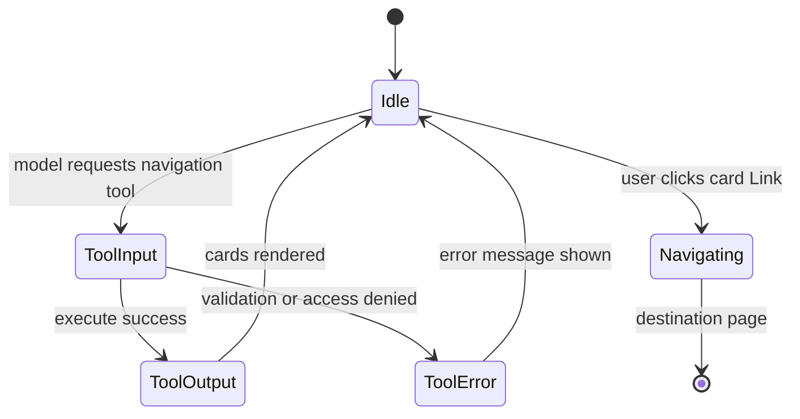

# AI agent: navigation link cards — User flows

> Companion to [`plan.md`](plan.md) and [`tdd.md`](tdd.md). Parent agent flows: [`../flows.md`](../flows.md).

## 1. Happy path

| # | User does | UI shows | System does | Telemetry |
|---|-----------|----------|-------------|-----------|
| 1 | On **`/agent`**, asks e.g. “Take me to ingredients for **Org A / Venue B**” (or equivalent wording the model maps to tool args) | Streaming text; optional “Calling navigation…” when tool is **input-available** | Model calls **`suggestAppNavigation`** (name TBD) with **slugs + catalog keys** | Server: `agent.tool.navigation_started` (see [`plan.md`](plan.md) §9) |
| 2 | Waits for tool result | **Card(s)** with title, optional blurb, **primary link** per destination | Server validates membership, resolves **`href`**, returns card payload | Server: `agent.tool.navigation_finished` |
| 3 | Clicks a card | Normal **client navigation** to the venue ingredients page | Same as clicking the same path from sidebar—**existing** page auth/RLS applies | Optional future client analytics (out of scope) |
| 4 | Arrives on destination | Standard page UI for that route | No agent-specific bypass | n/a |

**Manual smoke:** sign in → open **`/agent`** → prompt that should yield **ingredients** card for an org/venue the user can access → click card → confirm URL and page load → confirm **403/redirect** behavior still matches visiting that URL manually when using a **disallowed** slug in the prompt (tool should not emit cards).

## 2. Error states

Every row should map to a test in [`tdd.md`](tdd.md) §1 where a **Test ref** is given.

| Trigger | User-visible state | Recovery path | Telemetry | Test ref |
|---------|--------------------|---------------|-----------|----------|
| User **not a member** of requested org/venue | Generic: e.g. “You don’t have access to that organisation or venue.” (copy finalized in implementation) | User picks allowed scope or rephrases | `agent.tool.navigation_denied` | tdd #6–#7 |
| Unknown / disallowed **catalog key** after server filter | “That destination isn’t available.” (or merge into generic denial if product prefers fewer strings) | User rephrases; model retries with valid keys | Server log | tdd #3 |
| Tool **execute** throws (unexpected) | `output-error` inline; short message—**no** stack, **no** secrets | Send another message; refresh if stuck | Server error log | tdd #7 / parent flows |
| Provider / stream failure while tool pending | Same as parent [`../flows.md`](../flows.md) §2 | Stop / retry per parent | Parent telemetry | parent |
| Valid tool but **zero** cards after filter | Assistant text explains nothing matched; optional empty-state line | User clarifies | Server log | flows-only |

## 3. Alternate flows

### 3.1 Cancel / stop

- **Behavior:** Unchanged from parent ([`../flows.md`](../flows.md) §3.1)—in-flight tool may stop mid-flight; **read-only** tool has no compensating transaction.
- **Acceptance:** No duplicate side effects.

### 3.2 Retry

- **MVP:** No dedicated “retry navigation tool” button—user sends a **new message**.
- **Acceptance:** Aligns with grill-me decisions.

### 3.3 Partial payloads

- **MVP:** **Not supported**—tool returns **full success payload** or **structured error**, never half-built cards.

### 3.4 Deep link + refresh

- User bookmarks **`/agent`** or refreshes mid-thread.
- **Behavior:** Parent ephemeral rules apply; **cards** only exist in current client-held thread.
- **Acceptance:** No requirement to restore historical cards from server.

### 3.5 Click card then browser back

- **Behavior:** Returns to prior history entry (often **`/agent`**).
- **Acceptance:** Standard Next.js navigation stack.

### 3.6 Mobile / narrow viewport

- **UI:** Cards stack vertically; tap targets use comfortable padding (reuse `@workspace/ui` patterns).
- **Acceptance:** No horizontal page scroll from the card row itself.

### 3.7 Offline

- **After click:** Same as rest of app—Next may show offline shell; **no** special agent handling required for MVP.
- **Before click, offline:** Parent offline behavior ([`../flows.md`](../flows.md) §3.8).

## 4. State diagram

## 5. Acceptance summary

This slice is **done** when:

- [ ] Happy path §1 passes **manual smoke** for **ingredients** at minimum.
- [ ] Error rows in §2 with **Test ref** are covered in Vitest.
- [ ] §3 alternate flows verified manually where not automated.
- [ ] `pnpm lint:architecture` passes from repo root.
- [ ] Server logs exist per [`plan.md`](plan.md) §9 without PII.
