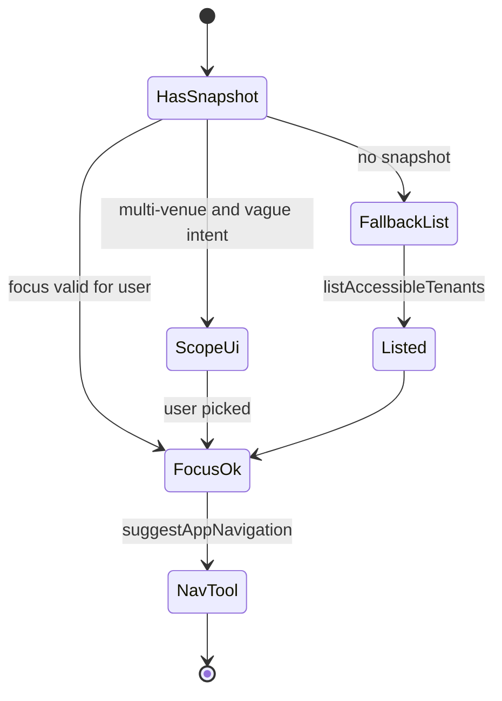

# AI agent: session org / venue scope — User flows

> Companion to [`plan.md`](plan.md) and [`tdd.md`](tdd.md). Parent agent flows: [`../flows.md`](../flows.md).

## 1. Happy path

| # | User does | UI shows | System does | Telemetry |
|---|-----------|----------|-------------|-----------|
| 1a | Opens **`/agent`** from main shell with access data **already loaded** | Normal composer | Client sends **`accessContext`** snapshot + **`focusOrganisationSlug` / `focusVenueSlug`** on each `POST` (same shape as `/api/access/context`) | `agent.chat.access_context_injected` when server uses snapshot for prompt |
| 1b | Asks “what are my ingredients” with **single** accessible venue globally | Assistant proceeds (or one short confirm) | Model uses **focus** slugs → **`suggestAppNavigation`** | Nav telemetry |
| 1c | Same question with **multiple** venues | **Deterministic** scope UI (strip/modal): “Use **current venue**?” / “**Pick another**…” | User picks **before** or **with** send; **no** `listAccessibleTenants` call if snapshot + focus sufficient | Optional UI analytics: out of scope |
| 1d | User picks “pick another” and selects org + venue from list | Focus updated for next `POST` | Model calls **`suggestAppNavigation`** with chosen slugs | Nav telemetry |
| 1e | User opens `/agent` **without** client snapshot (cold tab / cache miss) | Assistant may show “Loading…” for tool | Model or server fallback invokes **`listAccessibleTenants`** | `agent.tool.access_context_started` |
| 1f | User reply has fuzzy spelling after free text | Optional **`matchAccessibleTenants`** | Ranked candidates → confirm | `agent.tool.tenant_match_started` |

**Manual smoke:** multi-venue account → `/agent` from main app → “ingredients” → **scope UI appears** without access-denied card → choose current venue → navigation card **href** matches sidebar URL.

## 2. Error states

| Trigger | User-visible state | Recovery path | Telemetry | Test ref |
|---------|--------------------|---------------|-----------|--------|
| Not signed in | Parent 401 behaviour | Sign in | Parent | parent |
| User has **no** org/venue access | Plain explanation: no venues assigned | Contact admin | `access_context_finished` with zero counts or empty snapshot | tdd |
| **Invalid** client `accessContext` (shape / size) | Silent **drop** of snapshot; fallback loader or tool | Continues with server data | `access_context_denied` `invalid_client_snapshot` (optional) | tdd |
| `matchAccessibleTenants` **no** candidate above threshold | Ask user to pick from list or paste slug from URL | User rephrases | `tenant_match` finished empty | tdd |
| Loader **500** | Generic error; retry message | Retry; support if persists | `access_context_denied` `internal_error` | tdd |
| **Invalid** `focus*` hints | **Silent ignore**; scope UI or model asks | User picks explicitly | none | flows-only |

## 3. Alternate flows

### 3.1 User switches topic mid-disambiguation

- **Behaviour:** New message; **focus** and **snapshot** re-sent from client with current shell state.
- **Acceptance:** No stale forced scope.

### 3.2 Client sends `accessContext` + `focusOrganisationSlug` / `focusVenueSlug`

- **Behaviour:** Server uses snapshot for **prompt context** only; **`suggestAppNavigation` `execute`** still resolves venue by slug and **`assertUserHasVenueAccess`**.
- **Acceptance:** Tampered snapshot cannot grant access to slugs not in server truth when tools run.

### 3.3 User asks for “all venues” for a **navigation** card

- **Behaviour:** MVP: assistant explains **one link per card**; offer to repeat after each scope choice, or queue follow-ups—product copy in implementation.
- **Acceptance:** No silent fan-out of ten navigation cards without explicit user confirmation per venue.

### 3.4 Refresh `/agent`

- **Behaviour:** Ephemeral thread; client should **re-fetch** access context or rely on React Query cache and re-send snapshot.
- **Acceptance:** Same as parent.

### 3.5 Mobile / narrow viewport

- **Behaviour:** Scope UI stacks vertically; comfortable tap targets (`@workspace/ui`).
- **Acceptance:** No horizontal scroll from scope row alone.

## 4. State diagram

## 5. Acceptance summary

This slice is **done** when:

- [ ] Happy path §1a–§1f works in **manual smoke** for multi-venue users.
- [ ] Error rows in §2 with **Test ref** covered in Vitest where feasible.
- [ ] `GET /api/access/context` contract preserved for existing consumers.
- [ ] `pnpm lint:architecture` passes from repo root.
- [ ] Server logs per [`plan.md`](plan.md) §9 without PII beyond existing access-context semantics.
