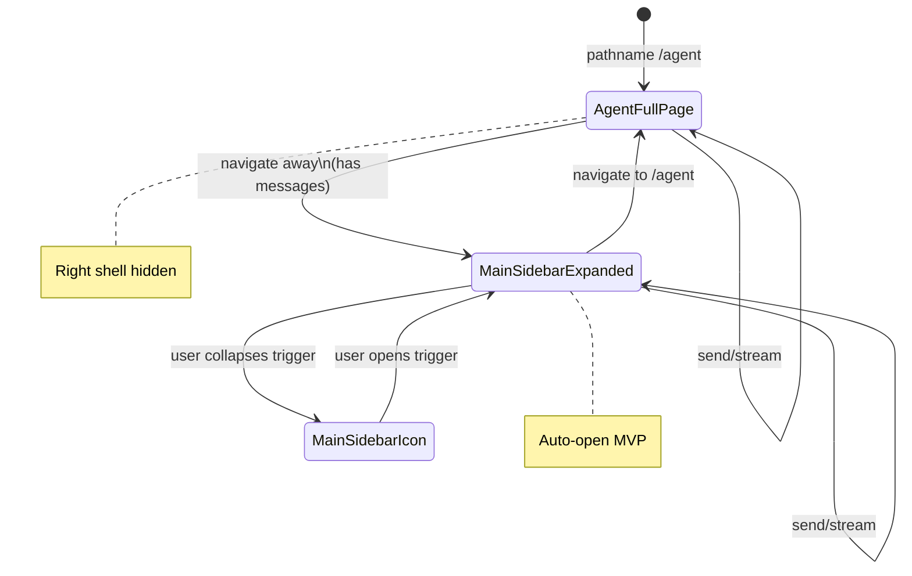

# Contextual agent right sidebar — User flows

> Companion to [`plan.md`](plan.md) and [`tdd.md`](tdd.md). MVP telemetry columns are **“—”** (no provider).

## 1. Happy path

| # | User does | UI shows | System does | Telemetry |
|---|-----------|----------|-------------|-----------|
| 1 | Opens **`/agent`** | Full-width **`AgentChatPanel`**; **no** right sidebar chrome | `useChat` lives in layout **`AgentChatProvider`** | — |
| 2 | Sends messages and uses assistant (e.g. asks for Ingredients) | Streaming replies; optional **nav link cards** | `POST /api/agent/chat` with `messages`, `accessContext`, focus slugs | — |
| 3 | Clicks a **nav card** to **`/{org}/{venue}/...`** | Navigates away from **`/agent`** | Client router changes `pathname` | — |
| 4 | Lands on destination | **Right sidebar auto-opens expanded**; **same thread** visible in sidebar-dense **`AgentChatPanel`** | Effect calls **`useRightSidebar`** open API; single `useChat` state preserved | — |
| 5 | Continues chatting from sidebar | Messages append in sidebar; main content area shows destination page | Each send includes updated **`pathname`** / optional **`pageLabel`** in JSON body | — |
| 6 | Clicks **`RightSidebarTrigger`** to collapse | Sidebar goes to **icon** mode (workspace default) | `RightSidebar` local state | — |
| 7 | Manual QA pass (no Playwright yet) | Same as 1–6 on staging | Human verification | — |

## 2. Error states

Every row maps to a test in [`tdd.md`](tdd.md) §1 or explicit **flows-only** (no automated test yet).

| Trigger | User-visible state | Recovery path | Telemetry | Test ref |
|---------|--------------------|---------------|-----------|----------|
| Invalid / oversized `pathname` or `pageLabel` in body | **None** — chat proceeds without extra page context line | User continues; optional fix in next message | — | tdd #2, #4 |
| Chat API / network failure (existing behavior) | Inline / panel error from **`useChat`** (same as today) | Retry send / **`clearError`** per existing UI | — | flows-only (reuse AgentChatPanel) |
| Auth missing / expired mid-session | Existing app/session handling (redirect or error surface) | Re-authenticate | — | flows-only |
| User full **refresh** on any route | **Thread empty** — new session | Accept limitation; user starts new chat | — | §3.3 |
| User opens **second tab** | Independent empty session | Document limitation | — | §3.3 |

## 3. Alternate flows

### 3.1 Cancel

- **Trigger:** User collapses sidebar while streaming.
- **Behavior:** **`stop()`** if exposed in panel; otherwise standard **`useChat`** stop control unchanged.
- **Acceptance:** No server orphan beyond existing streaming semantics.

### 3.2 Retry

- **Trigger:** Transient failure on send.
- **Behavior:** Same as today’s **`AgentChatPanel`** retry / resend.
- **Acceptance:** User can complete send after recovery.

### 3.3 Partial save / drafts

- **MVP:** **Not supported** — refresh or new tab **clears** thread ([`plan.md`](plan.md) §2).
- **Acceptance:** No false promise of restore; no silent `localStorage` writes in MVP.

### 3.4 Deep link entry

- **Trigger:** User lands on **`/some/deep/route`** without visiting **`/agent`** first.
- **Behavior:** Sidebar available per shell rules; **empty** chat until user sends.
- **Acceptance:** No crash; trigger opens empty state.

### 3.5 Empty state

- **Trigger:** Sidebar open, **zero** messages.
- **UI:** Same empty / quick-action entry as full panel (possibly tightened for narrow width).
- **Acceptance:** User can send first message from sidebar.

### 3.6 Loading state

- **Trigger:** Venues / me loading while panel needs scope.
- **UI:** Reuse existing **`AgentChatPanel`** / tenant scope loading patterns.
- **Acceptance:** No layout crash when sidebar mounts mid-load.

### 3.7 Permissions denied

- **Trigger:** Server rejects chat (403) or tool access denied.
- **Behavior:** Existing error mapping from **`/api/agent/chat`**.
- **Acceptance:** Message surfaces in thread; no silent failure.

### 3.8 Offline

- **Trigger:** Network offline on send.
- **Behavior:** Existing transport / **`useChat`** error surface.
- **Acceptance:** User sees failure; can retry when online.

### 3.9 Mobile / small viewport

- **Behavior:** Inherit **`@workspace/ui`** **`RightSidebar`** responsive / collapsible behavior (**no** custom bottom sheet in MVP).
- **Acceptance:** No horizontal scroll in default pages; tap targets remain usable (workspace defaults).

## 4. State diagram

## 5. Acceptance summary

This feature is "done" when:

- [ ] Happy path §1 steps 1–5 behave as described on local/staging.
- [ ] §2 rows are covered by tests where **`tdd.md`** references them; others marked flows-only are smoke-checked.
- [ ] §3.3 limitation is understood by stakeholders (no persistence).
- [ ] `pnpm lint:architecture` passes from monorepo root.
- [ ] `pnpm --filter supersolt test` passes including new tests in [`tdd.md`](tdd.md).
