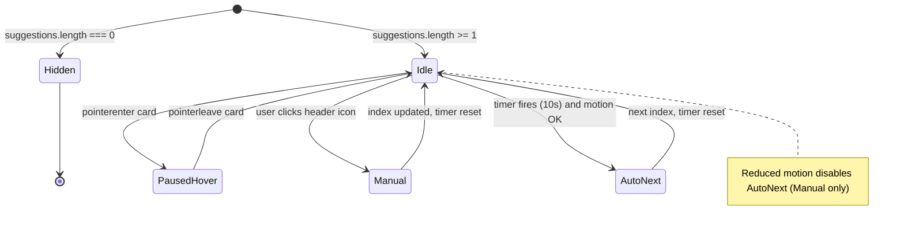

# Dashboard Superbot suggestions card — User flows

> Companion to [`plan.md`](plan.md) and [`tdd.md`](tdd.md). **Telemetry column:** n/a in MVP (no events fired).

## 1. Happy path

User is signed in and opens **`/dashboard`**. Suggestions list is non-empty.

| # | User does | UI shows | System does | Telemetry |
|---|-----------|----------|-------------|-----------|
| 1 | Lands on `/dashboard` after KPI row paints | Full-width **Superbot suggestions** card: section title, **first** suggestion headline + description, primary CTA, **header icons** for each suggestion (active state on first), **bottom progress** advancing over **10s** | Starts interval for auto-advance | n/a |
| 2 | Waits (no hover) | Progress completes; content **cross-fades or swaps** to suggestion **2**; active icon updates | Index increments (wraps after last); timer resets | n/a |
| 3 | Hovers pointer over the card | Timer **paused**; progress **holds** | Clears or freezes interval until leave | n/a |
| 4 | Moves pointer off the card | Progress **resumes** from paused state (implementation choice: **continue same 10s segment** vs **restart segment**—pick one and test in [`tdd.md`](tdd.md) #4) | Interval resumes | n/a |
| 5 | Clicks header **icon** for suggestion **k** | Slide **k** visible; that icon shows **active**; **10s** cycle **restarts** | Sets index to `k`; resets timer | n/a |
| 6 | Clicks primary CTA while **`resolvedScope`** is set | Navigates to `/{org}/{venue}/…` per [`plan.md`](plan.md) §6 | Client navigation via `Link` | n/a |

## 2. Error states

Most rows are **guardrails** for misconfiguration or edge runtime—not user “errors” in the traditional sense.

| Trigger | User-visible state | Recovery path | Telemetry | Test ref |
|---------|--------------------|---------------|-----------|----------|
| Suggestions array **empty** (data regression) | **Card not rendered** (no empty shell) | Fix data module; restore ≥1 item | n/a | [`tdd.md`](tdd.md) #1 |
| **`resolvedScope` is null** on dashboard | CTA **disabled**; optional short hint copy | User picks org/venue from sidebar / navigates from a scoped route | n/a | [`tdd.md`](tdd.md) #7 |
| **`prefers-reduced-motion: reduce`** | No auto-rotate; **no animated** progress fill; icons still work | User uses **icon buttons** to read each suggestion | n/a | [`tdd.md`](tdd.md) #6 |
| Component **unmounts** mid-timer (navigate away) | n/a | Intervals cleared (no leaks) | n/a | refactor checklist / optional RTL |

## 3. Alternate flows

### 3.1 Cancel

n/a — no multi-step commit; user can leave the page anytime.

### 3.2 Retry

n/a — no network calls in MVP.

### 3.3 Partial save / drafts

n/a.

### 3.4 Deep link entry

User opens **`/dashboard`** directly.

- **Behavior:** First suggestion shows; scope may be null until user interacts with sidebar—CTA rule per §2.
- **Acceptance:** No infinite redirect; no console errors.

### 3.5 Empty state

No suggestions configured.

- **UI:** Card **omitted** entirely ([`plan.md`](plan.md) §2).
- **Acceptance:** Layout matches “card never existed”; unit test prevents empty export.

### 3.6 Loading state

Data is static—**no async fetch** in MVP.

- **UI:** Card appears with first suggestion as soon as client renders.
- **Acceptance:** No skeleton required for this slice.

### 3.7 Permissions denied

n/a for MVP—no role-based suggestion list ([`plan.md`](plan.md) §2). Future: filter list server-side and re-handle empty → §3.5.

### 3.8 Offline

n/a — static bundle; links may fail if offline (browser default).

### 3.9 Mobile / small viewport

- **Layout:** Card remains **full width** inside dashboard inset; header **title + icons** wrap or scroll per visual QA (icons remain **tap targets ≥ 44px** where feasible).
- **Hover pause:** **Does not apply** on touch-first devices unless a later iteration adds explicit pause—documented expectation: timer keeps running on mobile MVP.

## 4. State diagram

## 5. Acceptance summary

This feature is “done” for MVP when:

- [ ] Card appears **between** KPI row and revenue trend on **`/dashboard`**, **full width**.
- [ ] **10s** auto-advance, **hover pause**, **icon jump**, **bottom progress**, **`prefers-reduced-motion`** behavior match [`plan.md`](plan.md) and this file.
- [ ] **CTA** behavior matches [`plan.md`](plan.md) §6 when scope is present vs absent.
- [ ] Tests in [`tdd.md`](tdd.md) §1 are green; **`pnpm lint:architecture`** clean.
- [ ] **§6 manual smoke** (below) passes once.

## 6. Manual smoke (no Playwright)

1. Sign in; open **`/dashboard`**.
2. Confirm card order: **Hero → KPIs → Superbot card → Revenue trend row**.
3. Observe **progress** advancing; after **~10s**, copy changes to the **next** suggestion.
4. **Hover** card: advance **stops**; **leave**: advance **resumes** per implementation.
5. Click each **header icon**: matching suggestion shows; timer **resets**.
6. Enable **OS “reduce motion”**; reload: **no** auto-rotation; **icons** still switch slides.
7. (Optional) Open dashboard **without** venue scope: CTA **disabled** or copy matches spec.
