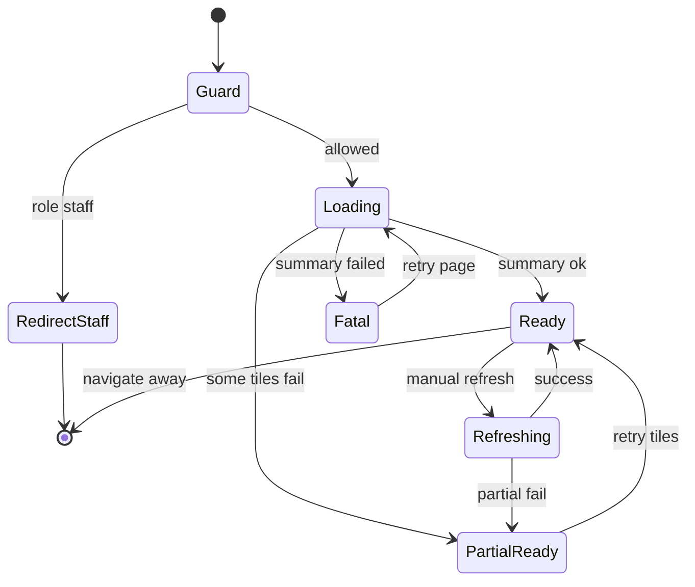

# Dashboard (operator home) — User flows

> Companion to [`plan.md`](plan.md) and [`tdd.md`](tdd.md). Telemetry column references **contract-only** events from [`plan.md`](plan.md) §9 unless implementation adds the provider.

## 1. Happy path

Primary route today: **`/dashboard`**. Future canonical: **`/{organisation}/{venue}/dashboard`** ([`plan.md`](plan.md) §11).

| # | User does | UI shows | System does | Telemetry |
|---|-----------|----------|-------------|-----------|
| 1 | Owner opens `/dashboard` after login | Top: **digest** + KPI strip; below: permission-appropriate tiles; selectors top-right | Server **layout** verifies role; RSC/hooks fetch summary + prefs | `dashboard.viewed` (deferred) |
| 2 | Changes **time window** to “This week” | Tiles skeleton briefly then values for window; comparison deltas update | PATCH prefs + refetch or coalesced query | `dashboard.pref_changed` (deferred) |
| 3 | (Owner) Changes **venue** scope to single venue | Tiles re-scope | PATCH prefs + refetch | `dashboard.pref_changed` (deferred) |
| 4 | Taps **revenue** tile | Navigates to Sales/Insights route with **same window** (and venue) query params | Client navigation preserving scope from [`plan.md`](plan.md) Notion decision log | `dashboard.tile_drilled` (deferred) |
| 5 | Taps **“Ask the agent more”** on digest | Agent side panel opens with preloaded thread context | Opens existing agent UI integration | `dashboard.digest_cta_opened` (deferred) |
| 6 | Taps **manual refresh** | Spinner on control; tiles refetch | POST refresh + parallel readers | `dashboard.manual_refresh` (deferred) |

**Manual smoke (no Playwright):** (1) sign in as Owner fixture, (2) load `/dashboard`, (3) change window, (4) open one drill-down link, (5) confirm Staff test user hits redirect (separate case).

## 2. Error states

Maps to [`tdd.md`](tdd.md) §1.

| Trigger | User-visible state | Recovery path | Telemetry | Test ref |
|---------|--------------------|---------------|-----------|----------|
| Session missing / expired | Redirect to **sign-in** with return URL | Re-authenticate | deferred | flows-only |
| Staff / disallowed role | **Silent redirect** to roster landing (path TBC) | n/a | deferred | tdd #10 |
| One tile backend fails | **That tile**: error + **Retry**; rest unchanged | Retry click | deferred | tdd #8 |
| All tiles / summary fail (catastrophic) | Full-page **“couldn’t load dashboard”** + retry | Reload / retry | deferred | tdd #5 |
| Prefs PATCH fails after optimistic UI | **Toast or banner**; revert selector to last good | Retry save | deferred | tdd #9 |
| Digest missing (cold start) | Digest tile shows **short fallback** + refresh CTA | Wait for job / manual refresh | deferred | tdd #5 |
| Filter-empty (no rows in window) | Tile copy per Notion: “No data in this window” + reset | Reset window | deferred | tdd #8 |
| Square/Xero stale (> policy) | **“Last updated Xm ago”** on affected tiles | User accepts staleness or manual refresh | deferred | tdd #8 |

## 3. Alternate flows

### 3.1 Cancel

User navigates away mid-interaction.

- **Acceptance:** In-flight fetches may abort; **no** partial prefs write unless optimistic save already committed—document race in implementation.

### 3.2 Retry

Per-tile and full-page retries per §2.

### 3.3 Partial save / drafts

Dashboard prefs are **immediate save** (no draft row UX). **Optimistic** UI with server reconciliation only.

### 3.4 Deep link entry

User opens `/dashboard` cold.

- **Behaviour:** Layout resolves auth + access; Staff redirects; allowed roles see grid.
- **Acceptance:** No client-only redirect loop.

### 3.5 Empty state — brand-new org

Per Notion: welcome digest copy, **complete setup** cards, integration health, placeholders for future tiles.

### 3.6 Loading state

Skeleton grid matching final layout ([ARCHITECTURE.md §7.1](../../../../../ARCHITECTURE.md) UX expectation).

### 3.7 Permissions denied

**Staff:** silent redirect (not 403 page). **Tile-level:** tiles omitted or never fetched for Venue Manager financial KPIs.

### 3.8 Offline / flaky network

No offline KPI cache ([`plan.md`](plan.md) grill-me). Per-tile errors + prefs optimistic failure path.

### 3.9 Mobile / small viewport

Responsive **single-column stack** (Notion: responsive MVP). Tap targets ≥ 44px where feasible.

## 4. State diagram

## 5. Acceptance summary

- [ ] Happy path §1 steps pass **manual smoke** (or E2E when harness exists).
- [ ] Every §2 row has a **Vitest** (or integration) mapping in [`tdd.md`](tdd.md).
- [ ] §3 alt flows documented; offline/staff paths verified manually.
- [ ] Superbot card still meets [`../dashboard-superbot-suggestions/flows.md`](../dashboard-superbot-suggestions/flows.md) when composed on this page.
- [ ] Telemetry: contract in [`plan.md`](plan.md) §9; implementation explicitly deferred until provider exists.
