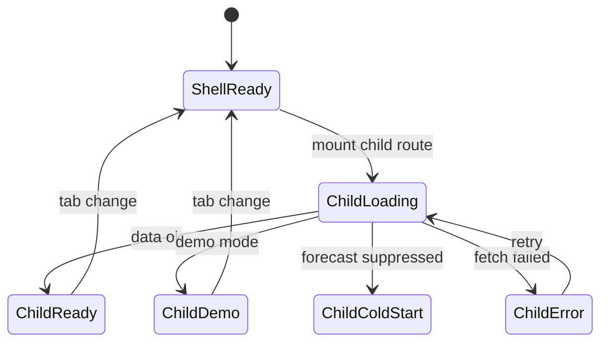

# Insights platform — User flows (cross-cutting)

> Companion to [`plan.md`](plan.md) and [`tdd.md`](tdd.md). Route-specific steps live in child `flows.md` files.

## 1. Happy path — navigate Insights subtree

| # | User does | UI shows | System does | Telemetry |
|---|-----------|----------|-------------|-----------|
| 1 | Opens sidebar **Insights → Sales** | Sales page with shell tabs visible | Load scoped org/venue from shell; read period from URL | `insights.viewed` |
| 2 | Changes period to **Last week** | All tab routes keep `?preset=last-week` when switching tabs | Update search params; child pages refetch | `insights.period_changed` |
| 3 | Switches to **Labour** tab | Labour insights (Demo or live per data) | Same period/venue context | `insights.tab_changed` |
| 4 | Taps proactive alert **Dig deeper** | Agent side panel opens with context | Load alert payload; open agent session | `insights.dig_deeper` |

## 2. Error states (platform)

| Trigger | User-visible state | Recovery | Test ref |
|---------|-------------------|----------|----------|
| Staff opens `/insights/*` | 403 or redirect | None — hidden nav | parent tdd #4 |
| Session expired | Auth redirect with `returnTo` | Sign in | flows-only |
| Venue not in scope | Empty or 403 | Pick venue in shell | child flows |
| Forecast not ready | Cold-start banner; actuals only | Wait for backfill / day 14 | forecast-engine flows |
| Refresh cooldown (Sales) | Toast "data is current" | Wait 1 min | sales flows |
| Network failure on fetch | Toast + retry | Retry | child tdd |

## 3. Alternate flows

### 3.1 Deep link with period

`/org/venue/insights/sales?preset=custom&from=2026-03-01&to=2026-03-31` — layout reads params; child page loads range.

### 3.2 Tab switch preserves context

Switching Sales → Inventory keeps preset and custom dates.

### 3.3 Demo / Seeded mode

Tabs without upstream data show **Demo data** badge (Labour Team Composition, Inventory Variance until stock counts, etc.). Badge removed when first real aggregate row exists.

### 3.4 Multi-venue (Owner)

Shell venue selector changes all Insights routes; no second selector on page.

### 3.5 Mobile

Tab nav scrollable; KPI strips stack 3+2 then single column per Notion.

## 4. State diagram

## 5. Child flow documents

- [`sales/flows.md`](sales/flows.md) — Notion flows 1–12
- [`labour/flows.md`](labour/flows.md) — Notion flows 1–12
- [`inventory/flows.md`](inventory/flows.md) — Notion flows 1–12
- [`forecast-engine/flows.md`](forecast-engine/flows.md) — compute, backfill, anomaly
- [`p-and-l/flows.md`](p-and-l/flows.md) — scaffold only

## 6. Acceptance (parent)

- [ ] Shared layout renders four tabs with persisted period.
- [ ] Staff cannot access any insights route.
- [ ] Every child happy path in §5 has passing tests per child `tdd.md`.
