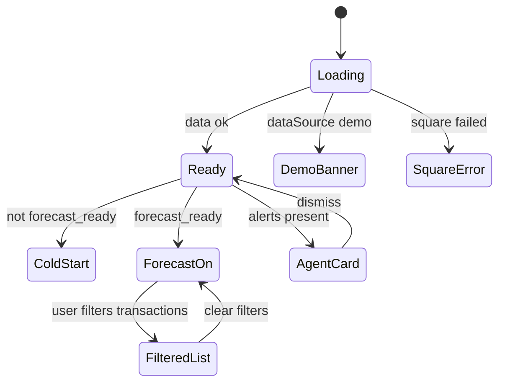

# Sales Insights — Flows

> Source: [Sales (Notion)](https://www.notion.so/34f64094bde680ba91abdd753390422e). Maps to [`tdd.md`](tdd.md). **Strict Notion** — no Tax tile, hourly chart, or invoices on this page.

## 1. Happy path — Owner morning check-in (Notion #1)

| # | User | UI | System |
|---|------|-----|--------|
| 1 | Opens Sales, preset **Yesterday** | Five KPIs with forecast deltas when ready | `sales-orders`, `daily-sales`, `forecasts`, `forecast/state` |
| 2 | — | Sales vs Forecast chart (7-day context in range) | Actual + forecast bars |
| 3 | — | Channel split + Sales Mix top sellers | Period-only aggregates |
| 4 | — | Transaction list (unfiltered) | All yesterday orders |

## 2. Forecast miss drill-down (Notion #2)

| # | User | UI | System |
|---|------|-----|--------|
| 1 | Hovers/taps day bar | Tooltip: actual, forecast, delta %, confidence, `inputs` | `forecasts.inputs` |
| 2 | Taps **Dig deeper** | Agent right sidebar with scoped context | `insights.dig_deeper` |

## 3. Map recipe (Notion #3)

| # | User | UI | System |
|---|------|-----|--------|
| 1 | Taps **Map** on unmapped row | Modal: variation details + recipe search | |
| 2 | Selects recipe, confirms | Row: recipe name, GP%, COGS | `POST .../menu-catalog-links` |
| 3 | — | Historical rows in view use current recipe cost | Re-fetch mix |

## 4. Transaction filters scoped (Notion #4)

| # | User | UI | System |
|---|------|-----|--------|
| 1 | Filters dine-in + card | List shrinks; **"47 of 800"** counter | Filter `filteredOrders` only |
| 2 | — | KPIs, chart, channel, mix **unchanged** | Headline queries ignore filters |

## 5. Custom range (Notion #5)

| # | User | UI | System |
|---|------|-----|--------|
| 1 | Custom Mar 1–31 | All sections refresh | Refetch APIs |
| 2 | Header Export CSV | Transactions in range + filters | |
| 3 | Sales Mix Export CSV | Mix rows for period | |

## 6. Cold-start venue (Notion #6)

| # | User | UI | System |
|---|------|-----|--------|
| 1 | `<14` days history, not ready | KPIs actuals only; banner day 14 | `forecast_ready: false` |
| 2 | — | Chart actual-only | No forecast bars |

## 7. Existing Square user (Notion #7)

| # | User | UI | System |
|---|------|-----|--------|
| 1 | Backfill complete | High confidence; deltas from day one in app | `available_history_days` ≥ 42 |

## 8. Forecast confidence (Notion #8)

| # | User | UI | System |
|---|------|-----|--------|
| 1 | 21 days history | **Low** badge on forecast numbers | 14–27 days |
| 2 | 35 days | **Medium** | 28–41 days |
| 3 | 42+ days | No badge (High) | |

## 9. Refresh (Notion #9)

| # | User | UI | System |
|---|------|-----|--------|
| 1 | Tap Refresh | Sync Square; update last-sync | Cooldown 1 min |
| 2 | Second tap <1 min | Toast: data is current | `cooldown_hit` |
| 3 | Sync >5 min ago | Amber last-sync text | |

## 10. Agent proactive card (Notion #11)

| # | User | UI | System |
|---|------|-----|--------|
| 1 | Open page with alert | Card above KPIs | `GET insights/alerts?module=sales` |
| 2 | Dismiss or dig deeper | Card hides / Agent opens | `PATCH` dismiss |

## 11. Permission gating (Notion #12)

| # | User | UI | System |
|---|------|-----|--------|
| 1 | Venue Manager | Single venue data; no org picker | Venue scope |
| 2 | Staff | 403 / hidden nav | Route guard |

## 12. Error states

| Trigger | UI | Recovery |
|---------|-----|----------|
| Square disconnected | Banner + Connect CTA | Connect POS |
| Square API error | Error list in banner | Reconnect / settings |
| No orders in range | Empty list copy | Widen period |
| Filter no matches | "No transactions match" + Reset | Clear filters |
| Map save failed | Toast error | Retry modal |
| Alerts fetch failed | Hide card strip; log | Retry on refresh |
| Network failure on fetch | Error state + retry | Refresh page |

## 13. Alternate flows

### 13.1 Loading

Skeleton for KPI strip, chart, channel, mix; table skeleton rows.

### 13.2 Empty Square connected, zero sales

KPI zeros; empty chart/mix copy per Notion.

### 13.3 Connecting (no sync yet)

"Connecting to Square…" — empty KPIs.

### 13.4 Mobile

KPI strip stacks; channel mini-tiles stack; mix table horizontal scroll if needed.

### 13.5 Offline

Read-only if cached; refresh disabled with banner.

## 14. Removed flows (regression)

| Removed | Verify |
|---------|--------|
| Hourly day chart | Not rendered for any preset |
| Tax Collected tile | Only 5 KPI tiles |
| Square invoices section | No invoice table on Sales |
| Last 30 Days preset | Not in selector |

## 15. State diagram

## 16. Acceptance

- [ ] Notion flows 1–12 covered by tests in [`tdd.md`](tdd.md) §1.
- [ ] Filter scoping (#4) green (test #13, #18).
- [ ] Removed surfaces absent (test #19).
- [ ] Two CSV exports (test #17 / manual).
