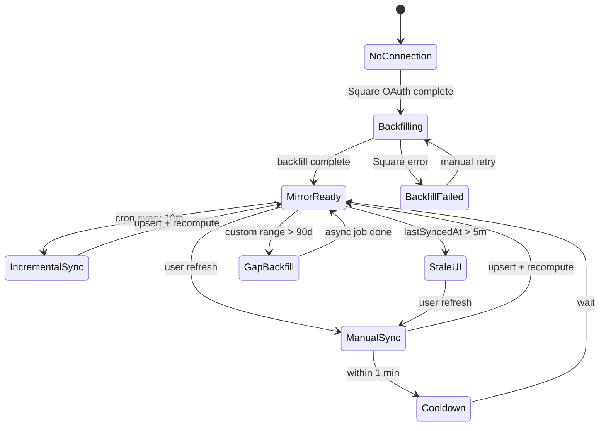

# Square sales mirror — Flows

> Companion to [`plan.md`](plan.md) and [`tdd.md`](tdd.md).

## 1. Happy path — Fast dashboard load (mirror warm)

| # | User | UI | System |
|---|------|-----|--------|
| 1 | Opens venue dashboard (fresh browser) | Live sales week tile renders quickly | SSR `loadDashboardLiveSalesSnapshot` → Postgres mirror only |
| 2 | — | KPIs match last cron sync | No Square HTTP on request path |
| 3 | Navigates to Sales Insights, preset Yesterday | Transaction list + KPIs load fast | `GET sales-orders` from mirror + `daily_sales` / `forecasts` |

## 2. Happy path — Manual refresh

| # | User | UI | System |
|---|------|-----|--------|
| 1 | Taps Refresh on Sales | Spinner on refresh control | `POST .../square/sync` → Square import job |
| 2 | — | Last-sync timestamp updates | Upsert payments/lines; recompute affected days |
| 3 | — | KPIs and list reflect new data | Client refetch sales-orders |

## 3. Happy path — Square connect (new venue)

| # | User | UI | System |
|---|------|-----|--------|
| 1 | Completes Square OAuth | "Importing sales history…" banner | `backfill_status: running`, 90-day backfill queued |
| 2 | Waits / navigates away | Partial or empty data OK during import | Postgres-only reads return what's imported so far |
| 3 | Backfill completes | Full yesterday + week data; forecast backfill proceeds | `backfill_status: complete`, `last_payments_sync_at` set |

## 4. Happy path — Deploy migration (existing connected venues)

| # | User | UI | System |
|---|------|-----|--------|
| 1 | Deploy lands | No user action | Staggered 90-day backfill script runs per venue |
| 2 | User opens app post-deploy | Syncing banner if backfill still running | Reads from partial mirror |
| 3 | Backfill done | Normal fast loads | Cron takes over 10-min incremental |

## 5. Error states

| Trigger | User-visible state | Recovery | Test ref |
|---------|-------------------|----------|----------|
| Mirror empty, backfill not started | "Connecting to Square…" / import banner | Wait for backfill; admin re-run script | tdd #14 |
| Backfill failed | Banner: import failed + retry in Settings/Admin | Admin triggers manual sync or support re-run | tdd #11 |
| Sync in progress (`backfill_status: running`) | Non-blocking banner; partial data | Auto-clears on complete | tdd #14 |
| Manual refresh within 1 min | Toast: data is current | Wait for cooldown | tdd #9 |
| Requested range partially outside 90-day mirror | Data for covered days; banner "Importing older history…" if async job queued | Wait or narrow range | flows §6 |
| Square API error during sync (not read) | Last good mirror data still shown; stale amber >5 min | User taps Refresh after cooldown | tdd #15 |
| Square disconnected | Existing demo/disconnect banner | Connect POS | sales flows §12 |
| Cron auth failure | No user impact | Ops fixes `CRON_SECRET` | tdd #10 |
| Permission denied | 403 on sync POST | Contact admin | sales flows §11 |

## 6. Alternate flows

### 6.1 Custom date range >90 days

- **Trigger:** User selects range extending before mirror coverage.
- **Behavior:** Return available rows immediately; enqueue async backfill for gap; `backfill_progress` in forecast state.
- **Acceptance:** No synchronous Square call; no page hang.

### 6.2 Refund after initial sync

- **Trigger:** Square updates payment `refunded_money` within rolling 3-day window.
- **Behavior:** Next cron upserts payment row; recomputes that calendar day; KPIs decrease.
- **Acceptance:** No duplicate payment rows; daily total matches Square.

### 6.3 Overlapping cron + manual refresh

- **Trigger:** User refreshes while cron runs.
- **Behavior:** Idempotent upserts; second run is no-op or update-only.
- **Acceptance:** No double-count in `daily_sales` (tdd #7).

### 6.4 Loading state (mirror warm)

- **UI:** Skeleton as today; should resolve faster (<1s server time target).
- **Acceptance:** No regression to multi-second SSR.

### 6.5 Loading state (mirror cold / backfill running)

- **UI:** Banner + skeleton; KPIs may show zeros or partial.
- **Acceptance:** Page never blocks on Square HTTP.

### 6.6 Offline

- **UI:** Cached client data if available; refresh disabled.
- **Acceptance:** Clear offline banner (existing sales behavior).

### 6.7 Pagination / truncation during backfill

- **Trigger:** Venue exceeds Square pagination safety cap (50k payments / range).
- **Behavior:** Log `square_sync.truncated`; set warning in `backfill_progress`; admin re-run narrower range.
- **Acceptance:** Partial import documented; no silent full history claim.

## 7. State diagram

## 8. Acceptance summary

- [ ] Dashboard and sales-orders never call Square synchronously on read (tdd #13).
- [ ] Overlapping syncs do not double-count daily_sales (tdd #7).
- [ ] 90-day backfill on connect and deploy (flows §3–§4).
- [ ] 10-min cron with 3-day lookback updates refunds (flows §6.2).
- [ ] Manual refresh 1-min cooldown (tdd #9).
- [ ] Sync/backfill status visible in UI (tdd #14–#15).
- [ ] E2E dashboard + sales load from seeded mirror (tdd #16–#17).
