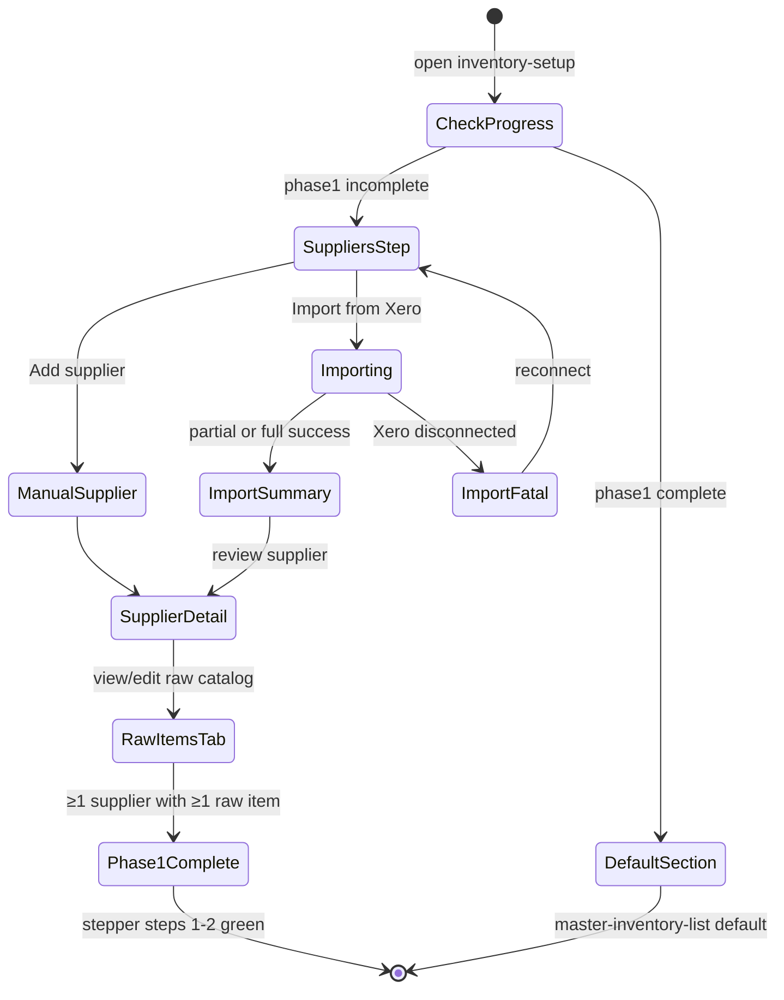

# Inventory Setup Phase 1 — User flows

> Companion to [`plan.md`](plan.md) and [`tdd.md`](tdd.md). Phase 1: suppliers + raw supplier items.

## 1. Happy path (Xero connected)

| # | User does | UI shows | System does | Log |
|---|-----------|----------|-------------|-----|
| 1 | Opens Settings → Inventory Setup | Redirect to **Suppliers** (setup stepper: step 1 active) | `GET …/inventory-setup/progress` | — |
| 2 | Clicks **Import from Xero** | Progress dialog: Syncing suppliers → invoices → items | POST `…/inventory-setup/import-from-xero` | `import_started` |
| 3 | Waits for import | Summary: N suppliers, M raw items, optional parse failures list | Partial success payload | `import_completed` |
| 4 | Opens a supplier row | Supplier detail sheet; **Raw items** tab (not Products) | GET `…/suppliers/[id]/raw-items` | — |
| 5 | Reviews raw lines | Table: description, unit, last price, source badge | — | — |
| 6 | Edits a wrong description | Inline save / form sheet | PATCH raw item | — |
| 7 | Opens Schedule tab | Suggested delivery days highlighted ("Suggested from invoices") | Prior infer step wrote suggestions | — |
| 8 | Confirms schedule, saves | Success toast | PATCH supplier `delivery_schedule` | — |
| 9 | Returns to setup index | Stepper: steps 1–2 green; step 3 Normalise locked | Progress complete for Phase 1 | — |

## 2. Error states

| Trigger | User-visible state | Recovery path | Log | Test ref |
|---------|-------------------|---------------|-----|----------|
| Xero not connected | Empty state: manual add + "Connect Xero" link to Settings → Integrations | Connect Xero, retry import | — | flows-only |
| Xero token expired | Toast: reconnect Xero; import aborted | Re-authorise OAuth | `import_completed` with fatal error | tdd #14 |
| Partial PDF parse failure | Import summary: "2 invoices couldn't be parsed" + expandable list | Retry import or fix in Purchasing → Invoices | `import_completed` | tdd #14–15 |
| Duplicate raw item (manual) | Inline: "This item already exists for this supplier" | Edit existing row | — | tdd #16 |
| Required description empty | Field error, submit blocked | User fills field | — | tdd #16 |
| Manager+ required | Toast: "You don't have permission" | Contact venue manager | — | tdd #10 |
| Auth expired | Redirect sign-in with `returnTo` | Sign in | — | flows-only |
| Network failure | Toast + retry on import | Click retry (idempotent upsert) | — | manual |
| Server 500 | Toast with support message | Retry | `import_completed` or error middleware | tdd #14 |

## 3. Alternate flows

### 3.1 Manual-only (no Xero)

- **Trigger:** User skips Xero connect.
- **Flow:** Add supplier manually → open detail → Raw items tab → Add item manually.
- **Acceptance:** Progress reaches Phase 1 complete without import; persistent "Connect Xero to import automatically" banner remains.

### 3.2 Cancel import

- **Trigger:** User closes progress dialog mid-import.
- **Behaviour:** Server continues; client polls or shows "Import running in background" (lean: disable close until done, show cancel only before request fires).
- **Acceptance:** Partial commits remain (suppliers synced even if user navigates away).

### 3.3 Retry import

- **Trigger:** Retry on partial failure summary.
- **Behaviour:** Idempotent upsert on suppliers and raw items; re-attempt parse for failed attachments only.
- **Acceptance:** No duplicate raw items; counts increase only for new invoice data.

### 3.4 Deep link

- **Example:** `…/settings/inventory-setup/suppliers?supplier=[id]`
- **Behaviour:** Opens supplier sheet; 404 if supplier archived; 403 if wrong org (RLS empty).

### 3.5 Empty states

| Screen | UI |
|--------|-----|
| No suppliers | Illustration + "Import from Xero" + "Add supplier manually" |
| Supplier with no raw items | "No items yet — import from Xero or add manually" |

### 3.6 Loading

- Supplier list: existing table skeleton.
- Import: stepped progress indicator with labels (not indeterminate spinner only).
- Raw items tab: table skeleton ≤100ms.

### 3.7 Permissions denied

- Staff role opens inventory setup URL: `canSeeSettingsNav` false → Access denied card (existing layout pattern).
- Staff hits write API: 403 JSON error.

### 3.8 Offline

- Web app: standard browser offline — submit blocked with toast "No connection".
- No offline queue in Phase 1.

### 3.9 Mobile

- Reuse existing supplier list → bottom sheet detail pattern.
- Raw items table horizontal scroll on small viewports; add button full-width.

### 3.10 Purchasing route unchanged

- **Trigger:** User opens Purchasing → Suppliers (not setup mode).
- **Behaviour:** Full tabs including Products; no setup stepper; Xero import button still available.
- **Acceptance:** Same underlying data; mode prop `inventorySetupMode={false}`.

### 3.11 Locked setup sections

- **Trigger:** User selects Master Inventory List / Recipes in section nav during Phase 1.
- **UI:** Locked state overlay: "Finish supplier and raw item setup first. Normalisation coming next."
- **Acceptance:** No navigation or disabled select item with tooltip.

## 4. State diagram

## 5. Manual smoke checklist (Phase 1 — no E2E)

- [ ] Fresh venue: inventory-setup redirects to suppliers.
- [ ] Xero connected: import populates suppliers + raw items; summary shows counts.
- [ ] One corrupt PDF: import still succeeds for other invoices; failure listed.
- [ ] Manual raw item add works; duplicate blocked.
- [ ] Manager can import; staff cannot (403).
- [ ] Purchasing → Suppliers still shows Products tab.
- [ ] Readiness CTA opens `settings/inventory-setup/suppliers`.
- [ ] Section nav locked sections show message until Phase 2.

## 6. Acceptance summary

Phase 1 is done when:

- [ ] Every row in §1 has a passing manual smoke or automated test.
- [ ] Every row in §2 maps to a test in [`tdd.md`](tdd.md) or manual verification.
- [ ] Alternate flows §3 documented behaviour verified.
- [ ] State diagram matches implementation.
- [ ] Server logs emit on import start/complete with step counts.
