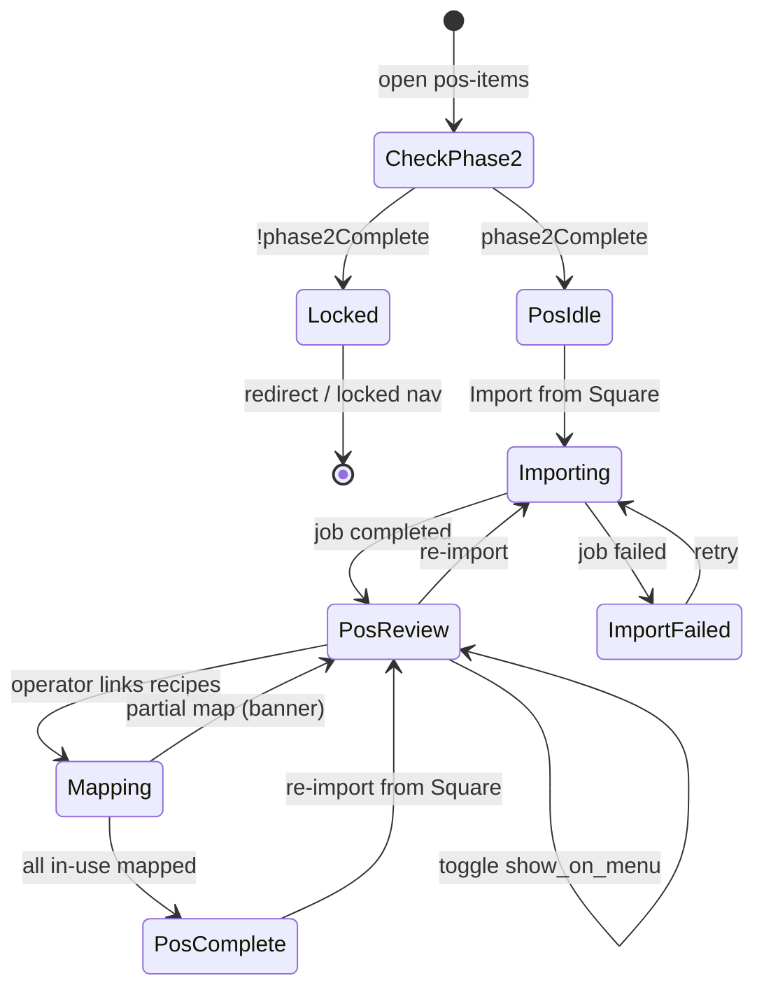

# POS Catalog Import (Square) — User flows

> Companion to [`plan.md`](plan.md) and [`tdd.md`](tdd.md). Every state listed here must have a corresponding test in `tdd.md`.

## 1. Happy path

| # | User does | UI shows | System does | Log |
|---|-----------|----------|-------------|-----|
| 1 | Completes Phase 2 (normalisation) | Section nav unlocks **POS Items** | `GET …/inventory-setup/progress` `phase2Complete: true` | — |
| 2 | Opens **POS Items** | Empty state or table; stepper: POS step pending | `GET …/inventory-setup/pos-items` | — |
| 3 | Clicks **Import from Square** | Progress dialog opens | `POST …/import-jobs` `{ jobType: 'square_catalog' }` | `import_started` |
| 4 | — | Step 1: Connect to Square ✓ | Verifies `venue_square_connections` + location | — |
| 5 | — | Step 2: Fetch item library (page 1 of N) | `GET connect.squareup.com/v2/catalog/list` paginated | — |
| 6 | — | Step 3: Import modifiers (lists + modifiers) | Upsert `venue_modifier_lists` / `venue_modifiers` | `modifiers_upserted` |
| 7 | — | Step 4: Import POS lines (12 of 47) | Upsert `menu_item_groups` + `menu_items` (group_id) + links + group↔modifier links + `square_raw` | — |
| 8 | — | Summary: 12 groups, 40 lines, 6 modifier lists | Job `completed`; dialog Done | `import_completed` |
| 9 | Reviews table | Rows grouped **category → subcategory** (DRINKS › JUICE › Apple/Orange); columns: name, price, in-use, recipe, **modifier count** | — | — |
| 9a | Clicks a row's modifier count | Drawer: "ADD ONS (Optional/19 max)" + modifiers; "Remove Ingredients" | `GET …/pos-items/[id]/modifiers` | — |
| 10 | Toggles off unused lines | `show_on_menu` false | `PATCH …/pos-items/[id]` | — |
| 11 | Maps **Cotoletta** to recipe (description "Chicken Schnitzel, Rocket…" assists) | Recipe select / create → save | `PUT …/pos-items/[id]/recipe` | `recipe_mapped` |
| 12 | Maps all in-use rows | Banner: "POS setup complete"; stepper POS green | Progress `posStepComplete: true` | `pos_step_complete` |
| 13 | Opens Recipes section | Recipes unchanged; POS lines now linked for later consumption | No re-lock | — |

## 2. Error states

| Trigger | User-visible state | Recovery path | Log | Test ref |
|---------|-------------------|---------------|-----|----------|
| Square not connected | Empty state: "Connect Square" + link to Settings → Integrations | Connect Square, retry import | — | tdd #20, flows-only |
| Square token expired | Toast: reconnect Square; import fails at verify step | Re-authorize OAuth | `import_completed` fatal | tdd #20 |
| Missing `square_location_id` | Toast: set location on Integrations | Org admin sets location, retry | — | tdd #21 |
| `ITEMS_READ` scope missing | Toast: re-authorize Square with catalog permissions | Disconnect/reconnect | — | flows-only |
| Catalog API rate limit / 5xx | Step 2 failed in dialog; retry button | Retry import (new job) | — | manual |
| Partial page failure mid-import | Job `failed` with detail; summary shows partial counts if any rows written | Retry import | — | tdd #17 |
| Manager+ required | Import button hidden or toast on POST | Contact venue manager | — | tdd #19 |
| Auth expired | Redirect sign-in with `returnTo` | Sign in | — | flows-only |
| Recipe from other venue selected | Inline error / 404 | Pick venue recipe | — | tdd #23 |
| Network failure on map | Toast + retry on recipe select | Reselect recipe | — | manual |

## 3. Alternate flows

### 3.1 Re-import (sync from Square)

- **Trigger:** **Import from Square** again after menu edits in Square Dashboard.
- **Behaviour:** Upsert by catalog link; update name, price, `section_name`, `show_on_menu`; preserve `menu_item_recipes` links.
- **Acceptance:** Summary shows `updated` count; no duplicate menu rows.

### 3.2 Missing from Square badge

- **Trigger:** Linked variation absent from latest catalog pull (deleted in Square or location filter).
- **UI:** Amber badge "Missing from Square" on row; row stays active.
- **Acceptance:** No auto-archive; badge clears if item reappears on next import.

### 3.3 Dismiss progress dialog mid-import

- **Trigger:** User closes dialog while job `running`.
- **Behaviour:** Job continues server-side; Realtime updates; reopen via persisted job id (same as Xero).
- **Acceptance:** Import completes; toast on completion if dialog dismissed.

### 3.4 Concurrent Xero + Square imports

- **Trigger:** Xero import running on suppliers; user starts Square import on POS page.
- **Behaviour:** Separate jobs (`job_type`); both progress independently.
- **Acceptance:** No job collision (tdd #18).

### 3.5 All in-use lines toggled off

- **Trigger:** Operator sets every row `show_on_menu = false`.
- **Behaviour:** POS step completes (no recipe mapping required when `inUseCount = 0`).
- **Acceptance:** Stepper green; banner explains "No in-use POS lines".

### 3.6 Skip recipe mapping temporarily

- **Trigger:** Import done; operator maps some recipes, leaves others.
- **UI:** Banner "8 of 24 in-use lines mapped"; stepper POS stays pending; **Recipes section stays unlocked**.
- **Acceptance:** No downstream re-lock.

### 3.7a Subcategory grouping

- **Trigger:** Import returns multi-variation items (JUICE → Apple/Orange) and single-variation items (LATTE → Regular).
- **UI:** Rows grouped by **category → subcategory**; single-variation groups render as one row (no redundant nesting).
- **Acceptance:** Variations of the same Square ITEM share one `group_id`; collapsing/expanding a subcategory does not change mapping state.

### 3.7b Modifiers drawer

- **Trigger:** Row shows a modifier count badge; user opens the drawer.
- **UI:** Modifier lists with selection rules ("Optional/19 max") and their modifiers (with prices); read-only in MVP.
- **Acceptance:** Reflects `item.modifier_list_info`; no modifier→ingredient mapping (deferred); empty state when item has no modifiers.

### 3.7c Description present / absent

- **Trigger:** Square ITEM has (or lacks) a description.
- **UI:** Description shown on the row / in the recipe editor when mapping; absent → no description hint.
- **Acceptance:** `menu_item_groups.description` populated when present; recipe AI assist degrades gracefully when null ([`../pos-recipe-inline-create/flows.md`](../pos-recipe-inline-create/flows.md)).

### 3.7 Deep link

- **Example:** `…/settings/inventory-setup/pos-items`
- **Behaviour:** Respects phase2 gate (redirect or locked nav if incomplete); dev unlock env bypasses (local only).

### 3.8 Empty states

| Screen | UI |
|--------|-----|
| Square not connected | Illustration + Connect Square CTA |
| Import never run | "Import from Square" primary CTA |
| Import done, zero variations at location | "No POS items at this location" + check location on Integrations |

### 3.9 Loading

- Table: skeleton on first load.
- Import: stepped progress with page/row counts (not spinner-only).
- Recipe select: combobox loading state while recipes fetch.

### 3.10 Permissions denied

- Staff opens POS page: read-only table; no import button; recipe select disabled.
- Staff POST import: 403 JSON.

### 3.11 Offline

- Web: submit blocked with toast "No connection".
- No offline queue in MVP.

### 3.12 Mobile

- Table horizontal scroll; import button full-width; recipe select in sheet on narrow viewports.

## 4. State diagram

## 5. Manual smoke checklist

- [ ] Square sandbox merchant with ITEM_VARIATION catalog imports to menu_items.
- [ ] Location filter excludes variations from other locations.
- [ ] Progress dialog shows fetch pages and upsert counts via Realtime.
- [ ] Re-import updates price without duplicating rows (incl. groups + modifiers).
- [ ] Multi-variation item groups its variations under one subcategory; single-variation renders as one row.
- [ ] Modifier lists + modifiers import; drawer shows selection rules; `square_raw` stored.
- [ ] Item description imported and shown when mapping a recipe.
- [ ] Recipe map persists in `menu_item_recipes`.
- [ ] Missing-from-Square badge appears when variation removed from mock catalog.
- [ ] POS stepper completes when in-use lines mapped; Recipes nav still accessible.
- [ ] Xero import still works with `job_type: xero`.

## 6. Acceptance summary

This feature is "done" when:

- [ ] Every row in §1 (happy path) passes manual smoke.
- [ ] Every row in §2 has a passing test in `tdd.md` or documented manual verification.
- [ ] §3 alternate flows verified.
- [ ] State diagram matches implementation.
- [ ] Server logs in `plan.md` §9 emit on import and map.
