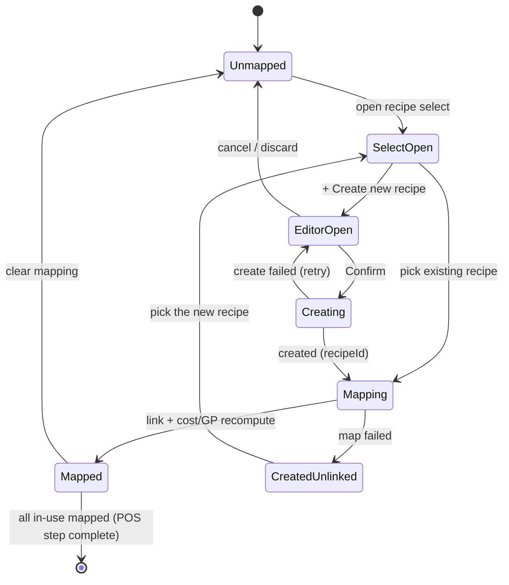

# Inline Create Recipe from POS — User flows

> Companion to [`plan.md`](plan.md) and [`tdd.md`](tdd.md). Every state listed here must have a corresponding test in `tdd.md`.

## 1. Happy path

| # | User does | UI shows | System does | Log |
|---|-----------|----------|-------------|-----|
| 1 | Opens POS Items (Phase 3) | Table: Item, Category, Price, In use, Recipe (select), Cost/serve, GP% | `GET …/inventory-setup/pos-items` | — |
| 2 | Opens recipe `<Select>` on an in-use, unmapped line | Dropdown lists existing recipes + **`+ Create new recipe`** at top | — | — |
| 3 | Clicks **`+ Create new recipe`** | Recipe editor drawer opens, **prefilled**: name = POS item name, suggested price = Square price, category from `section_name` | `buildRecipePrefillFromPosLine` | — |
| 3a | — (item has a Square description) | Ingredients tab prefilled with suggested lines (e.g. Chicken Schnitzel, Rocket, Pickled Onion, Salsa Verde) to confirm/edit | `GET …/pos-items/[id]/recipe-ingredient-suggestions` (deterministic parser, matched to master ingredients) | `ingredient_suggest` |
| 4 | Confirms/edits suggested ingredients + adds quantities + method | Live cost/serve + suggested price update in editor | Client cost calc | — |
| 5 | Clicks **Confirm** | Confirm spinner; drawer disabled | `POST …/recipes` (status `draft`) → returns `recipeId` | `recipe_created_inline` |
| 6 | — | Drawer closes; row now shows recipe name | Client calls `PUT …/pos-items/[menuItemId]/recipe { recipeId }` (`mapRecipe`) | `recipe_mapped` |
| 7 | — | Row shows **cost/serve** + **GP%** | `mapRecipe` recomputes `cost_per_serve_cents` + `gp_percent` | — |
| 8 | Maps remaining in-use lines (create or select existing) | Progress banner advances | Repeat 2–7 | — |
| 9 | All in-use lines mapped | POS step complete; stepper updates | `GET …/progress` → `posMappingComplete` | `pos_step_complete` |

## 2. Error states

Every row maps to a test in [`tdd.md`](tdd.md).

| Trigger | User-visible state | Recovery path | Log | Test ref |
|---------|--------------------|---------------|-----|----------|
| Recipe create validation fails (no name/ingredients on publish) | Inline editor errors; Confirm blocked | Fix fields | — (client) | tdd #14 |
| Recipe create 5xx | Toast: "Couldn't create recipe — try again"; drawer stays open with values | Retry Confirm (no double-create — create-intent still set, in-flight guard) | `recipe_created_inline` (on success) | tdd #12 |
| Create succeeded but `mapRecipe` failed | Toast: "Recipe created but not linked — pick it from the list"; drawer closes | Re-open select → recipe now appears → select it | `recipe_mapped` (on success) | tdd #11 |
| Map as non-manager (RLS) | Toast: "You don't have permission"; select reverts | Contact venue manager | `recipe_mapped` denied | tdd #8 |
| Network failure on map | Toast: "Network error, try again" + select reverts | Re-select | — | tdd #5 |
| Mapped recipe has zero cost | Row shows GP% with **"incomplete recipe"** hint | Open recipe, add ingredients | `recipe_cost_incomplete` | tdd #7, #13 |
| Suggestion fetch fails (network/5xx) | Editor opens with empty Ingredients tab; no error blocks the flow | Type ingredients manually | `ingredient_suggest` (failed) | tdd #18 (N/A — deterministic) |
| No Square description on the item | No suggestions; editor opens with empty Ingredients tab | Add ingredients manually | — | tdd #19 |
| Stale list (recipe mapped in another tab) | Row reflects latest on refresh | Refresh queue | — | tdd #9 |

## 3. Alternate flows

### 3.1 Reuse existing recipe (no create)

- **Trigger:** Select an existing recipe from the dropdown (shared Small/Large variants).
- **Flow:** `mapRecipe { recipeId }` → recompute cost/GP.
- **Acceptance:** No new recipe row; one recipe backs multiple POS lines; each line’s GP computed from the shared recipe cost.

### 3.2 Clear mapping

- **Trigger:** Select "Unmapped" / clear in the dropdown.
- **Flow:** `mapRecipe { recipeId: null }` → link removed, `cost_per_serve_cents`/`gp_percent` reset to `0`.
- **Acceptance:** Row returns to unmapped; POS step may flip incomplete if it was the last in-use line.

### 3.3 Cancel the editor

- **Trigger:** Close drawer / Cancel before Confirm.
- **Dirty:** "Discard changes?" confirm (existing editor behavior).
- **Clean:** Close silently.
- **Acceptance:** No recipe created, no link written, no row change.

### 3.4 Create-then-retry (idempotency)

- **Trigger:** Confirm clicked twice / retried after a slow response.
- **Behavior:** Confirm disabled while in-flight; on success the create-intent is cleared so a subsequent retry maps the **existing** recipe rather than creating a duplicate.
- **Acceptance:** Exactly one recipe created per logical Confirm; no duplicate recipes.

### 3.5 Incomplete recipe (draft, zero cost)

- **Trigger:** Recipe created/linked with no ingredients yet.
- **UI:** Row mapped; GP% shown (≈100% vs price); **"incomplete recipe"** hint badge.
- **Acceptance:** POS step still counts the line as mapped (non-blocking); operator can finish the recipe later from Recipes or by editing.

### 3.5a AI ingredient suggestion from description

- **Trigger:** Opening the editor for a POS item whose group has a Square `description`.
- **Flow:** Server parses the description (deterministic split on commas/`and`/`&`) into candidate ingredient lines, fuzzy-matched to master `ingredients` (matched → linked; unmatched → name only, user can inline-create). User confirms/edits before Confirm.
- **Acceptance:** Nothing is written until Confirm; matched lines link existing ingredients; a fetch failure or absent description degrades to manual entry (empty Ingredients tab).

### 3.6 Deep link

- **Example:** `…/pos-items?menuItem=[id]` — opens table; selecting create for that row opens prefilled editor.
- **Acceptance:** No redirect loop; honors auth.

### 3.7 Empty / loading states

| Screen | UI |
|--------|-----|
| No POS items imported | "Import from Square first" CTA (existing) |
| Recipe list empty | Dropdown shows only `+ Create new recipe` |
| Loading queue | Table skeleton |
| Saving recipe | Confirm spinner; drawer disabled |

### 3.8 Permissions denied

- Staff opens POS Items: read-only table; `+ Create new recipe` and select are disabled or 403 on write (match Phase 1–3 pattern).

### 3.9 Mobile

- **Breakpoint:** `sm` (640px).
- Table → stacked cards; recipe control + create open full-screen drawer; tap targets ≥44px.

## 4. State diagram

## 5. Acceptance summary

This feature is "done" when:

- [ ] Every row in §1 (happy path) has a passing test or manual smoke step.
- [ ] Every row in §2 (errors) has a passing test in `tdd.md`.
- [ ] Every alt flow in §3 has documented acceptance and a passing test or manual verification note.
- [ ] State diagram in §4 matches the implementation.
- [ ] `mapRecipe` recompute verified for link, clear, and zero-cost cases (tdd #5–#7).
- [ ] Recipes page still works through the re-export shim (tdd #15).
- [ ] `pnpm lint:architecture` passes from monorepo root.

### Manual smoke checklist

- [ ] In-use POS line → `+ Create new recipe` → editor prefilled with POS name + price.
- [ ] Confirm → drawer closes, row shows recipe + cost/serve + GP%.
- [ ] Select-existing path recomputes GP too.
- [ ] Clear mapping resets cost/GP to 0.
- [ ] Zero-cost recipe shows the "incomplete recipe" hint but still counts as mapped.
- [ ] Item with a Square description prefills suggested ingredients; LLM-off path shows description as reference and allows manual entry.
- [ ] Recipes section (`menu/recipes`) opens and edits recipes unchanged after the editor move.
