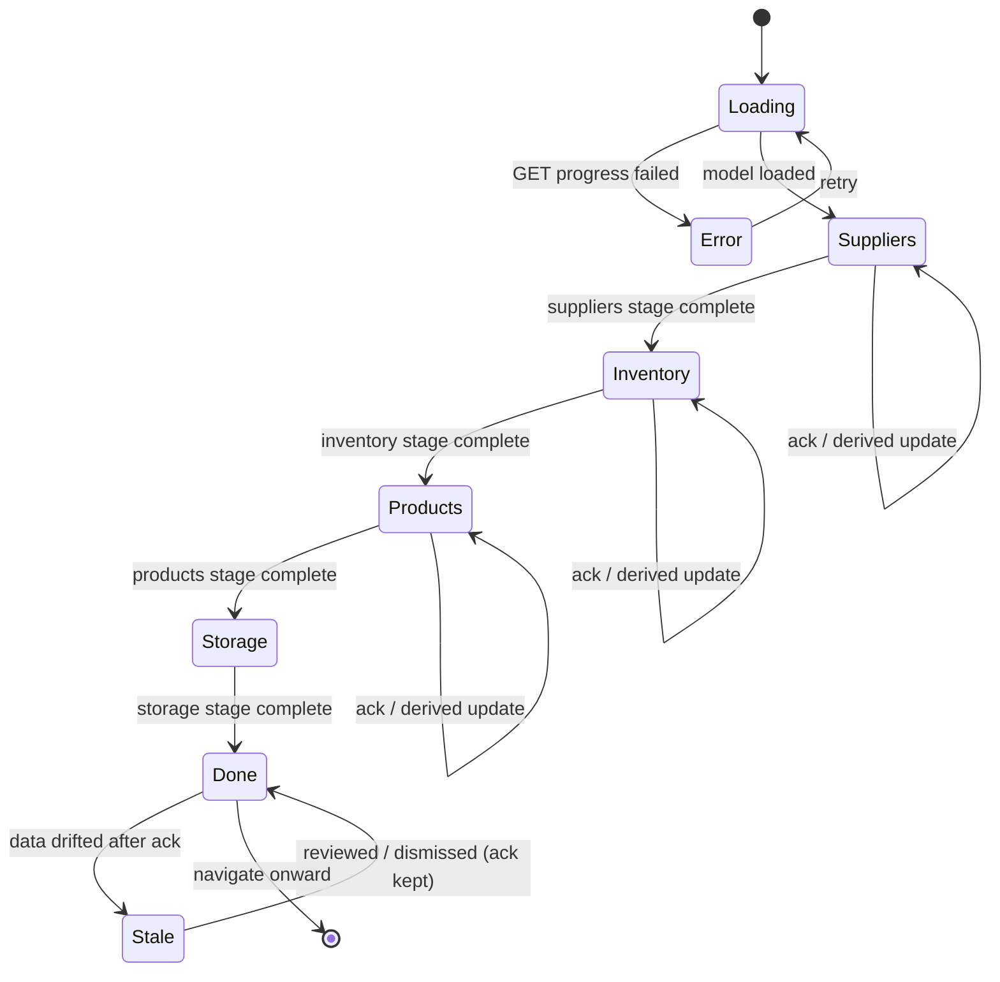

# Inventory Setup Wizard — User flows

> Companion to [`plan.md`](plan.md) and [`tdd.md`](tdd.md). Every state listed here must have a corresponding test in `tdd.md` (or a noted manual-smoke step, since supersolt has no Playwright).

## 1. Happy path

Operator is a venue **manager** on a fresh venue. The superbot narrates each stage.

| # | User does | UI shows | System does | Telemetry |
|---|-----------|----------|-------------|-----------|
| 1 | Opens `…/settings/inventory-setup` | Big card; **Suppliers** stage current + expanded with superbot welcome ("Let's get your suppliers sorted…"), why-it-matters, bot-benefit; later stages collapsed + locked | `GET progress` returns wizard model | `stage_completed` (none yet) |
| 2 | Reads Suppliers intro, clicks **Get started → suppliers** | Deep-links to suppliers page | Records `introSeen: suppliers` | `intro_seen` |
| 3 | Adds supplier(s) + raw items (bot offers Xero import suggestions) | Returns to card; "Add suppliers" + "Add supplier items" sub-steps ticked (derived) | counts update on next `GET progress` | — |
| 4 | Clicks **Filter non-inventory items**, reviews bot's `likely_non_inventory` suggestions, confirms | Sub-step ticks; **Suppliers** stage goes green | `PATCH setSubStepAck suppliers.nonInventoryFiltered` | `substep_acked`, `stage_completed:suppliers` |
| 5 | **Inventory** unlocks + auto-expands; bot pitches normalisation benefits | Stage intro + sub-steps | — | `intro_seen` |
| 6 | Normalises raw items to zero pending; acks batches + master-list review | Inventory sub-steps tick; stage green | derived `pendingRawItemCount===0` + 2 acks | `substep_acked`, `stage_completed:inventory` |
| 7 | **Products** unlocks; imports POS from Square; confirms modifiers; maps recipes until "X of Y mapped" hits all | Live mapped-count progress; sub-steps tick | derived `posImportRan`, `mappedInUseCount===inUseMenuItemCount` + ack | `substep_acked`, `stage_completed:products` |
| 8 | **Storage Locations** unlocks; adds locations | Storage sub-step ticks; stage green | derived `storageLocationCount>=1` | `stage_completed:storage` |
| 9 | — | Card shows all-stages-complete celebratory state + link onward | revalidate progress | — |

## 2. Error states

Every row maps to a test in [`tdd.md`](tdd.md) §1 or a manual-smoke note.

| Trigger | User-visible state | Recovery path | Telemetry | Test ref |
|---------|--------------------|---------------|-----------|----------|
| `GET progress` fails (network/500) | Card error region: "Couldn't load your setup" + retry | Click retry | — | flows-only (manual) |
| `PATCH wizard-state` fails (network/500) | Toast "Couldn't save that — try again"; optimistic ack rolls back | Retry CTA | server log | tdd #10 |
| Permission denied (non-manager confirms) | Confirm CTAs disabled + tooltip "Ask a manager to confirm"; reads still work | Manager confirms | — | tdd #9, #12 |
| Unknown stage/ack key (client drift) | 400; toast "Something's out of date — refresh" | Reload | server log | tdd #7 |
| Xero not connected on Suppliers stage | Bot copy swaps to "Connect Xero so I can pull this in" + connect CTA (no auto-suggestions) | Connect Xero, return | — | flows-only |
| Square not connected on Products stage | "Import POS items" sub-step shows connect-Square CTA, gated | Connect Square, return | — | flows-only |
| Stale after ack (new raw items / modifiers) | Stage stays green + non-blocking nudge "N new since you confirmed — review" | Open stage, re-review/dismiss | — | tdd #5, #13 |

## 3. Alternate flows

### 3.1 Cancel / navigate away mid-stage
- **Trigger:** Leaves the page or follows a deep-link without completing.
- **State:** Nothing partial persisted beyond `introSeen`; derived sub-steps reflect reality on return.
- **Acceptance:** No orphaned ack written; returning resumes at the same current stage.

### 3.2 Retry
- **Trigger:** Retry CTA after a failed `PATCH`/`GET`.
- **State:** PATCH is idempotent upsert (same key → same result); GET re-fetches.
- **Acceptance:** No duplicated/contradictory ack state.

### 3.3 Partial save / drafts
- N/A — there is no draft entity; acks are atomic booleans, derived steps reflect live data. No draft storage.

### 3.4 Deep-link entry
- **Example:** Operator lands directly on `…/inventory-setup/pos-items` (a stage's target) without opening the card.
- **Behavior:** The section page works standalone (unchanged); returning to the index shows updated derived progress.
- **Acceptance:** No redirect loop; wizard never traps the user.

### 3.5 Empty state (fresh venue)
- **UI:** All stages pending; Suppliers current/expanded with full superbot welcome; others locked with reasons.
- **Acceptance:** Get-started CTA opens the suppliers flow.

### 3.6 Loading state
- **UI:** Card skeleton matching the stage layout (no layout shift) while `GET progress` resolves.
- **Acceptance:** Skeleton within ~100ms; replaced with real model, no flash.

### 3.7 Permissions denied (read-only)
- **UI:** Venue member who isn't manager+ sees the full narrated card **read-only**: progress visible, all confirm/get-started writes disabled with "Ask a manager" copy.
- **Acceptance:** No write button is actionable; deep-links to section pages still honor each page's own RLS.

### 3.8 Offline
- **UI:** Banner "You're offline — changes will save when reconnected."
- **Behavior:** Reads from React Query cache if present; ack writes blocked (no draft queue).
- **Acceptance:** No throw; clear messaging.

### 3.9 Mobile / small viewport
- **Breakpoint:** `sm` (640px).
- **Adjustments:** Stages stack full-width; intro/why/benefit collapse into the expanded stage; CTAs full-width; superbot bubble wraps.
- **Acceptance:** No horizontal scroll; tap targets ≥44px.

### 3.10 Dev-unlock
- **Trigger:** `isInventorySetupSectionsUnlockedForDev()` true.
- **Behavior:** Gating bypassed — all stages openable and actionable regardless of prerequisites.
- **Acceptance:** Lock reasons suppressed; derived/ack completion still computed honestly.

## 4. State diagram

## 5. Acceptance summary

This feature is "done" when:

- [ ] Every row in §1 (happy path) has a passing test or a noted manual-smoke step.
- [ ] Every row in §2 (errors) has a passing test or manual-smoke note.
- [ ] Every alt flow in §3 has documented acceptance and a passing test or manual verification note.
- [ ] The state diagram in §4 matches the implementation.
- [ ] Structured server logs in `plan.md` §9 fire with documented payloads.
- [ ] Soft-linear gating, staleness nudge, and read-only (non-manager) behaviour verified.
