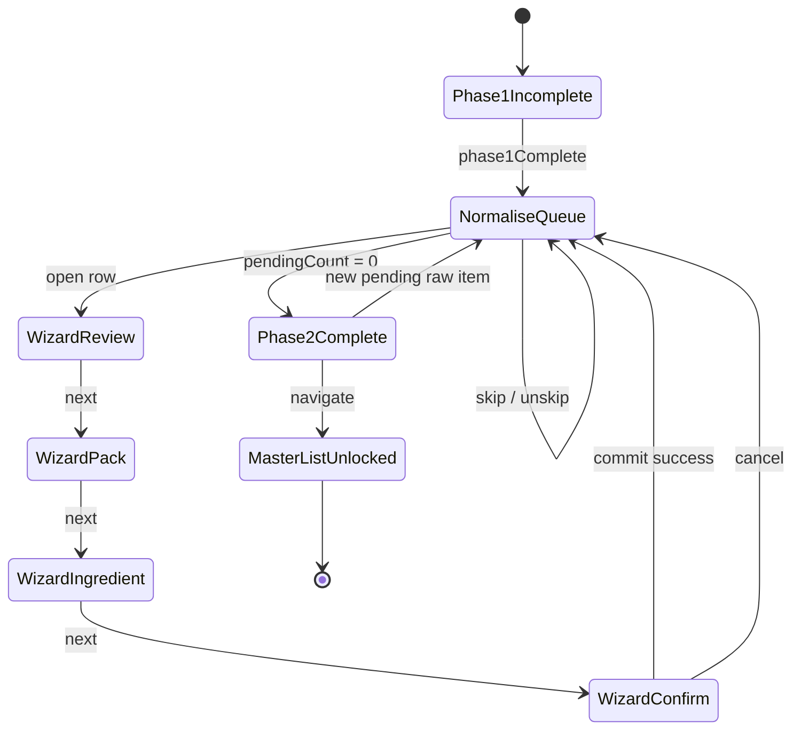

# Inventory Setup Phase 2 (Unit Normalisation) — User flows

> Companion to [`plan.md`](plan.md) and [`tdd.md`](tdd.md). Every state listed here must have a corresponding test in `tdd.md`.

## 1. Happy path

| # | User does | UI shows | System does | Log |
|---|-----------|----------|-------------|-----|
| 1 | Completes Phase 1 (suppliers + raw items) | Stepper: Normalise step unlocks | `GET …/inventory-setup/progress` | — |
| 2 | Opens Inventory Setup index | Redirect to **Normalise** | `phase1Complete && !phase2Complete` | — |
| 3 | Lands on Normalise page | Progress banner: "12 of 47 actioned"; three sections | `GET …/normalise/queue` + keyword bucket | `queue_loaded` |
| 4 | Clicks **Normalise** on a produce row | 4-step sheet opens; step 1 Review | — | — |
| 5 | Advances to step 2 Pack | AI loading → prefilled pack fields | `POST …/normalise/suggest` | `suggest_started` / `suggest_completed` |
| 6 | Adjusts pack (10 kg, box, $32) | Fields editable | — | — |
| 7 | Step 3 Ingredient — **Create new** | Name/category/unit prefilled | — | — |
| 8 | Step 4 Confirm | "$3.20 per kg" preview + summary | `computeCostPerBaseUnitCents` | — |
| 9 | Clicks **Confirm** | Success toast; row moves to Done | `POST …/normalise/commit` (atomic) | `committed` |
| 10 | Skips fuel surcharge row | Row moves to Done (skipped) | `POST …/normalise/[id]/skip` | `skipped` |
| 11 | Actions all rows | Banner: "Setup complete"; stepper green | `phase2Complete: true` | `phase2_complete` |
| 12 | Opens section nav → Master Inventory List | Ingredients table with new rows | Section unlocked | — |

## 2. Error states

| Trigger | User-visible state | Recovery path | Log | Test ref |
|---------|-------------------|---------------|-----|----------|
| OpenAI unavailable / suggest fails | Banner: "AI suggestions unavailable — enter manually"; empty pack fields | Fill manually; **Retry suggest** | `suggest_failed` | tdd #11, #18, #21 |
| Invalid pack unit | Inline error on step 2; Next blocked | Select valid unit (g/kg/mL/L/each) | — | tdd #9 |
| unitsPerPack ≤ 0 | Inline error on step 2 | Enter positive number | — | tdd #4 |
| Link mode without ingredient | Inline error on step 3 | Select ingredient | — | tdd #9 |
| Manager+ required | Toast: "You don't have permission" | Contact venue manager | — | tdd #17 |
| Auth expired | Redirect sign-in with `returnTo` | Sign in | — | flows-only |
| Network failure on commit | Toast + retry on Confirm | Click Confirm again (idempotent update) | — | manual |
| Server 500 on commit | Toast with support message | Retry; row stays pending | — | tdd #12 |
| Raw item already normalised by another tab | Toast: "This item was updated elsewhere" + refresh queue | Refresh and re-open | — | tdd #15 |
| Ingredient link to archived ingredient | 404 / validation error | Pick active ingredient | — | tdd #13 |

## 3. Alternate flows

### 3.1 Link to existing ingredient

- **Trigger:** Step 3 → "Link to existing" → search select.
- **Flow:** Pick ingredient → Confirm → commit with `mode: link`.
- **Acceptance:** No new ingredient row; new `supplier_product` linked; Master List shows one ingredient, two products if second supplier.

### 3.2 Re-open and edit normalised row

- **Trigger:** Done section → **Edit mapping**.
- **Flow:** Wizard opens with current values; Confirm → PATCH.
- **Acceptance:** `supplier_product` and ingredient fields update; `normalisation_status` stays `normalised`.

### 3.3 Unskip

- **Trigger:** Done section (skipped row) → **Unskip**.
- **Flow:** Row returns to To normalise section as `pending`.
- **Acceptance:** Phase 2 may flip back to incomplete if no other pending existed; downstream sections stay unlocked (warning badge only).

### 3.4 Likely non-inventory section

- **Trigger:** Keyword classifier buckets "Fuel surcharge".
- **UI:** Separate section with warning icon; actions: **Skip** or **Normalise anyway**.
- **Acceptance:** No auto-skip; operator must choose explicitly.

### 3.5 New raw items after Phase 2 complete

- **Trigger:** Invoice sync adds new `pending` raw item.
- **UI:** Stepper shows Normalise warning badge; banner "3 new items need normalisation"; Master List stays accessible.
- **Acceptance:** `phase2Complete: false` until new items actioned; no re-lock of Recipes/POS.

### 3.6 Cancel wizard

- **Trigger:** Close sheet or Cancel on step 1–3.
- **Dirty:** Confirm dialog "Discard changes?".
- **Clean:** Close without dialog.
- **Acceptance:** No partial DB writes until Confirm on step 4.

### 3.7 Deep link

- **Example:** `…/settings/inventory-setup/normalise?rawItem=[id]`
- **Behaviour:** Opens queue and auto-opens wizard for that row if pending; toast if already done.

### 3.8 Empty states

| Screen | UI |
|--------|-----|
| Phase 1 incomplete | Redirect to suppliers (not normalise) |
| No raw items at all | "Add raw items first" CTA → suppliers |
| All actioned | Celebration empty state + CTA to Master Inventory List |

### 3.9 Loading

- Queue: table skeleton.
- Suggest: step 2 skeleton fields + "Analysing line item…".
- Commit: Confirm button spinner; disable navigation until response.

### 3.10 Permissions denied

- Staff opens normalise URL: read-only queue **or** access denied on write actions (match Phase 1 pattern).
- Staff POST commit: 403 JSON.

### 3.11 Offline

- Submit blocked with toast "No connection".
- No offline queue.

### 3.12 Mobile

- **Breakpoint:** `sm` (640px)
- Queue: stacked cards instead of wide table.
- Wizard: full-screen sheet.
- Tap targets ≥44px.

## 4. State diagram

## 5. Acceptance summary

This feature is "done" when:

- [ ] Every row in §1 (happy path) has a passing test or manual smoke step.
- [ ] Every row in §2 (errors) has a passing test in `tdd.md`.
- [ ] Every alt flow in §3 has documented acceptance and a passing test or manual verification note.
- [ ] State diagram in §4 matches the implementation.
- [ ] Telemetry logs in §1 and §2 emit with documented payloads.
- [ ] `pnpm lint:architecture` passes from monorepo root.

### Manual smoke checklist

- [ ] Phase 1 complete venue redirects to normalise (not master list).
- [ ] AI prefill on sample tomato line; manual path works with API key removed.
- [ ] Fuel surcharge appears in likely non-inventory section.
- [ ] Skip + unskip round-trip.
- [ ] Master Inventory List unlocks only after all items actioned.
- [ ] New invoice line after complete shows warning without locking recipes.
