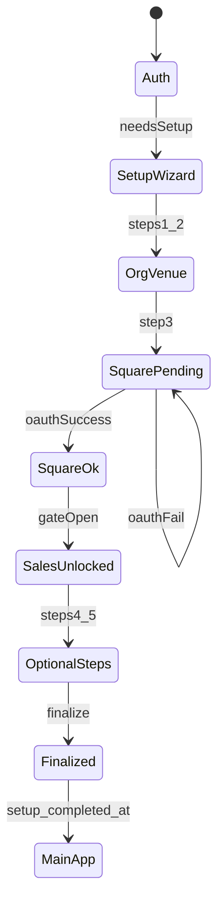

# Onboarding — User flows

> Companion to [`plan.md`](plan.md) and [`tdd.md`](tdd.md). Every error row has a test reference.

## 1. Happy path (Phase 1a — wizard)

| # | User does | UI shows | System does | Telemetry |
|---|-----------|----------|-------------|-----------|
| 1 | Clicks welcome email link | Auth screen | OTP / session | — |
| 2 | Authenticates | Redirect `/setup` | `needsSetup=true` | `onboarding.viewed` |
| 3 | Saves organisation (step 1) | Step 2 enabled | `POST organisation` | `onboarding.step_completed` |
| 4 | Saves venue + data-starts-from (step 2) | Step 3 enabled | `POST venue` | `onboarding.step_completed` |
| 5 | Connects Square (step 3) | Success toast; **Sales** nav unlocks | OAuth tokens; progress flag | `onboarding.square_connected` |
| 6 | Opens Sales Insights | Live or cold-start sales page | Route allowed pre-finalize | `onboarding.sales_early_access` |
| 7 | Skips or completes Xero (step 4) | Skip dialog or connected badge | `PATCH progress` or Xero token | `onboarding.step_skipped` / completed |
| 8 | Skips or sends invites (step 5) | Email sent or skip ack | `POST invite` or skip | same |
| 9 | Finalizes (step 6) | Redirect dashboard; full nav | `setup_completed_at`; middleware | `onboarding.finalized` |

## 2. Error states

| Trigger | User-visible state | Recovery | Telemetry | Test ref |
|---------|-------------------|----------|-----------|----------|
| Email not whitelisted | Generic auth failure | Contact support | `auth.forbidden` | auth flows |
| Session expired on setup | Redirect `/auth?returnTo=/setup` | Re-login | — | flows-only |
| Org name empty | Inline validation | Fill name | — | tdd #3 |
| ABN invalid (11 digits) | Inline hint | Fix or clear | — | tdd #3 |
| No venue before step 3 | Connect Square disabled | Add venue | — | tdd #10 |
| Square OAuth denied | Toast + detail from query | Retry Connect | `onboarding.failed` | tdd #6, #13 |
| Square config missing | Hint from `XERO_ERROR_HINTS` pattern | Fix env | `onboarding.failed` | manual |
| Finalize without org/venue | Toast: add business + venue | Complete steps | `onboarding.failed` | tdd #7 |
| Finalize without Square (flag on) | Toast: connect POS first | Step 3 | `onboarding.failed` | tdd #6 |
| Finalize DB failure | Toast + support | Retry; check profile | `onboarding.failed` | tdd #7 |
| Already completed | Redirect `/dashboard` | — | — | tdd #4 |
| Network on save | Toast retry | Retry | `onboarding.failed` | tdd #10 |
| Permission denied | Toast forbidden | — | `onboarding.failed` | tdd #9 |

## 3. Alternate flows

### 3.1 Skip optional step (Xero / Team)

- **Trigger:** Skip on step 4 or 5.
- **UI:** Modal lists locked modules (e.g. “P&L stays locked until Xero — Settings → Integrations”).
- **System:** `PATCH progress` with `xeroSkipped: true` (or team).
- **Acceptance:** User can reach finalize if mandatory steps done; locked nav remains disabled.

### 3.2 Resume after browser close

- **Trigger:** Return to `/setup` with incomplete profile.
- **State:** `GET state` restores org/venues; URL `?step=` capped by `maxReachableStep`.
- **Acceptance:** No duplicate org rows; Square connection still detected.

### 3.3 Early Sales (instant value)

- **Trigger:** Square connected, user clicks Sales in sidebar during setup.
- **Acceptance:** Page loads; finalize not required; other modules still locked.

### 3.4 Multi-org (deferred)

- User with Org A complete adds Org B → lands on `/setup` for B; auth not repeated.
- Migration checklist — **not in 1a**; document in program index.

### 3.5 Cancel / back

- Browser back between wizard steps updates `?step=` only; no partial org without save.

## 4. State diagram

## 5. Permissions

- Only users with owner membership on the onboarding org may call onboarding mutating APIs.
- Invited users joining via invite flow — separate from setup wizard (post-finalize or invite API during step 5).

## 6. Phase 1b (agent) — preview

| # | User does | UI shows |
|---|-----------|----------|
| 1 | Lands on `/setup` | Agent full-screen + blurred sidebar |
| 2 | Clicks Get Started | Agent prompts step 1 |
| 3 | Embeds OAuth in thread | Square popup |
| 4 | Agent quotes revenue | Link to Sales |

Errors reuse §2; widgets add upload/OAuth failure inline.
