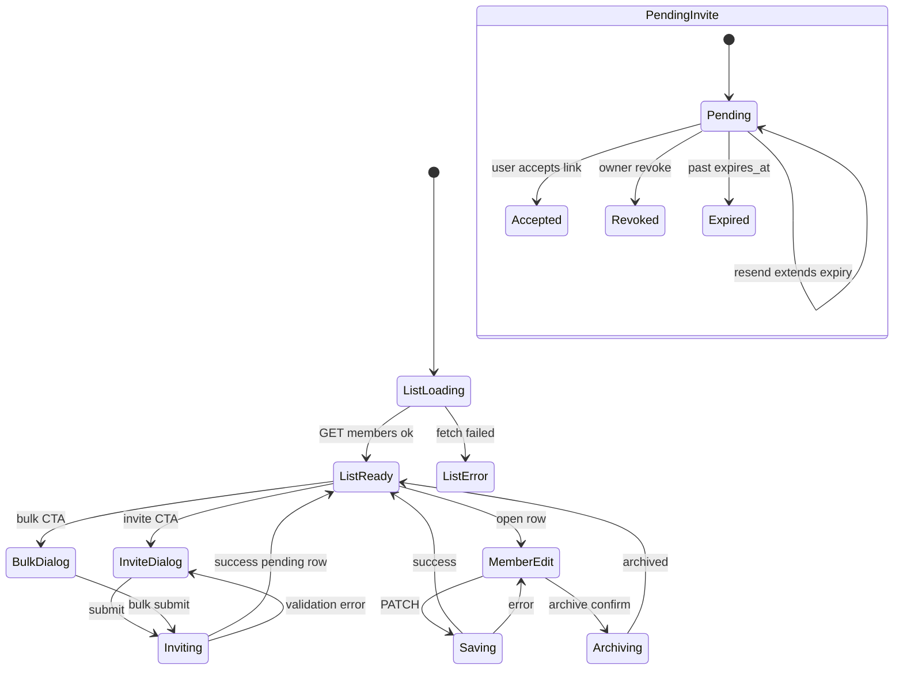

# Settings → Permissions — User flows

> Companion to [`plan.md`](plan.md) and [`tdd.md`](tdd.md). Aligned to [Notion Permissions/User](https://www.notion.so/34f64094bde680d09de7cfcebbafe4b0).

## 1. Happy paths

### 1.1 Owner views user list

| # | User does | UI shows | System does | Telemetry |
|---|-----------|----------|-------------|-----------|
| 1 | Opens `/settings/permissions` | Settings tabs; Permissions active | Check `roleSlug === 'owner'` | `permissions.viewed` |
| 2 | — | Table: Name, Email, Permission level, Venues, Status, Position (read-only) | GET `/members` merged list | — |
| 3 | Filters by Pending | Subset pending invites | Client filter | — |
| 4 | Searches email | Matching rows | Client search | — |

### 1.2 Single invite

| # | User does | UI shows | System does | Telemetry |
|---|-----------|----------|-------------|-----------|
| 1 | Clicks Invite user | Dialog: email, permission dropdown, venue multi-select | Load org venues | — |
| 2 | Enters email, Manager, Hawthorn | Validation inline | — | — |
| 3 | Sends invite | Spinner; row appears Pending | POST `/members/invites`; whitelist row; Supabase invite email; **no** uo until accept | `permissions.invite_sent` |
| 4 | — | Toast success | — | — |

### 1.3 Bulk invite (paste)

| # | User does | UI shows | System does | Telemetry |
|---|-----------|----------|-------------|-----------|
| 1 | Clicks Bulk invite | Textarea paste + default Staff + first venue | — | — |
| 2 | Pastes 10 emails | Preview table; invalid lines highlighted | Client parse | — |
| 3 | Confirms send | Progress | POST `/members/invites/bulk` | `permissions.invite_bulk` |
| 4 | — | 10 pending rows | — | — |

### 1.4 Xero employee import

| # | User does | UI shows | System does | Telemetry |
|---|-----------|----------|-------------|-----------|
| 1 | Clicks Import from Xero | Dialog | POST `/members/import/xero` preview | `permissions.xero_import` |
| 2 | Reviews pre-filled rows | Editable grid like bulk invite | Read Xero Payroll employees | — |
| 3 | Sends invites | Same as bulk | POST bulk | `permissions.invite_bulk` |

### 1.5 Pending invite resend

| # | User does | UI shows | System does | Telemetry |
|---|-----------|----------|-------------|-----------|
| 1 | Row menu → Resend invite | Confirm | POST `…/invites/[id]/resend`; new expiry (14d) | `permissions.invite_resent` |
| 2 | — | Toast | Re-send email | — |

### 1.6 Edit active user

| # | User does | UI shows | System does | Telemetry |
|---|-----------|----------|-------------|-----------|
| 1 | Clicks row | Navigate `/settings/permissions/[memberId]` | GET member detail | — |
| 2 | Changes Area Manager + adds venue | Venue multi-select | — | — |
| 3 | Saves | Spinner | PATCH role + venues | `permissions.role_changed`, `permissions.venues_changed` |
| 4 | — | Toast; back to list on next load reflects scope | RBAC cache refresh on user's next request | — |

### 1.7 Invite accept (invitee — Authentication co-release)

| # | User does | UI shows | System does | Telemetry |
|---|-----------|----------|-------------|-----------|
| 1 | Clicks magic link in email | `/auth` | Supabase invite / OTP flow | — |
| 2 | Completes profile | Name, mobile optional | Auth module | — |
| 3 | Enters platform | Dashboard or setup | `acceptInvite`: uo + uv + People stub; invite accepted_at | — |

### 1.8 Archive departed user

| # | User does | UI shows | System does | Telemetry |
|---|-----------|----------|-------------|-----------|
| 1 | Edit page → Archive user | Confirm destructive | POST archive | — |
| 2 | — | Redirect list; row Archived | Whitelist revoked; Admin signOut; uo/uv archived; People archived | `permissions.member_archived` |
| 3 | (Archived user) | — | Next navigation 401 / redirect auth | — |

### 1.9 Reactivate user

| # | User does | UI shows | System does | Telemetry |
|---|-----------|----------|-------------|-----------|
| 1 | Filter Archived → Reactivate | Confirm | POST reactivate | `permissions.member_reactivated` |
| 2 | — | Active row | Whitelist restored; uo unarchived; People unarchived | — |

## 2. Error states

Every row maps to a test in [`tdd.md`](tdd.md) §1.

| Trigger | Code | User-visible state | Recovery | Telemetry | Test ref |
|---------|------|-------------------|----------|-----------|----------|
| Non-owner opens route | `permissions.forbidden` | Access denied card; redirect to first allowed settings tab | — | `permissions.failed` | tdd #10, #33 |
| Non-owner API call | `permissions.forbidden` | Toast: no permission | — | `permissions.failed` | tdd #10 |
| Invalid email on invite | `permissions.invalid_email` | Inline field error | Fix email | — | tdd #30 |
| No venue selected | `permissions.invalid_venues` | Inline: select at least one venue | Pick venue | — | tdd #30 |
| Invalid role slug | `permissions.invalid_role` | Inline / toast | Pick valid tier | `permissions.failed` | tdd #2 |
| Already active member | `permissions.duplicate_member` | Toast: already a member | Open existing row | `permissions.failed` | tdd #12 |
| Pending invite exists | `permissions.duplicate_invite` | Toast: invite pending — resend or revoke | Resend/revoke | `permissions.failed` | tdd #13 |
| Resend expired/revoked | `permissions.invite_expired` / `invite_revoked` | Toast with explanation | Send new invite | `permissions.failed` | tdd #14 |
| Demote/archive last owner | `permissions.last_owner` | Toast: cannot remove last owner | Promote another first | `permissions.failed` | tdd #5, #19 |
| Member not found | `permissions.not_found` | 404 page | Back to list | `permissions.failed` | tdd #32 |
| Xero not connected | `permissions.xero_not_connected` | Dialog: connect in Integrations | Link to settings/integrations | `permissions.failed` | tdd #24 |
| Xero empty employees | `permissions.xero_import_empty` | Empty state in dialog | Manual paste | `permissions.failed` | tdd #25 |
| Email delivery failure | `permissions.email_delivery_failed` | Toast: could not send email; invite saved | Retry resend | `permissions.failed` | tdd #11 |
| Network failure | — | Toast: network error + retry | Retry | `permissions.failed` | tdd #28 |
| Auth session expired | — | Redirect `/auth?returnTo=…` | Sign in | — | flows-only |

## 3. Alternate flows

### 3.1 Cancel invite dialog / edit form

- **Trigger:** Cancel or navigate away with dirty form.
- **State:** Confirm if dirty; discard if clean.
- **Acceptance:** No partial PATCH; no duplicate invite on cancel.

### 3.2 Retry after transient failure

- **Trigger:** Retry on error toast.
- **State:** Re-submit same payload; idempotent where possible (resend safe).
- **Acceptance:** No duplicate whitelist rows.

### 3.3 Deep link to member edit

- **Route:** `/settings/permissions/[memberId]`
- **Behavior:** Server fetch; 404 if missing; forbidden card if non-owner.
- **Acceptance:** No redirect loop.

### 3.4 Empty state (no users beyond owner)

- **UI:** "Invite your team" CTA.
- **Acceptance:** Opens single invite dialog.

### 3.5 Loading state

- **UI:** Table skeleton matching column layout.
- **Acceptance:** Skeleton within 100ms of navigation.

### 3.6 Permissions denied (Manager / Staff)

- **UI:** Access denied card; Permissions tab hidden in nav.
- **Acceptance:** Direct URL to `/settings/permissions` shows denied; API 403.

### 3.7 Revoke pending invite

- **Trigger:** Row menu → Revoke.
- **State:** Confirm dialog.
- **Acceptance:** Row removed from pending; whitelist revoked; `permissions.invite_revoked`.

### 3.8 Offline

- **UI:** Banner; submit disabled.
- **Acceptance:** No unhandled throw.

### 3.9 Mobile

- **Breakpoint:** `sm` (640px)
- **Adjustments:** Stacked filters; full-width CTAs; edit page single column; tap targets ≥44px.
- **Acceptance:** No horizontal scroll on list.

### 3.10 Onboarding Invite Team (shared service)

- **Trigger:** Setup wizard invite step.
- **Behavior:** Same POST invite/bulk endpoints; defaults Staff + first venue.
- **Acceptance:** Pending rows visible in Permissions after setup completes.

## 4. State diagram

## 5. Manual smoke (E2E deferred)

Run before release until Playwright harness lands:

1. Sign in as **Owner** → Settings → Permissions → list loads.
2. Invite test email → pending row → email received (or Supabase logs in dev).
3. Accept invite in incognito → user lands in app → active row; People stub exists.
4. Edit role + venues → save → reflected in list.
5. Archive user → user signed out in other session → cannot log in.
6. Reactivate → can log in again.
7. Sign in as **Area Manager** → Permissions tab absent; direct URL denied.
8. Bulk paste 3 emails → 3 pending rows.
9. Xero import (staging org with Xero) → preview → send.

## 6. Acceptance summary

Feature is done when:

- [ ] Every row in §1 has passing integration or component tests per [`tdd.md`](tdd.md)
- [ ] Every error in §2 has a stable code + test
- [ ] §3 alternate flows documented acceptance met
- [ ] §5 manual smoke passed on staging
- [ ] Auth whitelist gate live in same deploy ([`plan.md`](plan.md) §10)
- [ ] Telemetry events fire (verify via `console.debug` in dev)
