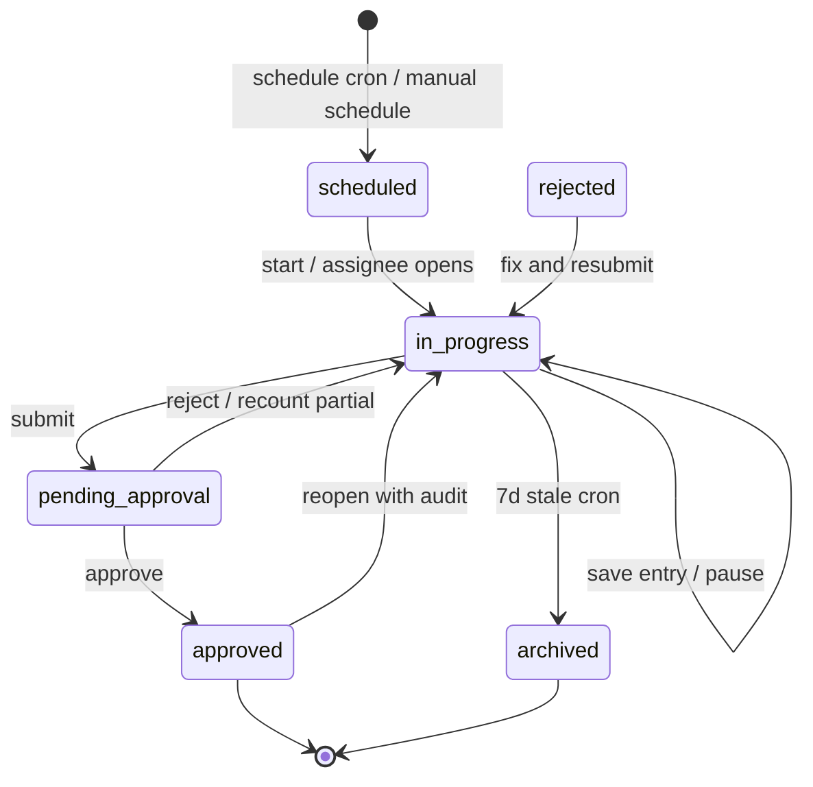

# Stock Counts — User flows

> Companion to [`plan.md`](plan.md) and [`tdd.md`](tdd.md). Every error row maps to a test in `tdd.md` §1.

## 1. Happy path

| # | User does | UI shows | System does | Telemetry |
|---|-----------|----------|-------------|-----------|
| 1 | Opens Stock Counts list | Cadence card, filter pills, count rows or empty state | GET counts for venue | `stock_counts.viewed` |
| 2 | Taps **New count** | Scope form (full / location / cycle / category) | POST count → `in_progress` | `stock_counts.created` |
| 3 | Taps **Start counting** (or auto-nav on create) | Full-screen `/count` flow; progress `0 of N` | Load entries for scope | `stock_counts.viewed` |
| 4 | Selects **Cold Room** location pill | Filtered ingredient list | Client filter on entries | — |
| 5 | Taps ingredient row | Quick-entry modal; previous qty faint | — | — |
| 6 | Enters mixed units (2 cartons + 3 bottles) | Live total in base unit | PATCH entry; convert via pack info | `stock_counts.entry_saved` |
| 7 | Repeats for all ingredients | Progress updates | Per-row optimistic save + retry | `stock_counts.entry_saved` |
| 8 | Taps **Submit count** | Variance summary screen | Compute expected + variance; status → `pending_approval` | `stock_counts.submitted` |
| 9 | Manager opens pending count | Variance table; approve/reject CTAs | GET detail + `allowedActions` | `stock_counts.viewed` |
| 10 | Taps **Approve** | Success toast; status Approved | Lock count; update `current_stock_level`; invalidate Order Guide | `stock_counts.approved` |

## 2. Error states

| Trigger | User-visible state | Recovery path | Code | Test ref |
|---------|-------------------|---------------|------|----------|
| Not venue member | 403 page / toast | Switch venue | `stock_counts.forbidden` | tdd #29 |
| Crew creates count | Toast: no permission | Ask manager | `stock_counts.forbidden` | tdd #10 |
| Non-assignee crew runs count | Toast | Get assignment | `stock_counts.forbidden` | tdd #11 |
| Manager approves large variance | Toast: owner approval required | Escalate to owner | `stock_counts.large_variance_owner_required` | tdd #25 |
| Submit with uncounted rows | Inline list of missing; submit blocked | Count remaining or **Set remaining to zero** | `stock_counts.incomplete_submit` | tdd #21 |
| Negative quantity | Inline field error | Fix value | `stock_counts.negative_quantity` | tdd #36 |
| Edit approved count | Toast: count locked | Request reopen | `stock_counts.locked` | tdd #37 |
| Invalid status transition | Toast with code | Refresh page | `stock_counts.invalid_status` | tdd #15 |
| Count not found | 404 | Back to list | `stock_counts.not_found` | tdd #29 |
| Photo upload fails | Toast + retry on row | Retry upload | `stock_counts.photo_upload_failed` | tdd #35 |
| Concurrent entry conflict | Toast: refresh count | Pull latest; re-enter | `stock_counts.concurrent_edit` | tdd #19 |
| Network failure on save | Row badge **Failed**; offline banner | Auto-retry on online; tap retry | `stock_counts.failed` | tdd #38 |
| Storage location missing | Empty location filter message | Settings → Venues | — | manual |
| No ingredients in venue | Empty state + CTA to Ingredients | Navigate to catalog | — | tdd #43 |
| Server 500 | Toast + support hint | Retry | `stock_counts.failed` | tdd #18 |

## 3. Alternate flows

### 3.1 Pause and resume

- **Trigger:** Pause button mid-count or navigate away.
- **Behavior:** Status stays `in_progress`; entries persisted.
- **Acceptance:** Same or different user resumes; progress restored. (tdd #18)

### 3.2 Bulk-zero remaining

- **Trigger:** **Set remaining to zero** on submit when <100% counted.
- **Behavior:** Confirm dialog; uncounted rows → qty 0; audit event.
- **Acceptance:** Default without action preserves last counted value per Notion. (tdd #22)

### 3.3 Request recount

- **Trigger:** Manager flags ingredients on pending count.
- **Behavior:** Assignee sees partial flow; merges back; re-approval.
- **Acceptance:** Only flagged rows editable; others locked. (tdd #26)

### 3.4 Reopen approved count

- **Trigger:** Manager **Reopen** with reason.
- **Behavior:** Status → `in_progress`; audit; Order Guide recomputes on re-approve.
- **Acceptance:** Audit row required. (tdd #27)

### 3.5 Cycle count

- **Trigger:** Create count with cycle scope (subset ingredients/locations).
- **Behavior:** Only scoped ingredients get variance + stock update on approve.
- **Acceptance:** Out-of-scope ingredients unchanged. (tdd #28)

### 3.6 Schedule recurring count

- **Trigger:** Schedule CTA on list page.
- **Behavior:** Creates `stock_count_schedules`; cron spawns count on due date.
- **Acceptance:** Reminder fires to assignee; escalation after 24h. (tdd #33)

### 3.7 First count (baseline)

- **Trigger:** Venue with no prior approved count.
- **Behavior:** No expected/variance; `is_baseline=true`.
- **Acceptance:** Submit → approve sets starting stock only. (tdd #5, #20)

### 3.8 Multi-location ingredient

- **Trigger:** Milk in Cold Room and Bar.
- **Behavior:** Separate entry rows per location; total summed on submit.
- **Acceptance:** Single ingredient variance on rolled-up total. (tdd #19)

### 3.9 Multi-counter simultaneous

- **Trigger:** Two users, same count, different location filters.
- **Behavior:** Independent PATCH per entry; optimistic concurrency on entry row.
- **Acceptance:** No lost updates; concurrent_edit on stale version. (tdd #19)

### 3.10 Deep link

- **Example:** `…/stock-counts/[countId]/count` opened directly.
- **Behavior:** Server fetch; 404 if missing; 403 if not member; redirect to list if approved.
- **Acceptance:** No client redirect loop.

### 3.11 Offline / poor connectivity

- **UI:** Banner **You're offline**; row-level saving/failed badges.
- **Behavior:** PATCH queued in memory; retry on `online` event; pause/submit disabled until flush.
- **Acceptance:** No silent data loss. (tdd #38, #41)

### 3.12 Mobile viewport

- **Route:** `/count` full-screen; ≥44px tap targets; number pad for qty.
- **Acceptance:** No horizontal scroll on 375px width. (tdd #39)

### 3.13 CSV export

- **Trigger:** Export on approved count detail.
- **Behavior:** Download CSV (ingredient, location, prev, counted, expected, variance, notes).
- **Acceptance:** Matches Notion column lean set. (manual)

### 3.14 Ingredient stock history

- **Trigger:** From ingredient detail → Stock history.
- **Behavior:** Chart last 12 counts + delivery markers.
- **Acceptance:** GET stock-history returns ordered points. (integration)

### 3.15 Mid-count verification flag (MVP-light)

- **Trigger:** Operator marks row **Needs verification**.
- **Behavior:** `needs_verification=true`; manager sees badge.
- **Acceptance:** Does not block submit. (manual)

### 3.16 Count template (MVP-light)

- **Trigger:** Create count from template.
- **Behavior:** Pre-ordered locations / groupings applied.
- **Acceptance:** Template CRUD + create with `template_id`. (manual)

### 3.17 Auto-archive stale in-progress

- **Trigger:** Count in_progress >7 days without submit.
- **Behavior:** Cron → `archived`; notification to assignee.
- **Acceptance:** Status archived; not deletable from history. (tdd #33)

## 4. State diagram

## 5. Manual E2E smoke (no Playwright)

1. Sign in as **Venue Manager** on demo venue with ingredients seeded.
2. **Stock Counts** → **New count** → full scope → **Start counting**.
3. Count 3 ingredients (one mixed-unit); pause; resume.
4. Submit → review variance → sign in as same manager → **Approve**.
5. **Purchasing → Order guide** → verify `stockCountMissing` false; stock levels reflect count.
6. Sign in as **Owner** → create count with artificial large variance → manager approve blocked → owner approves.
7. Export CSV from approved count detail.

## 6. Acceptance summary

- [ ] §1 happy path steps 1–10 pass manual smoke.
- [ ] Every §2 error row has passing test in `tdd.md`.
- [ ] §3 alternate flows 3.1–3.12 covered by integration tests or manual notes.
- [ ] State diagram matches service status enum.
- [ ] Telemetry events fire from service (dev console in non-production).
