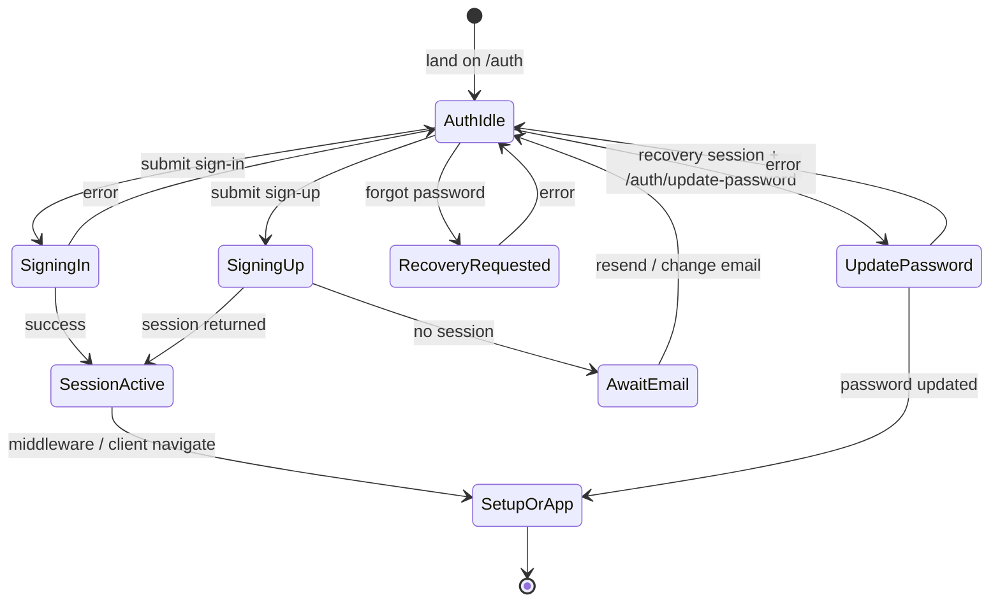

# Supersolt authentication — User flows

> Companion to [`plan.md`](plan.md) and [`tdd.md`](tdd.md). **MVP telemetry:** see [`plan.md`](plan.md) §9 — product events documented but not emitted.

## 1. Happy path

| # | User does | UI shows | System does | Telemetry |
|---|-----------|----------|-------------|-----------|
| 1 | Opens `/auth` in sign-in mode | Email + password fields, link to sign up | None | _(future)_ `auth.viewed` |
| 2 | Enters valid credentials and submits | Submit loading state | `signInWithPassword`; session cookies via SSR client | _(future)_ `auth.sign_in_success` |
| 3 | — | Redirect to `next` if safe, else app home | Middleware reads session; may send to `/setup` or `/dashboard` | — |
| 4 | New user: switches to sign up, fills name/email/password | Validation hints | `signUp`; may await email confirmation | _(future)_ `auth.sign_up_submitted` |
| 5 | Clicks confirmation link in email | Brief redirect flow | `GET /auth/callback?code=…` exchanges code for session | — |
| 6 | Forgot password: enters email, submits “Send reset link” | Confirmation copy | `resetPasswordForEmail` with app redirect URL | _(future)_ `auth.password_reset_requested` |
| 7 | Opens recovery link from email | May pass through callback | Session established per Supabase config | — |
| 8 | Lands on `/auth/update-password`, enters new password twice, submits | Success state | `updateUser({ password })` | _(future)_ `auth.password_reset_completed` |
| 9 | — | Navigates to `/setup` if `needsSetup`, else `/dashboard` | Client `router` + refresh, aligned with [`plan.md`](plan.md) §2 | — |

## 2. Error states

Every row should map to a **Vitest** case (see [`tdd.md`](tdd.md) §1) or explicit **manual** verification where marked.

| Trigger | User-visible state | Recovery path | Telemetry | Test ref |
|---------|--------------------|---------------|-----------|----------|
| Wrong email or password on sign-in | Curated: “Incorrect email or password” (or equivalent) | Retry credentials | — | tdd #6 |
| Email not confirmed (sign-in blocked) | Curated: confirm email + link to resend / OTP path | Resend or complete OTP per existing UI | — | tdd #6 |
| Weak password on sign-up | Inline: minimum length / policy | User adjusts password | — | tdd #6 |
| Sign-up email already registered | Curated duplicate message | Switch to sign-in | — | tdd #6 |
| Callback missing `code` | Redirect to `/auth?error=auth_callback_missing_code` | Request new link from sign-up or support | — | tdd #4 |
| Callback exchange failure | `/auth?error=auth_callback_exchange_failed&error_description=…` | Try again; decode-safe message mapping in `AuthForm` | — | tdd #5 |
| Forgot password: unknown email | Generic success-style or neutral copy per security policy (document choice in implementation) | Try another email | — | manual |
| Forgot password: rate limit / network | Curated + retry | Wait and retry | — | manual |
| Update password: session missing / expired | Curated: session invalid; CTA to restart recovery | Restart forgot-password flow | — | manual |
| Update password: mismatch / weak | Inline validation | Fix fields | — | manual |
| `/api/me` returns `email_not_confirmed` | User kept on auth surfaces via middleware | Complete confirmation | — | manual |

**Logging:** never log passwords, OTPs, or recovery links; server logs may record **event type** only.

## 3. Alternate flows

### 3.1 Cancel

- **Trigger:** User navigates away from `/auth` or update-password before submit.
- **Acceptance:** No partial server writes; no orphaned client state beyond normal React unmount.

### 3.2 Retry

- **Trigger:** Network failure on sign-in / forgot password / update password.
- **Acceptance:** User can retry submit; no duplicate side effects beyond Supabase idempotency expectations.

### 3.3 Partial save / drafts

- **n/a** — auth forms are not draft-persisted in MVP.

### 3.4 Deep link entry

- **`/auth?next=/dashboard`** — only same-origin relative paths after sanitisation; unsafe `next` ignored ([`plan.md`](plan.md) §5).
- **`/auth/update-password`** without valid recovery session — show error + link back to `/auth`.

### 3.5 Empty state

- **n/a** — auth pages are form-first.

### 3.6 Loading state

- Submit buttons show loading / disabled during async auth calls.
- **Acceptance:** No double-submit on rapid clicks (guard with `isSubmitting`).

### 3.7 Permissions denied

- **n/a** at auth routes for unauthenticated users; authenticated users hitting `/auth` are redirected per middleware ([`utils/supabase/middleware.ts`](../../../utils/supabase/middleware.ts)).

### 3.8 Offline

- Show curated network error; no silent failure.
- **Acceptance:** No uncaught promise rejections from Supabase client.

### 3.9 Mobile / small viewport

- Forms remain usable at `sm` breakpoint; tap targets use `@workspace/ui` defaults.
- **Acceptance:** No horizontal scroll on narrow devices for default copy lengths.

## 4. State diagram

## 5. Manual smoke (release gate)

Run in **staging** (or local with Supabase) before production enablement:

1. Sign up new user → receive confirmation email → confirm → land with session → `needsSetup` sends to `/setup` when applicable.
2. Sign out → sign in with password → reach `/dashboard` or `/setup` correctly.
3. Wrong password → curated error.
4. Forgot password → email received → complete flow → new password works → redirect to `/setup` or `/dashboard`.
5. Authenticated user visits `/auth` → redirected away per middleware.
6. Callback with tampered `next` → does not leave origin (open redirect check).

## 6. Acceptance summary

This feature is **done** when:

- [ ] Happy path §1 steps work on staging (manual §5).
- [ ] §2 error rows either have automated tests ([`tdd.md`](tdd.md)) or explicit **manual** verification notes.
- [ ] §3 alternate flows behave as described.
- [ ] §4 diagram matches implemented navigation.
- [ ] No passwords or tokens in logs; future telemetry names documented in [`plan.md`](plan.md) §9 only (no PII to third parties without policy).
