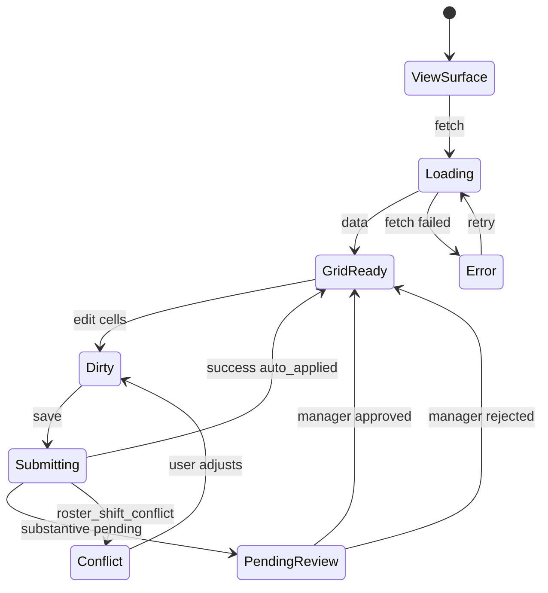

# Availability — User flows

> Companion to [`plan.md`](plan.md) and [`tdd.md`](tdd.md). Aligned to [Notion Availability](https://www.notion.so/34f64094bde680af8d86f371fdb250b8).

## 1. Happy paths

### 1.1 Staff sets recurring availability (first visit)

| # | User does | UI shows | System does | Telemetry |
|---|-----------|----------|-------------|-----------|
| 1 | Opens `/workforce/availability/me` | Empty CTA: “Set my availability” | GET `…/me` → implicit all-available grid | `availability.viewed` |
| 2 | Taps “Edit availability” | 7×4 grid, all green (Available) | — | — |
| 3 | Taps cells to mark Preferred / Unavailable | Colour + tooltip updates | Local draft state | — |
| 4 | Saves | Sticky save bar; spinner | PUT `…/me/patterns` + audit rows | `availability.pattern_submitted` |
| 5 | — | Success toast | Casual: `auto_applied`; patterns active `effective_from` | — |

### 1.2 Staff one-off unavailability

| # | User does | UI shows | System does | Telemetry |
|---|-----------|----------|-------------|-----------|
| 1 | Taps “Add unavailability” | Sheet: date picker + block picker | — | — |
| 2 | Picks next Tuesday 14:00 block (`afternoon`) | — | — | — |
| 3 | Saves | Conflict banner if rostered | PUT `…/overrides` + conflict scan vs `roster_shifts` | `availability.override_created` or `availability.roster_conflict` |

### 1.3 Manager team view

| # | User does | UI shows | System does | Telemetry |
|---|-----------|----------|-------------|-----------|
| 1 | Opens `/workforce/availability` | Date range default 14d; team grid | GET `…/team` | `availability.viewed` |
| 2 | Filters “Friday evening unavailable” | Subset of rows | Server filter on resolved blocks | — |
| 3 | Clicks employee row | Drill-down / history link | GET `…/history/[id]` | — |

### 1.4 Manager approves substantive FT/PT change

| # | User does | UI shows | System does | Telemetry |
|---|-----------|----------|-------------|-----------|
| 1 | Opens pending panel | List with before/after visual | GET `…/changes?status=pending` | — |
| 2 | Approves with note | — | POST `…/changes/[id]/decision` + audit | `availability.change_approved` |
| 3 | — | Employee `/me` shows new pattern | `approval_status = approved` | — |

### 1.5 Roster consumes availability (integration)

| # | User does | UI shows | System does | Telemetry |
|---|-----------|----------|-------------|-----------|
| 1 | Manager assigns shift in unavailable block | Amber warn on roster chip | `loadAvailabilityHints` → warn `availability` | `roster.compliance_overridden` (roster spec) |
| 2 | Hard block paths (leave) | — | Leave module Phase 2; until then override `leave_sync` | — |

## 2. Error states

| Trigger | `code` | HTTP | User-visible state | Recovery | Telemetry | Test |
|---------|--------|------|-------------------|----------|-----------|------|
| Not venue member | `forbidden` | 403 | Toast + redirect | Switch venue / ask admin | `availability.forbidden` | tdd #8 |
| Crew edits another user | `forbidden` | 403 | Toast | — | `availability.forbidden` | tdd #8 |
| Edit `leave_sync` override | `override_leave_locked` | 403 | “On leave — managed in Leave” | Open Leave module | `availability.failed` | tdd #12 |
| Shift exists in new unavailable window | `roster_shift_conflict` | 409 | Conflict card + actions | Swap (P2) / leave request / manager | `availability.roster_conflict` | tdd #11 |
| FT reduction needs approval | `substantive_change_pending` | 202 | “Submitted for manager review” | Wait for approval | `availability.substantive_pending` | tdd #5,10 |
| Below contract hours | `substantive_hours_below_contract` | 422 | Consultation copy + options | Talk to manager / formal hours change | `availability.substantive_pending` | tdd #5 |
| Invalid effective date in past | `invalid_effective_from` | 400 | Inline field error | Pick future date | `availability.failed` | tdd #7 |
| Pattern not found | `pattern_not_found` | 404 | Toast | Refresh | `availability.failed` | integration |
| Pending edit while pending exists | `pending_change_exists` | 409 | “Already awaiting approval” | Cancel prior or wait | `availability.failed` | integration |
| Legacy tables (pre-migrate deploy) | `availability_schema_missing` | 503 | Setup message | Run migration | `availability.failed` | — |
| Network failure | — | — | Toast + retry | Retry | `availability.failed` | e2e |
| Server 500 | `internal_error` | 500 | Generic error + support | Retry | `availability.failed` | integration |

## 3. Alternate flows

### 3.1 Cancel / dirty form

- **Trigger:** Navigate away with unsaved grid edits.
- **UI:** Confirm dialog (mobile sheet).
- **Acceptance:** No API call; `availability` audit unchanged.

### 3.2 Retry

- **Trigger:** Failed PUT/POST.
- **UI:** Toast with Retry.
- **Acceptance:** Idempotent upsert keys (`venue_id, user_profile_id, dow, block, effective_from`) — no duplicate active pattern.

### 3.3 Effective date in the future

- **Trigger:** Staff picks effective date 3 weeks out.
- **UI:** Banner “Applies from {date}”.
- **Acceptance:** Roster for current week uses old pattern; week after `effective_from` uses new (tdd #3).

### 3.4 Deep link

- **Entry:** `/workforce/availability/me?effectiveFrom=2026-06-15`
- **Behaviour:** Editor opens with that date pre-selected.
- **Acceptance:** 404 if venue slug invalid; 403 if not a member.

### 3.5 Empty states

| Surface | Copy (Notion) |
|---------|----------------|
| Staff, no custom pattern | “Set your availability so your manager knows when you can work. Otherwise, you're considered available everywhere.” |
| Manager, employee unset | “{name} hasn't set their availability yet. They'll show as available everywhere by default.” |

### 3.6 Loading

- Skeleton 7×4 grid matching final layout; no layout shift.

### 3.7 Permissions denied

- Crew on `/workforce/availability` (team) → redirect to `/me` or 403 page.
- Manager on `/me` → allowed read-only self only (same as crew).

### 3.8 Offline

- Banner: online-only; submit disabled when `navigator.onLine === false`.
- No offline queue (MVP).

### 3.9 Mobile

- Single-column grid scroll; 44px cells; pull-to-refresh on `/me`.
- Swipe row “mark whole day unavailable” shortcut (optional P1.1).

### 3.10 Leave sync (contract — writer deferred)

- **Trigger:** Leave approval event (future).
- **System:** Upsert overrides `source=leave_sync`, `reason=leave`, all blocks `unavailable` for date range.
- **UI:** Grey “On leave” cells; not editable in availability UI.
- **Acceptance:** tdd #12; `availability.leave_sync_applied` when wired.

### 3.11 New hire (People)

- **Trigger:** User assigned to venue in People.
- **System:** No pattern rows → resolver returns all `available`.
- **Acceptance:** Manager can roster immediately (Notion flow 8).

## 4. State diagram

## 5. Acceptance summary

- [ ] Notion flows 1–12 in §1 and §3 have passing tests in [`tdd.md`](tdd.md)
- [ ] Every §2 error `code` returned by API and covered by test
- [ ] Legacy availability tables and UI removed
- [ ] Roster hints use 4-block resolution
- [ ] `availability.*` events fire (no-op tracker acceptable)
- [ ] Atomic migration applied on `user-supabase-supersolt-mvp` before production deploy
