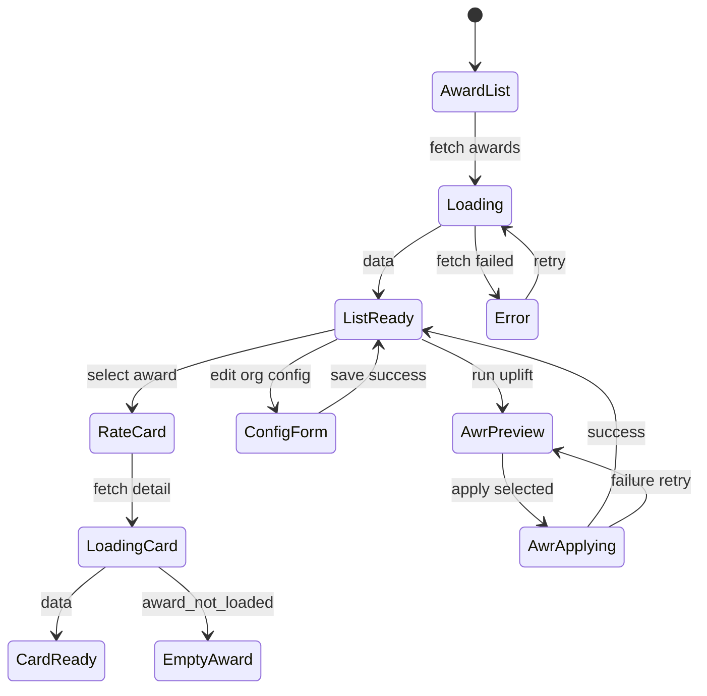

# Award Rate Library — User flows

> Companion to [`plan.md`](plan.md) and [`tdd.md`](tdd.md). Aligned to [Notion Award Rate Library](https://www.notion.so/36264094bde681449229f6912d2f6451).

## 1. Happy paths

### 1.1 View award rate card (Notion #10)

| # | User does | UI shows | System does | Telemetry |
|---|-----------|----------|-------------|-----------|
| 1 | Opens Settings → **Award rates** | Award list (MA000119, MA000009) + org default | GET `/award-rates` | `award_rates.viewed` |
| 2 | Clicks MA000119 | Rate card: classifications, FT/PT/casual mins, penalty grid, PR ref, source URL | GET `/award-rates/MA000119` | `award_rates.rate_card_viewed` |
| 3 | — | “Last updated” from `library_update_log` | — | — |

### 1.2 Configure org award defaults (Notion #1 setup)

| # | User does | UI shows | System does | Telemetry |
|---|-----------|----------|-------------|-----------|
| 1 | Sets default award MA000119 | Select pre-filled from org config | — | — |
| 2 | Saves | Toast success | PUT `/award-rates/config` | `award_rates.config_updated` |
| 3 | — | — | Future Add Employee pre-selects MA000119 (People module) | — |

### 1.3 Annual AWR uplift (Notion #2)

| # | User does | UI shows | System does | Telemetry |
|---|-----------|----------|-------------|-----------|
| 1 | Taps **Run AWR uplift** (visible when new rate version loaded for target year) | Sheet opens | GET preview | `award_rates.awr_preview` |
| 2 | Reviews table: current rate, new minimum, suggested action | Rows: auto_uplift (checked), skip, manual_review (unchecked) | — | — |
| 3 | Optionally checks “apply % uplift” on above-award rows | Row action updates | — | — |
| 4 | Sets effective date (default 1 July) | Date picker | — | — |
| 5 | Taps **Apply selected** | Confirm dialog with counts | POST apply (transaction) | `award_rates.awr_applied` |
| 6 | — | Success toast + event summary | Updates profiles + `employee_pay_rate_history`; inserts `awr_uplift_events` | — |

### 1.4 Payroll uses library across rate change (Notion #3 — internal)

| # | User does | UI shows | System does | Telemetry |
|---|-----------|----------|-------------|-----------|
| 1 | — | — | Pay run calculate: per-line `as_of_date` = shift date | — |
| 2 | — | Split rate detail on lines spanning 30 Jun / 1 Jul | Two rate versions applied | — |

### 1.5 Wage Theft pre-flight (Notion #4 — internal)

| # | User does | UI shows | System does | Telemetry |
|---|-----------|----------|-------------|-----------|
| 1 | — | Hard block in payroll pre-flight | `getMinimumRate` @ pay-period midpoint vs employee rate | — |
| 2 | Owner exemption | — | Override category + audit (Payroll Export owns UI) | — |

### 1.6 Roster shift costing (Notion #3 — internal)

| # | User does | UI shows | System does | Telemetry |
|---|-----------|----------|-------------|-----------|
| 1 | Adds Sunday casual shift on Roster | Cost chip updates | `computeShiftCost` via award engine | — |
| 2 | Hovers chip | Base vs penalty tooltip + rule labels | — | — |

## 2. Error states

| Trigger | Code | HTTP | User-visible | Recovery | Telemetry | Test ref |
|---------|------|------|--------------|----------|-----------|----------|
| Venue manager opens Award rates | `forbidden` | 403 | Settings tab hidden or access denied card | — | `award_rates.failed` | tdd #15 |
| Staff role deep-link | `forbidden` | 403 | Access denied | — | `award_rates.failed` | tdd #15 |
| Award not seeded (e.g. MA000003) | `award_not_loaded` | 404 | “This award is not yet supported in MVP…” | Contact support | — | tdd #21 |
| Classification missing on rate card | `classification_not_found` | 404 | “Classification not found…” | Verify award data | — | tdd #7 |
| No rate effective on date | `rate_not_effective` | 422 | “No rate effective on {date}…” | Aaron update library | — | tdd #8 |
| Penalty gap during roster cost | `penalty_schedule_gap` | 422 | Roster: cannot price shift | Fix library data | server log | tdd #9 |
| Roster/payroll unknown award on employee | `award_not_loaded` | 422 | Fix employee award on People | — | server log | tdd #6 |
| AWR apply with zero rows selected | `validation_error` | 422 | “Select at least one employee” | Check rows | — | tdd #22 |
| AWR apply mid-transaction failure | `internal_error` | 500 | Toast + retry | Retry apply | `award_rates.failed` | tdd #12 |
| Network failure on rate card load | `network_error` | — | Banner + retry | Retry | `award_rates.failed` | tdd #20 |
| Auth expired | — | 401 | Redirect sign-in | Sign in | — | flows-only |

## 3. Alternate flows

### 3.1 Cancel AWR uplift

- **Trigger:** Close sheet or Cancel on confirm dialog.
- **State:** No profile or history changes.
- **Acceptance:** Preview fetch discarded; no `awr_uplift_events` row.

### 3.2 Retry after transient failure

- **Trigger:** Retry on error banner / toast.
- **State:** Re-fetch preview or re-POST apply with same payload (idempotent apply keyed by `organisation_id + awr_year + effective_date + userProfileId` set).
- **Acceptance:** Second apply for already-updated employee is no-op or returns conflict code `awr_already_applied`.

### 3.3 Selective bulk apply (grill-me)

- **Trigger:** Preview mix of auto_uplift, skip, manual_review.
- **UI:** Only `auto_uplift` checked by default; Owner toggles checkboxes + optional % uplift on skip rows.
- **Acceptance:** Unchecked rows unchanged; `manual_review` remains for later pass; event log records applied vs skipped counts.

### 3.4 Deep link

- **Entry:** `/settings/award-rates?award=MA000119`
- **Behaviour:** Opens rate card for MA000119 directly.
- **Acceptance:** 404 invalid award code; 403 if not grantsOrgAdmin.

### 3.5 Empty states (Notion)

| Surface | Copy |
|---------|------|
| No awards in org use yet | “Select a default award in configuration below. Rate cards appear for awards your employees use.” |
| Award not loaded | “This award is not yet supported in MVP. Contact Supersolt support if you need it loaded.” |
| No employees for AWR preview | “No employees on award classification found for this organisation.” |

### 3.6 Loading

- Skeleton for award list + rate card tables; no layout shift.

### 3.7 Permissions denied

- Settings tab not rendered unless `canViewAwardRates`.
- Deep link without permission → access denied card (same as Organisation settings pattern).

### 3.8 Offline

- Banner: online-only; AWR apply disabled when offline.
- Read-only rate cards may show cached data with stale indicator (optional P1.1).

### 3.9 Mobile / small viewport

- Rate card tables horizontal scroll; tap targets ≥44px on AWR checkboxes.
- AWR sheet full-height on mobile.

### 3.10 EBA-covered org

- **Trigger:** `is_eba_covered` true on org config.
- **UI:** Banner on rate cards: “Award minimum enforcement uses EBA rates per employee.”
- **AWR:** Preview skips auto-uplift from award minimums; manual rates unchanged unless Owner opts in.

### 3.11 Aaron loads FWC variation (developer flow)

- **Trigger:** New migration applied with `effective_from` mid-year.
- **System:** `library_update_log` row; existing calculations unchanged for past dates.
- **UI:** “Last updated” date changes on rate cards; no operator action unless employee rate now below minimum (Payroll pre-flight surfaces).

## 4. State diagram

## 5. Acceptance summary

This feature is "done" when:

- [ ] §1.1–1.3 have passing E2E or signed manual smoke.
- [ ] Every row in §2 has a passing test in [`tdd.md`](tdd.md).
- [ ] §3.3 selective AWR apply verified in integration test.
- [ ] Roster + Payroll contract tests (#17–18) green with stubs removed.
- [ ] Telemetry events fire with redacted payloads (no employee pay rates in analytics).
