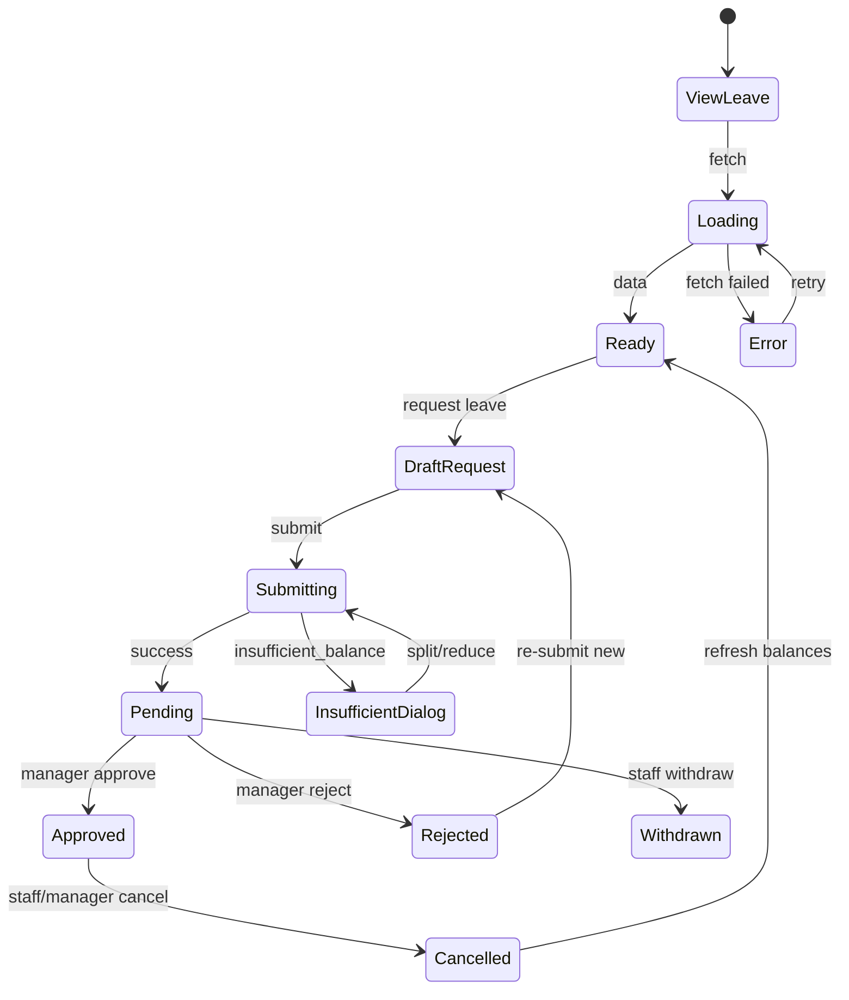

# Leave — User flows

> Companion to [`plan.md`](plan.md) and [`tdd.md`](tdd.md). Aligned to [Notion Leave](https://www.notion.so/34f64094bde680f8a37cd54ff7106475).

## 1. Happy paths

### 1.1 Staff submits leave request

| # | User does | UI shows | System does | Telemetry |
|---|-----------|----------|-------------|-----------|
| 1 | Opens `/workforce/leave` | Balance summary + Upcoming/History tabs | GET balances + requests (self) | `leave.viewed` |
| 2 | Taps "Request leave" | Sheet: type dropdown with balances | — | — |
| 3 | Selects Annual, 14–21 Jul, optional reason | Date picker + duration preview | Client validates dates | — |
| 4 | Submits | Spinner on CTA | POST `…/requests`; status Pending | `leave.request_submitted` |
| 5 | — | Success toast; appears in Upcoming | Audit `request_created`; manager event stub | — |

### 1.2 Manager approves

| # | User does | UI shows | System does | Telemetry |
|---|-----------|----------|-------------|-----------|
| 1 | Opens leave page (manager surface) | Pending inbox count | GET pending for venue team | `leave.viewed` |
| 2 | Opens request detail | Employee context, balance impact, team calendar snippet, roster shifts list | GET request + coverage + shifts | — |
| 3 | Taps Approve | Roster conflict dialog if shifts exist | — | — |
| 4 | Chooses unassign all + confirms | — | POST decision; deduct balance; availability sync; optional unassign; payroll line | `leave.approved`, `leave.sync_availability`, `leave.roster_conflict?` |
| 5 | — | Approved tab + calendar block | Employee sees approved status | — |

### 1.3 Manager rejects

| # | User does | UI shows | System does | Telemetry |
|---|-----------|----------|-------------|-----------|
| 1 | Opens pending request | Detail view | — | — |
| 2 | Rejects with reason | Reason required | POST decision rejected; audit | `leave.rejected` |
| 3 | — | Employee sees Declined + reason | No balance change; no sync | — |

### 1.4 Staff withdraws pending

| # | User does | UI shows | System does | Telemetry |
|---|-----------|----------|-------------|-----------|
| 1 | Taps Withdraw on pending row | Confirm | POST withdraw | `leave.withdrawn` |
| 2 | — | Removed from pending | Status withdrawn; audit | — |

### 1.5 Staff cancels approved leave

| # | User does | UI shows | System does | Telemetry |
|---|-----------|----------|-------------|-----------|
| 1 | Taps Cancel on approved | Copy: balance restored, availability removed | — | — |
| 2 | Confirms | — | POST cancel; restore balance; delete overrides | `leave.cancelled` |

### 1.6 Manager revokes approved leave

| # | User does | UI shows | System does | Telemetry |
|---|-----------|----------|-------------|-----------|
| 1 | Taps Revoke | Sensitive-action warning | — | — |
| 2 | Enters mandatory reason + confirms | — | POST cancel (manager); audit full detail | `leave.cancelled` `{ by: 'manager' }` |

### 1.7 LSL request with eligibility

| # | User does | UI shows | System does | Telemetry |
|---|-----------|----------|-------------|-----------|
| 1 | Selects Long Service type | LSL balance from state rules + years of service | Policy calc from venue state + People start date | — |
| 2 | Requests duration within balance | — | POST pending or Owner queue if > threshold | — |
| 3 | Owner approves | — | Same as 1.2 | `leave.approved` |

### 1.8 Insufficient balance — paid+unpaid split

| # | User does | UI shows | System does | Telemetry |
|---|-----------|----------|-------------|-----------|
| 1 | Requests 40h annual with 12h balance | Dialog: insufficient + options | — | `leave.insufficient_balance` |
| 2 | Chooses split 12h paid + 28h unpaid | — | POST with `paid_hours` / `unpaid_hours` | — |
| 3 | Manager approves | — | Deduct 12h from annual only | `leave.approved` |

### 1.9 Timesheet accrual (background)

| # | User does | UI shows | System does | Telemetry |
|---|-----------|----------|-------------|-----------|
| 1 | Manager approves timesheet | (Timesheets module) | `leaveAccrualService.onTimesheetApproved` | `leave.accrual_posted` |
| 2 | Staff refreshes leave page | Balance increased | Idempotent accrual event | — |

### 1.10 Termination payout

| # | User does | UI shows | System does | Telemetry |
|---|-----------|----------|-------------|-----------|
| 1 | Owner terminates employee in People | Payout summary | `computeTerminationPayout` | `leave.termination_payout` |
| 2 | Runs Payroll Export | Final pay lines | Reads `payroll_leave_lines` | — |

### 1.11 Leave calendar view

| # | User does | UI shows | System does | Telemetry |
|---|-----------|----------|-------------|-----------|
| 1 | Manager opens calendar section | Staff × dates grid, type colours | GET calendar | — |
| 2 | Filters org scope (Owner) | All venues | scope=org | — |
| 3 | Hovers DFV entry (peer staff) | "Leave (private)" | Reason hidden | — |

### 1.12 Bulk approve (MVP-light)

| # | User does | UI shows | System does | Telemetry |
|---|-----------|----------|-------------|-----------|
| 1 | Multi-select straightforward pending | Checkbox column | — | — |
| 2 | Approve selected | Progress | POST bulk-approve | `leave.approved` × n |

## 2. Error states

| Trigger | `code` | HTTP | User-visible state | Recovery | Telemetry | Test |
|---------|--------|------|-------------------|----------|-----------|------|
| Not venue member | `forbidden` | 403 | Toast + redirect | Switch venue | `leave.forbidden` | tdd #20 |
| Crew views team inbox | `forbidden` | 403 | Staff-only surface | — | `leave.forbidden` | tdd #20 |
| Insufficient balance (strict) | `insufficient_balance` | 422 | Dialog with options | Split / reduce / change type | `leave.insufficient_balance` | tdd #5,31 |
| Negative balance would result | `negative_balance_not_allowed` | 422 | Inline error | Reduce duration | `leave.failed` | tdd #6 |
| Owner approval required | `owner_approval_required` | 403 | "Sent to owner" or block manager | Owner action | `leave.failed` | tdd #22 |
| LSL insufficient | `lsl_insufficient_balance` | 422 | Explanation + eligible hours | Reduce duration | `leave.failed` | tdd #8 |
| Withdraw non-pending | `invalid_status_transition` | 409 | Toast | — | `leave.failed` | tdd #17 |
| Approve already decided | `invalid_status_transition` | 409 | Toast | Refresh | `leave.failed` | integration |
| Overlapping own approved | `overlap_warning` | 200/202 | Warn banner; allow submit | Proceed or edit | — | flows-only |
| Edit leave_sync in Availability | `override_leave_locked` | 403 | Link to Leave | Open Leave | `availability.failed` | availability tdd #12 |
| Roster shift on leave | `leave_clash` | 422 | Hard block on roster save | Change dates / cancel leave | `roster.compliance_blocked` | tdd #26 |
| Casual requests annual accrual type | `leave_type_not_applicable` | 422 | "Not available for casual employment" | Choose unpaid/other | `leave.failed` | tdd #4 |
| Network failure | — | — | Toast + retry | Retry | `leave.failed` | e2e |
| Server 500 | `internal_error` | 500 | Generic + support | Retry | `leave.failed` | integration |

## 3. Alternate flows

### 3.1 Cancel / dirty form

- **Trigger:** Close request sheet with unsaved fields.
- **UI:** Confirm discard.
- **Acceptance:** No POST; no audit row.

### 3.2 Retry

- **Trigger:** Failed POST decision/submit.
- **UI:** Toast with Retry.
- **Acceptance:** Idempotent client request key on submit prevents duplicate pending rows.

### 3.3 Deep link

- **Entry:** `/workforce/leave?requestId={uuid}`
- **Behaviour:** Opens detail sheet if authorized; 404 missing; 403 wrong venue.
- **Acceptance:** No redirect loop.

### 3.4 Empty states (Notion)

| Surface | Copy |
|---------|------|
| Staff, no requests | "No leave requests. Tap 'Request leave' to start. You currently have {X} hours of Annual Leave." |
| Manager inbox empty | "No pending requests. The team is up to date." |
| Calendar empty period | "No leave scheduled for this period." |

### 3.5 Loading

- Skeleton for balance cards + inbox rows; calendar grid placeholder.

### 3.6 Permissions denied

- Staff cannot access org leave-types settings → 403.
- Manager cannot adjust balances → hidden CTA.

### 3.7 Offline

- Banner online-only; submit disabled when offline (MVP).

### 3.8 Mobile

- Full-width sheet; 44px targets; sticky submit bar on request form.

### 3.9 Half-day (MVP-light)

- **Trigger:** Toggle half-day + AM/PM or time pickers.
- **System:** `start_time`/`end_time` stored; hours recalculated.
- **Acceptance:** tdd #2.

### 3.10 Team overlap warning (not blocking)

- **Trigger:** ≥2 others already approved same period.
- **UI:** "3 staff would be off — 30% of kitchen team."
- **Acceptance:** Manager can still approve; tdd #32.

### 3.11 Public holiday manual (MVP)

- **Trigger:** Manager/employee creates Public Holiday type entry for specific date.
- **Phase 2:** auto from Forecast Engine.

### 3.12 Compassionate per-occasion

- **Trigger:** Compassionate type selected.
- **System:** Does not decrement annual balance; tracks occasion in audit.
- **Acceptance:** tdd #9.

## 4. State diagram

## 5. Acceptance summary

- [ ] All Notion MVP flows §1.1–1.14 covered by test or manual note.
- [ ] Every §2 error row has tdd reference or explicit manual-only.
- [ ] Roster `leave_clash` uses approved leave ranges (not availability proxy).
- [ ] Availability `leave_sync` wired on approve/cancel.
- [ ] Timesheet approval accrual idempotent.
- [ ] DFV privacy on calendar + reason fields.
- [ ] Demo `SEED_LEAVE` removed.
- [ ] Telemetry events fire per §1–§2.
